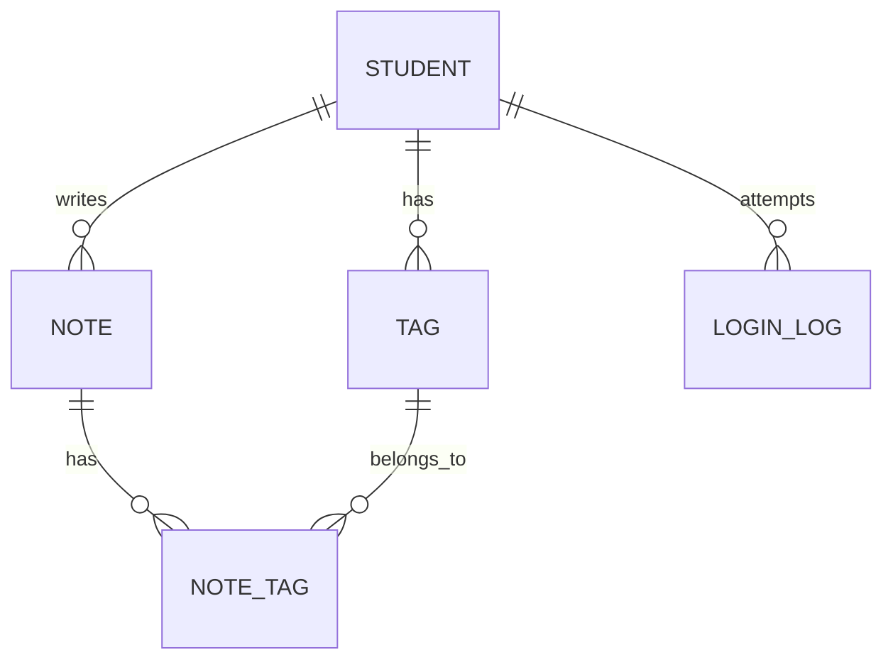

# 笔记管理系统数据库设计完整文档

## TL;DR

MySQL 5表数据库设计，包含学生、笔记、标签及关联表，支持软删除、数据隔离、登录审计、级联删除，配套3个存储过程和2个触发器。

---

## 一、数据库概述

| 项目 | 内容 |
|------|------|
| 数据库名 | note_db |
| 字符集 | utf8mb4 |
| 排序规则 | utf8mb4_0900_ai_ci |
| 存储引擎 | InnoDB |
| 表数量 | 5张 |

### 建库SQL

```sql
CREATE DATABASE IF NOT EXISTS note_db
  DEFAULT CHARACTER SET utf8mb4
  COLLATE utf8mb4_0900_ai_ci;
USE note_db;
```

---

## 二、ER图



### 表关系说明

```
┌──────────────┐                   ┌──────────────┐
│   student   │ 1                 │    note     │
├──────────────┤ │                 ├──────────────┤
│ PK  id      │─┼───── 1          │ PK  id      │
│    student_no    │                 │ FK  student_id───────┐
│    real_name     │                 │    content     │     │
│    created_at    │                 │ is_deleted  │     │
└──────────────┘                   │ created_at  │     │
                                  │ updated_at  │     │
                                  └──────┬───────┘     │
                                         │ 1:N          │
                                         ▼              │
                           ┌──────────────────┴────┐
                           │     note_tag          │
                           ├───────────────────────┤
                           │ PK  id                │
                           │ FK  note_id ─────────┼───┐
                           │ FK  tag_id  ─────────┼───┘
                           │ UQ  (note_id,tag_id) │
                           └───────────────────────┘
                                  │
                                  │ N:1
                                  ▼
                           ┌──────────────┐
                           │    tag      │
                           ├──────────────┤
                           │ PK  id      │
                           │ FK  student_id───────┐
                           │    name      │     │
                           │ created_at  │     │
                           └──────┬───────┘     │
                                  │ 1:N
                                  └────────────┘
```

---

## 三、表结构详解

### 3.1 student（学生表）

#### 字段说明

| 序号 | 字段名 | 数据类型 | 长度 | 约束 | 说明 |
|------|--------|----------|------|------|------|
| 1 | id | BIGINT | - | PRIMARY KEY, AUTO_INCREMENT, NOT NULL | 主键，自增ID |
| 2 | student_no | VARCHAR | 20 | NOT NULL, UNIQUE | 学号，唯一不可重复 |
| 3 | real_name | VARCHAR | 50 | NOT NULL | 学生姓名 |
| 4 | created_at | DATETIME | - | NOT NULL, DEFAULT CURRENT_TIMESTAMP | 创建时间 |

#### 建表SQL

```sql
CREATE TABLE student (
  id BIGINT PRIMARY KEY AUTO_INCREMENT,
  student_no VARCHAR(20) NOT NULL UNIQUE,
  real_name VARCHAR(50) NOT NULL,
  created_at DATETIME NOT NULL DEFAULT CURRENT_TIMESTAMP
) ENGINE=InnoDB;
```

#### 索引

| 索引名 | 类型 | 字段 | 说明 |
|--------|------|------|------|
| Primary | PRIMARY | id | 主键索引 |

#### 演示数据

```sql
INSERT INTO student (student_no, real_name) VALUES ('2024001', '张三');
INSERT INTO student (student_no, real_name) VALUES ('2024002', '李四');
INSERT INTO student (student_no, real_name) VALUES ('2024003', '王五');
```

---

### 3.2 login_log（登录日志表）

#### 字段说明

| 序号 | 字段名 | 数据类型 | 长度 | 约束 | 说明 |
|------|--------|----------|------|------|------|
| 1 | id | BIGINT | - | PRIMARY KEY, AUTO_INCREMENT, NOT NULL | 主键，自增ID |
| 2 | student_no | VARCHAR | 20 | NOT NULL | 登录时输入的学号 |
| 3 | real_name | VARCHAR | 50 | NOT NULL | 登录时输入的姓名 |
| 4 | is_success | TINYINT | 1 | NOT NULL | 登录结果：0=失败，1=成功 |
| 5 | login_at | DATETIME | - | NOT NULL, DEFAULT CURRENT_TIMESTAMP | 登录时间 |

#### 建表SQL

```sql
CREATE TABLE login_log (
  id BIGINT PRIMARY KEY AUTO_INCREMENT,
  student_no VARCHAR(20) NOT NULL,
  real_name VARCHAR(50) NOT NULL,
  is_success TINYINT(1) NOT NULL,
  login_at DATETIME NOT NULL DEFAULT CURRENT_TIMESTAMP
) ENGINE=InnoDB;
```

#### 索引

| 索引名 | 类型 | 字段 | 说明 |
|--------|------|------|------|
| Primary | PRIMARY | id | 主键索引 |

#### 为什么没有外键？

- login_log 记录的是登录尝试，无论是成功还是失败
- 即使学生被删除，登录日志也要保留（审计需求）
- 所以不建立外键，保留历史记录

#### 常用查询

```sql
-- 查看所有登录记录
SELECT * FROM login_log;

-- 查看成功登录
SELECT * FROM login_log WHERE is_success = 1;

-- 查看失败登录
SELECT * FROM login_log WHERE is_success = 0;

-- 统计登录次数
SELECT student_no, real_name,
       COUNT(*) as total,
       SUM(is_success) as success,
       COUNT(*) - SUM(is_success) as failed
FROM login_log
GROUP BY student_no, real_name;

-- 查看今天登录的学生
SELECT DISTINCT student_no, real_name
FROM login_log
WHERE DATE(login_at) = CURDATE();
```

> [!tip]
> login_log 表用于记录用户的登录历史，是课程设计的加分项。登录日志的写入由 sp_login 存储过程统一处理。

---

### 3.3 note（笔记表）

#### 字段说明

| 序号 | 字段名 | 数据类型 | 长度 | 约束 | 说明 |
|------|--------|----------|------|------|------|
| 1 | id | BIGINT | - | PRIMARY KEY, AUTO_INCREMENT, NOT NULL | 主键，自增ID |
| 2 | student_id | BIGINT | - | NOT NULL, FOREIGN KEY | 外键关联 student 表 |
| 3 | content | TEXT | - | NOT NULL | 笔记内容，支持长文本 |
| 4 | is_deleted | TINYINT | 1 | NOT NULL, DEFAULT 0 | 软删除标记：0=正常，1=已删除 |
| 5 | created_at | DATETIME | - | NOT NULL | 创建时间 |
| 6 | updated_at | DATETIME | - | NOT NULL, ON UPDATE CURRENT_TIMESTAMP | 更新时间，自动更新 |

#### 建表SQL

```sql
CREATE TABLE note (
  id BIGINT PRIMARY KEY AUTO_INCREMENT,
  student_id BIGINT NOT NULL,
  content TEXT NOT NULL,
  is_deleted TINYINT(1) NOT NULL DEFAULT 0,
  created_at DATETIME NOT NULL DEFAULT CURRENT_TIMESTAMP,
  updated_at DATETIME NOT NULL DEFAULT CURRENT_TIMESTAMP ON UPDATE CURRENT_TIMESTAMP,
  CONSTRAINT fk_note_student FOREIGN KEY (student_id) REFERENCES student(id)
) ENGINE=InnoDB;
```

#### 索引

| 索引名 | 类型 | 字段 | 说明 |
|--------|------|------|------|
| Primary | PRIMARY | id | 主键索引 |
| idx_note_student_time | INDEX | student_id, updated_at | 按学生查笔记，按时间排序 |
| idx_note_student_deleted | INDEX | student_id, is_deleted | 按学生查未删除笔记 |

#### 索引说明

**idx_note_student_time 复合索引**

字段顺序：student_id (ASC), updated_at (DESC)

```
查询 "学生1的笔记，按时间倒序"：
→ 只需要扫描这个索引，不需要额外排序
→ 避免 filesort，提升性能
```

#### 外键

| 外键名 | 字段 | 引用表 | 引用字段 | 删除时 | 更新时 |
|--------|------|--------|----------|--------|--------|
| fk_note_student | student_id | student | id | RESTRICT | RESTRICT |

- ON DELETE RESTRICT：如果笔记存在，不能删除该学生
- ON UPDATE RESTRICT：如果笔记存在，不能修改该学生ID

#### 触发器

| 触发器名 | 事件 | 时间 | 作用 |
|----------|------|------|------|
| trg_after_delete_note | DELETE | AFTER | 删除笔记后自动清理 note_tag 关联 |

```sql
DELIMITER $

CREATE TRIGGER trg_after_delete_note
AFTER DELETE ON note
FOR EACH ROW
BEGIN
    DELETE FROM note_tag WHERE note_id = OLD.id;
END$

DELIMITER ;
```

> [!warning]
> 当删除 note 表中的一行时自动触发，OLD.id 表示被删除的笔记ID，同时删除 note_tag 表中关联这条笔记的记录，防止出现"孤儿数据"。

#### CRUD 操作

```sql
-- 插入
INSERT INTO note (student_id, content) VALUES (1, '新笔记内容');

-- 查询（默认只查未删除）
SELECT * FROM note WHERE student_id = 1 AND is_deleted = 0;

-- 查询（包含已删除）
SELECT * FROM note WHERE student_id = 1;

-- 修改内容
UPDATE note SET content = '修改后的内容' WHERE id = 1;

-- 软删除（标记为已删除）
UPDATE note SET is_deleted = 1 WHERE id = 1;

-- 恢复笔记
UPDATE note SET is_deleted = 0 WHERE id = 1;

-- 硬删除（触发器会自动清理关联）
DELETE FROM note WHERE id = 1;
```

#### 软删除说明

| 方式 | 命令 | 效果 |
|------|------|------|
| 硬删除 | `DELETE FROM note WHERE id = 1;` | 数据直接从表中消失，无法恢复 |
| 软删除 | `UPDATE note SET is_deleted = 1 WHERE id = 1;` | is_deleted 变为 1，数据仍存在 |

**软删除优点：**
1. 数据可恢复
2. 保留历史
3. 统计方便

---

### 3.4 tag（标签表）

#### 字段说明

| 序号 | 字段名 | 数据类型 | 长度 | 约束 | 说明 |
|------|--------|----------|------|------|------|
| 1 | id | BIGINT | - | PRIMARY KEY, AUTO_INCREMENT, NOT NULL | 主键，自增ID |
| 2 | student_id | BIGINT | - | NOT NULL, FOREIGN KEY | 外键关联 student 表 |
| 3 | name | VARCHAR | 30 | NOT NULL | 标签名称 |
| 4 | created_at | DATETIME | - | NOT NULL | 创建时间 |

#### 建表SQL

```sql
CREATE TABLE tag (
  id BIGINT PRIMARY KEY AUTO_INCREMENT,
  student_id BIGINT NOT NULL,
  name VARCHAR(30) NOT NULL,
  created_at DATETIME NOT NULL DEFAULT CURRENT_TIMESTAMP,
  CONSTRAINT fk_tag_student FOREIGN KEY (student_id) REFERENCES student(id)
) ENGINE=InnoDB;
```

#### 索引

| 索引名 | 类型 | 字段 | 说明 |
|--------|------|------|------|
| Primary | PRIMARY | id | 主键索引 |
| tag_student_id_name | UNIQUE | student_id, name | 每个学生的标签名唯一 |
| idx_tag_student | INDEX | student_id, name | 快速查询学生标签 |

#### 唯一索引作用

```
学生1（张三）的标签：
┌────┬────────────┬─────────────┐
│ id │ student_id │ name        │
├────┼────────────┼─────────────┤
│ 1  │ 1          │ 学习        │ ← 第一个标签
│ 2  │ 1          │ 生活        │ ← 第二个标签
└────┴────────────┴─────────────┘

✗ 不能再插入 student_id=1, name='学习'
  → 报错：Duplicate entry '1-学习'

✓ 可以插入 student_id=2, name='学习'（不同学生）
```

> [!tip]
> 每个学生独立管理自己的标签，互不影响。标签必须通过存储过程 sp_delete_tag 删除，该过程会先清理 note_tag 关联再删除标签。

---

### 3.5 note_tag（关联表）

#### 字段说明

| 序号 | 字段名 | 数据类型 | 长度 | 约束 | 说明 |
|------|--------|----------|------|------|------|
| 1 | id | BIGINT | - | PRIMARY KEY, AUTO_INCREMENT, NOT NULL | 主键，自增ID |
| 2 | note_id | BIGINT | - | NOT NULL, FOREIGN KEY | 外键关联 note 表 |
| 3 | tag_id | BIGINT | - | NOT NULL, FOREIGN KEY | 外键关联 tag 表 |

#### 建表SQL

```sql
CREATE TABLE note_tag (
  id BIGINT PRIMARY KEY AUTO_INCREMENT,
  note_id BIGINT NOT NULL,
  tag_id BIGINT NOT NULL,
  CONSTRAINT fk_nt_note FOREIGN KEY (note_id) REFERENCES note(id),
  CONSTRAINT fk_nt_tag FOREIGN KEY (tag_id) REFERENCES tag(id)
) ENGINE=InnoDB;
```

#### 索引

| 索引名 | 类型 | 字段 | 说明 |
|--------|------|------|------|
| Primary | PRIMARY | id | 主键索引 |
| note_id_tag_id | UNIQUE | note_id, tag_id | 防止重复绑定同一标签 |

#### 外键

| 外键名 | 字段 | 引用表 | 引用字段 | 删除时 | 更新时 |
|--------|------|--------|----------|--------|--------|
| fk_nt_note | note_id | note | id | CASCADE | RESTRICT |
| fk_nt_tag | tag_id | tag | id | CASCADE | RESTRICT |

#### 级联删除说明

```
删除笔记时（DELETE FROM note WHERE id = 1）：
1. note 表中 id=1 的笔记被删除
2. 触发 ON DELETE CASCADE
3. note_tag 表中 note_id=1 的记录自动被删除
→ 不需要手动清理，自动保持数据一致性
```

#### 触发器

| 触发器名 | 事件 | 时间 | 作用 |
|----------|------|------|------|
| trg_check_note_tag_owner | INSERT | BEFORE | 插入前检查标签是否属于笔记作者 |

```sql
DELIMITER $

CREATE TRIGGER trg_check_note_tag_owner
BEFORE INSERT ON note_tag
FOR EACH ROW
BEGIN
  DECLARE v_note_student BIGINT;
  DECLARE v_tag_student BIGINT;

  SELECT student_id INTO v_note_student FROM note WHERE id = NEW.note_id;
  SELECT student_id INTO v_tag_student FROM tag WHERE id = NEW.tag_id;

  IF v_note_student IS NULL
     OR v_tag_student IS NULL
     OR v_note_student <> v_tag_student THEN
    SIGNAL SQLSTATE '45001'
    SET MESSAGE_TEXT = '禁止操作：标签不属于该笔记的作者';
  END IF;
END$

DELIMITER ;
```

> [!danger]
> 该触发器防止跨用户操作：只能给自己笔记打自己标签，不能给别人的笔记打标签。

#### 多对多关系

```
笔记1 有 2个标签（学习、生活）
标签1 被 2个笔记使用（笔记1、笔记2）
```

---

## 四、索引汇总

| 序号 | 表名 | 索引名 | 类型 | 字段 | 说明 |
|------|------|--------|------|------|------|
| 1 | student | Primary | PRIMARY | id | 主键索引 |
| 2 | login_log | Primary | PRIMARY | id | 主键索引 |
| 3 | note | Primary | PRIMARY | id | 主键索引 |
| 4 | note | idx_note_student_time | INDEX | student_id, updated_at | 按学生查笔记，按时间排序 |
| 5 | note | idx_note_student_deleted | INDEX | student_id, is_deleted | 按学生查未删除笔记 |
| 6 | tag | Primary | PRIMARY | id | 主键索引 |
| 7 | tag | tag_student_id_name | UNIQUE | student_id, name | 每个学生的标签名唯一 |
| 8 | tag | idx_tag_student | INDEX | student_id, name | 快速查询学生标签 |
| 9 | note_tag | Primary | PRIMARY | id | 主键索引 |
| 10 | note_tag | note_id_tag_id | UNIQUE | note_id, tag_id | 防止重复绑定 |

---

## 五、外键汇总

| 序号 | 表名 | 外键名 | 字段 | 引用表 | 引用字段 | 删除时 | 更新时 |
|------|------|--------|------|--------|----------|--------|--------|
| 1 | note | fk_note_student | student_id | student | id | RESTRICT | RESTRICT |
| 2 | tag | fk_tag_student | student_id | student | id | RESTRICT | RESTRICT |
| 3 | note_tag | fk_nt_note | note_id | note | id | CASCADE | RESTRICT |
| 4 | note_tag | fk_nt_tag | tag_id | tag | id | CASCADE | RESTRICT |

### 外键约束说明

| 约束 | 说明 |
|------|------|
| RESTRICT | 阻止删除/更新，回报错 |
| CASCADE | 级联删除/更新，子表同步变化 |

---

## 六、触发器汇总

| 序号 | 表名 | 触发器名 | 事件 | 时间 | 作用 |
|------|------|----------|------|------|------|
| 1 | note | trg_after_delete_note | DELETE | AFTER | 删除笔记后自动清理 note_tag 关联 |
| 2 | note_tag | trg_check_note_tag_owner | INSERT | BEFORE | 检查标签是否属于笔记作者 |

---

## 七、存储过程详解

### 7.1 sp_login（学生登录）

```sql
CREATE PROCEDURE sp_login(
    IN  p_student_no  VARCHAR(20),
    IN  p_real_name   VARCHAR(50),
    OUT p_student_id  BIGINT,
    OUT p_code        TINYINT
)
BEGIN
    DECLARE v_id        BIGINT   DEFAULT NULL;
    DECLARE v_name      VARCHAR(50) DEFAULT NULL;
    DECLARE v_is_ok     TINYINT  DEFAULT 0;

    -- 1. 按学号查询学生
    SELECT id, real_name
    INTO   v_id, v_name
    FROM   student
    WHERE  student_no = p_student_no
    LIMIT  1;

    -- 2. 判断结果
    IF v_id IS NULL THEN
        SET p_student_id = -1;
        SET p_code       = 1;  -- 学号不存在
        SET v_is_ok      = 0;
    ELSEIF v_name <> p_real_name THEN
        SET p_student_id = -1;
        SET p_code       = 2;  -- 姓名不匹配
        SET v_is_ok      = 0;
    ELSE
        SET p_student_id = v_id;
        SET p_code       = 0;  -- 登录成功
        SET v_is_ok      = 1;
    END IF;

    -- 3. 无论成功失败都记录登录日志
    INSERT INTO login_log(student_no, real_name, is_success)
    VALUES (p_student_no, p_real_name, v_is_ok);
END$
```

**调用示例：**

```sql
-- 登录成功
CALL sp_login('2024001', '张三', @sid, @code);
-- @sid=1, @code=0

-- 学号不存在
CALL sp_login('9999', '张三', @sid, @code);
-- @sid=-1, @code=1

-- 姓名不匹配
CALL sp_login('2024001', '李四', @sid, @code);
-- @sid=-1, @code=2
```

---

### 7.2 sp_delete_tag（安全删除标签）

```sql
CREATE PROCEDURE sp_delete_tag(
    IN  p_tag_id      BIGINT,
    IN  p_student_id  BIGINT,
    OUT p_code        TINYINT
)
BEGIN
    DECLARE v_owner_id BIGINT DEFAULT NULL;

    SELECT student_id INTO v_owner_id
    FROM   tag
    WHERE  id = p_tag_id
    LIMIT  1;

    IF v_owner_id IS NULL THEN
        SET p_code = 1;  -- 标签不存在
    ELSEIF v_owner_id <> p_student_id THEN
        SET p_code = 2;  -- 无权限
    ELSE
        START TRANSACTION;
        DELETE FROM note_tag WHERE tag_id = p_tag_id;
        DELETE FROM tag WHERE id = p_tag_id;
        COMMIT;
        SET p_code = 0;  -- 成功
    END IF;
END$
```

**调用示例：**

```sql
-- 成功删除
CALL sp_delete_tag(1, 1, @code);
-- @code=0

-- 标签不存在
CALL sp_delete_tag(999, 1, @code);
-- @code=1

-- 无权限
CALL sp_delete_tag(1, 2, @code);
-- @code=2
```

---

### 7.3 sp_create_note_with_tags（新建笔记并绑定标签）

```sql
CREATE PROCEDURE sp_create_note_with_tags(
    IN  p_student_id  BIGINT,
    IN  p_content     TEXT,
    IN  p_tag_ids     VARCHAR(200),
    OUT p_note_id     BIGINT,
    OUT p_code        TINYINT
)
BEGIN
    DECLARE v_sid    BIGINT DEFAULT NULL;
    DECLARE v_nid    BIGINT DEFAULT NULL;
    DECLARE v_remain VARCHAR(200);
    DECLARE v_token  VARCHAR(20);
    DECLARE v_pos    INT;
    DECLARE EXIT HANDLER FOR SQLEXCEPTION
    BEGIN
        ROLLBACK;
        SET p_note_id = -1;
        SET p_code    = 2;
    END;

    SELECT id INTO v_sid FROM student WHERE id = p_student_id LIMIT 1;

    IF v_sid IS NULL THEN
        SET p_note_id = -1;
        SET p_code    = 1;
    ELSE
        START TRANSACTION;
        INSERT INTO note(student_id, content)
        VALUES (p_student_id, p_content);
        SET v_nid = LAST_INSERT_ID();

        IF p_tag_ids IS NOT NULL AND p_tag_ids <> '' THEN
            SET v_remain = CONCAT(p_tag_ids, ',');
            WHILE LOCATE(',', v_remain) > 0 DO
                SET v_pos   = LOCATE(',', v_remain);
                SET v_token = TRIM(SUBSTRING(v_remain, 1, v_pos - 1));
                SET v_remain = SUBSTRING(v_remain, v_pos + 1);
                IF v_token <> '' THEN
                    INSERT IGNORE INTO note_tag(note_id, tag_id)
                    VALUES (v_nid, CAST(v_token AS UNSIGNED));
                END IF;
            END WHILE;
        END IF;

        COMMIT;
        SET p_note_id = v_nid;
        SET p_code    = 0;
    END IF;
END$
```

**调用示例：**

```sql
CALL sp_create_note_with_tags(1, 'Spring Boot 学习笔记', '1,2,3', @nid, @code);
-- @nid=1, @code=0
```

---

## 八、Navicat 操作指南

1. **创建数据库**：右键连接 →「新建数据库」→ 填写 note_db、utf8mb4
2. **创建表**：右键「表」→「新建表」→ 填写字段 → 保存
3. **创建索引**：右键表 →「设计表」→「索引」选项卡 → 添加
4. **创建外键**：右键表 →「设计表」→「外键」选项卡 → 添加
5. **创建触发器**：右键 note_db →「新建触发器」→ 编写代码 → 保存
6. **创建存储过程**：右键「存储过程」→「新建存储过程」→ 编写 → 保存
7. **运行 SQL 文件**：右键 note_db →「运行 SQL 文件」→ 选择文件 → 开始

---

## 九、设计亮点

> [!tip]
> 1. **软删除** - 使用 is_deleted 标记删除状态，数据可恢复，查询时自动过滤 `WHERE is_deleted = 0`
> 2. **数据隔离** - 每个学生的标签独立管理（UNIQUE student_id + name），防止跨用户操作
> 3. **索引优化** - 复合索引覆盖常见查询场景，唯一索引防止重复数据
> 4. **级联删除** - note_tag 与 note、tag 级联，删除时自动清理关联
> 5. **登录审计** - login_log 记录所有登录尝试，保留历史支持安全审计
> 6. **存储过程封装** - 核心业务逻辑封装到存储过程，减少网络传输，提高安全性

---

## 十、答辩总结

"各位老师好，我设计的是一个笔记管理系统数据库，包含5张表：

**表结构设计：**
- student（学生表）：存储用户基本信息
- login_log（登录日志表）：记录登录历史
- note（笔记表）：存储笔记内容，支持软删除
- tag（标签表）：每个学生独立管理自己的标签
- note_tag（关联表）：实现笔记和标签的多对多关系

**索引设计：** 针对常见查询场景创建了3个复合索引，提升查询性能

**外键设计：** 建立了4个外键约束，保证数据完整性

**触发器设计：** 设计了2个触发器，分别用于清理关联数据和校验操作权限

**存储过程：** 封装了登录、删除标签、创建笔记等核心业务逻辑

系统设计遵循数据库设计范式，结构清晰，便于维护和扩展。

以上是我的答辩，感谢各位老师！"

---

## References

- MySQL 8.0 官方文档
- 数据库设计三大范式
- 软删除设计模式
- 数据库索引优化最佳实践
