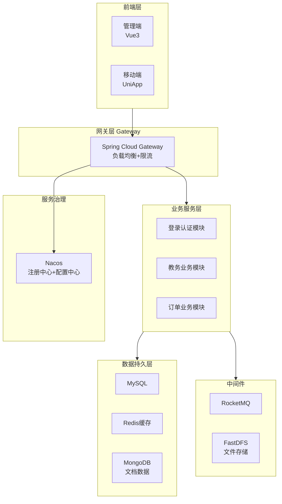
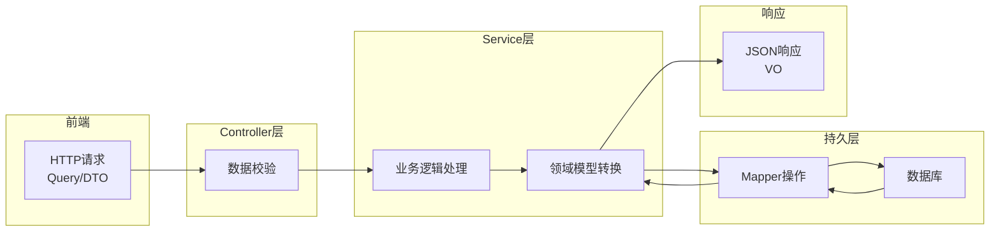

# Java项目架构实战

## TL;DR

基于Spring Cloud Alibaba的分布式微服务架构，包含Nacos注册/配置中心、Gateway网关、MySQL/Redis/MongoDB数据层、消息队列等组件。重点讲解分层领域模型(DTO/VO/Query/DO)的数据流转过程。

---

## 一、项目整体架构

### 1.1 系统架构图



### 1.2 技术栈

| 分类 | 技术 |
|------|------|
| 微服务框架 | Spring Cloud Alibaba |
| 注册/配置中心 | Nacos |
| 网关 | Spring Cloud Gateway |
| 数据库 | MySQL 8.0 |
| 缓存 | Redis |
| 文档数据库 | MongoDB |
| 消息队列 | RocketMQ |
| 对象存储 | FastDFS |
| 构建工具 | Maven 3.6+ |
| 开发工具 | IDEA 2022+ |

### 1.3 服务器环境要求

- CentOS 8.6 / 阿里云龙蜥8
- JDK 1.8+
- Docker 容器环境
- MySQL / Redis / Nacos

---

## 二、分层领域模型

### 2.1 领域模型定义

根据阿里巴巴开发手册，数据流转涉及四大领域对象：

| 模型 | 名称 | 作用范围 | 说明 |
|------|------|----------|------|
| DO | Data Object | 持久层 | 与数据库表一一对应 |
| DTO | Data Transfer Object | 业务层 | 层间数据传输 |
| Query | Data Query Object | Controller→Service | 查询条件封装 |
| VO | View Object | Service→Controller | 返回前端的数据 |

### 2.2 数据流转流程



### 2.3 各层命名规范

**Controller层**：
- 查询方法：`getXxx` / `listXxx` / `pageXxx`
- 新增方法：`addXxx` / `saveXxx`
- 修改方法：`updateXxx` / `modifyXxx`
- 删除方法：`deleteXxx` / `removeXxx`

**Service层**：
- 单个查询：`getXxx`
- 列表查询：`listXxx`
- 分页查询：`pageXxx`

**DAO层**：
- 单一查询：`selectById`
- 列表查询：`selectList`
- 分页查询：`selectPage`

---

## 三、项目结构

```
EAMS/
├── docs/                  # 项目文档
├── eams-api/             # API接口定义模块
├── eams-common/          # 公共组件模块
├── eams-command/         # 公共配置/工具类
├── eams-domain/          # 领域模型定义
│   └── src/main/java/com/xxx/eams/xxx/
│       ├── dto/          # 数据传输对象
│       ├── query/        # 查询对象
│       └── vo/           # 视图对象
├── eams-gateway/        # 网关模块
├── eams-xx/             # 业务模块xx
└── pom.xml              # 父POM
```

### 3.1 包名规范

基础包名：`com.${公司名}.${项目名}.${模块名}`

示例：
```
com.zerotask.eams.common   # 公共模块
com.zerotask.eams.system  # 系统模块
com.zerotask.eams.edu    # 教育模块
```

---

## 四、快速开发流程

### 4.1 创建业务模块步骤

1. **定义API接口** - 在`eams-api`模块定义接口
2. **定义领域模型** - 在`eams-domain`模块定义DTO/Query/VO
3. **创建业务模块** - 复制现有模块修改
4. **实现业务逻辑** - Controller实现API接口
5. **配置Nacos** - 服务注册到Nacos
6. **配置Swagger** - 生成API文档

### 4.2 代码生成

使用MyBatis-Plus Generator生成基础代码：

```xml
<!-- pom.xml配置插件 -->
<plugin>
    <groupId>com.zerotask</groupId>
    <artifactId>mybatisplus-generator</artifactId>
</plugin>
```

执行生成：
```bash
mvn mybatisplus:generator -Dmodule=业务模块名 -Dtable=表名
```

### 4.3 自动填充

利用MyBatis-Plus的MetaObjectHandler实现自动填充：

```java
@Component
public class MybatisPlusMetaObjectHandler implements MetaObjectHandler {

    @Override
    public void insertFill(MetaObject metaObject) {
        this.strictInsertFill(metaObject, "createTime",
            LocalDateTime.class, LocalDateTime.now());
        this.strictInsertFill(metaObject, "updateTime",
            LocalDateTime.class, LocalDateTime.now());
    }

    @Override
    public void updateFill(MetaObject metaObject) {
        this.strictUpdateFill(metaObject, "updateTime",
            LocalDateTime.class, LocalDateTime.now());
    }
}
```

---

## 五、关键配置

### 5.1 Nacos服务配置

```yaml
spring:
  cloud:
    nacos:
      discovery:
        server-addr: 127.0.0.1:8848
        namespace: dev
      config:
        server-addr: 127.0.0.1:8848
        namespace: dev
        file-extension: yml
```

### 5.2 数据源配置

```yaml
spring:
  datasource:
    type: com.alibaba.druid.pool.DruidDataSource
    driver-class-name: com.mysql.cj.jdbc.Driver
    url: jdbc:mysql://localhost:3306/eams?useUnicode=true
    username: root
    password: xxx
```

---

## 六、验证码集成

### 6.1 引入依赖

```xml
<dependency>
    <groupId>com.anji</groupId>
    <artifactId>aptcha-spring-boot-starter</artifactId>
</dependency>
```

### 6.2 配置

```yaml
captcha:
  cache-type: redis
  redis:
    host: localhost
    port: 6379
```

### 6.3 聚合网关（Spring Doc）

当微服务数量增多时，通过聚合网关统一访问各服务的Swagger文档：

```yaml
spring:
  doc:
    swagger-ui:
      paths: /v3/api-docs/*
```

启动后可通过单一入口切换查看不同微服务的API文档。

---

## 六、MapStruct对象转换

### 6.1 依赖引入

```xml
<dependency>
    <groupId>org.mapstruct</groupId>
    <artifactId>mapstruct</artifactId>
</dependency>
<dependency>
    <groupId>org.mapstruct</groupId>
    <artifactId>mapstruct-processor</artifactId>
</dependency>
```

### 6.2 转换接口定义

```java
@Mapper(componentModel = "spring")
public interface SimpleConvertMapper {

    // DO -> DTO
    SimpleDTO toDTO(SimpleDO entity);

    // DTO -> DO (新增时使用)
    SimpleDO toEntity(AddSimpleDTO dto);

    // DTO -> DO (修改时使用)
    SimpleDO toEntity(UpdateSimpleDTO dto);
}
```

### 6.3 使用示例

```java
@Autowired
private SimpleConvertMapper convertMapper;

// 查询结果转换
Page<SimpleDTO> result = baseMapper.selectPage(page, wrapper);
return PageUtil.convertPage(result, convertMapper::toDTO);
```

> **注意**：MapStruct在编译期生成转换代码，性能优于BeanUtils反射方式

---

## 七、Validation校验

### 7.1 实体类注解

```java
@Data
public class AddXXXDTO {

    @NotBlank(message = "名称不能为空")
    private String name;

    @Range(min = 0, max = 1, message = "性别只能是0或1")
    private Integer gender;

    @Min(value = 0, message = "年龄不能为负数")
    @Max(value = 150, message = "年龄不能超过150")
    private Integer age;
}
```

### 7.2 Controller使用

```java
@PostMapping("/xxx")
public JsonVO<XXXVO> add(@Valid @RequestBody AddXXXDTO dto) {
    return JsonVO.success(xxxService.add(dto));
}
```

### 7.3 全局异常处理

```java
@RestControllerAdvice
public class GlobalExceptionHandler {

    @ExceptionHandler(MethodArgumentNotValidException.class)
    public JsonVO<Void> handleValidException(MethodArgumentNotValidException e) {
        String message = e.getBindingResult().getFieldError().getDefaultMessage();
        return JsonVO.fail(message);
    }
}
```

---

## 常见坑与边界

### 1. 配置相关

- **Maven settings.xml**：必须使用项目提供的settings.xml，否则无法从阿里云制品库下载依赖
- **Nacos端口**：控制台8848，GRPC通讯9848，防火墙需放行
- **JDK版本**：必须是JDK 8，JDK 11+可能存在兼容性问题
- **resource目录颜色**：IDEA中resource目录颜色不对会导致配置不生效

### 2. 领域模型转换

- **MapStruct vs BeanUtils**：使用MapStruct在编译期生成转换代码，性能优于反射（BeanUtils）
- **Query对象**：超过2个参数必须封装为Query对象，使用Map无法维护且不可读

### 3. 服务注册

- **namespace ID vs namespace名称**：配置中使用的是ID不是名称，容易混淆
- **服务名称**：微服务名称在Nacos中必须唯一

### 4. 代码生成

- **ID策略**：非自增表需手动指定雪花算法 `@TableId(type = IdType.ASSIGN_ID)`
- **自动填充**：需要同时在实体类注解和MetaObjectHandler中配置才能生效

### 5. 验证码集成

- **Redis依赖**：验证码插件需要Redis支持
- **二次校验**：需要配合前端才能完整测试

---

## References

- [Spring Cloud Alibaba 官方文档](https://spring.io/projects/spring-cloud-alibaba)
- [阿里巴巴Java开发手册](https://github.com/alibaba/AlibabaJavaDeveloperCodeStandard)
- [MyBatis-Plus 官方文档](https://baomidou.com/)
- [Nacos 官方文档](https://nacos.io/)
- [Captcha 验证码插件](https://gitee.com/anji-plus/captcha)
