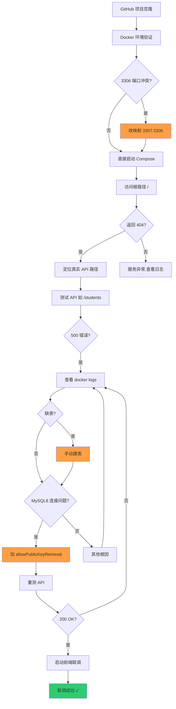

# WSL2 + Docker Compose 部署 Spring Boot 全流程复盘

## TL;DR

本文记录从 GitHub 克隆 Spring Boot 项目到 WSL2 环境，通过 Docker Compose 部署后端 + MySQL，并解决端口冲突、数据库连接、缺表等坑点，最终实现前后端联调成功的完整流程。企业级核心经验：端口冲突改映射、日志定位根因、MySQL8 连接参数配置、override 文件隔离配置。

## 背景与问题定义

在 WSL2 环境下部署一个 GitHub 上的 Spring Boot + MySQL 项目，预期目标是：
- 后端服务可通过 HTTP API 访问
- 前端能正常联调后端接口

实际遇到的核心问题：
1. 宿主机 3306 端口被占用
2. MySQL8 认证握手失败（Public Key Retrieval is not allowed）
3. 仓库无 SQL 脚本，需手动建表
4. API 路径定位与调试

## 核心机制拆解

### 1. WSL2 + Docker Desktop 集成验证

```bash
# 验证 Docker 是否可用
docker run --rm hello-world
```

> [!tip] Docker Desktop 已开启 WSL 集成时，WSL 内直接使用 docker 命令

### 2. 项目克隆与结构定位

```bash
git clone <repo-url>
# 定位 pom.xml 和源码目录
# pom.xml 在根目录，源码在 src/main/java
```

### 3. Docker Compose 端口冲突解决

**问题**：宿主机 3306 已被占用，报错 `0.0.0.0:3306 cannot be exposed`

**企业级做法**：不抢占系统端口，改用端口映射

```yaml
# compose.override.yml
services:
  mysql:
    ports:
      - "3307:3306"  # 宿主机用 3307，容器内仍 3306
```

> [!tip] 使用 override 文件避免污染源配置，便于 git pull 后不冲突

### 4. API 路径定位

项目首页 `/` 返回 404 是正常现象（未配置首页路由），真实 API 路径需定位 Controller：

```bash
# 在源码目录 grep 查找 @RequestMapping
grep -r "@RequestMapping" src/
```

定位到 `@RequestMapping("/students")`，正确测试路径为 `GET /students`

### 5. 缺表问题处理

仓库无 SQL 脚本时，根据 Entity + Mapper 手工建表：

```sql
CREATE TABLE student (
  id BIGINT PRIMARY KEY AUTO_INCREMENT,
  name VARCHAR(100),
  -- 根据实体字段补充
  created_at TIMESTAMP DEFAULT CURRENT_TIMESTAMP
);
```

### 6. MySQL8 连接问题根因定位与修复

**报错**：500 Internal Server Error，日志显示 `Public Key Retrieval is not allowed`

**根因**：MySQL8 默认使用 `caching_sha2_password` 认证插件，Java JDBC 需额外参数

**修复**：在 JDBC URL 中添加参数

```yaml
# compose.override.yml
services:
  app:
    environment:
      SPRING_DATASOURCE_URL: "jdbc:mysql://mysql:3306/student_db?useSSL=false&allowPublicKeyRetrieval=true"
```

> [!warning] `allowPublicKeyRetrieval=true` 仅开发环境使用，生产需配置正确证书

## 常见坑与边界

| 坑点 | 症状 | 解决方案 |
|------|------|----------|
| 端口 3306 占用 | `0.0.0.0:3306 cannot be exposed` | 改映射端口 3307:3306 |
| / 返回 404 | 首页未配置路由 | 非服务挂了，定位真实 API |
| /students 500 | 日志显示缺表或认证失败 | 先 `docker logs` 定位根因 |
| MySQL8 连接失败 | `Public Key Retrieval is not allowed` | URL 加 `allowPublicKeyRetrieval=true` |
| git pull 后配置丢失 | 改动了源 docker-compose.yml | 用 override 文件隔离 |

## 企业级最佳实践

1. **端口冲突优先改映射**：不抢系统端口，避免影响其他服务
2. **500 必看日志**：`docker logs <container>` 是定位根因的唯一可靠方式
3. **MySQL8 连接参数**：
   ```java
   jdbc:mysql://host:3306/db?useSSL=false&allowPublicKeyRetrieval=true&serverTimezone=UTC
   ```
4. **配置隔离**：用 `compose.override.yml` 覆盖配置，源文件保持不变
5. **SQL 脚本管理**：即使是小型项目，也应预留 `init.sql` 避免手工建表

## 后续资产化建议

- [ ] 编写 `README_DEPLOY_WSL_DOCKER.md` 一页纸部署指南
- [ ] 将 `compose.override.yml` 纳入项目（需 `.gitignore` 忽略敏感信息）
- [ ] 添加 `init.sql` 建表脚本，一键初始化数据库
- [ ] 考虑编写 Makefile 或 Shell 脚本封装部署命令

## References

- Docker Compose 官方文档：https://docs.docker.com/compose/
- MySQL8 JDBC 连接参数：https://dev.mysql.com/doc/connector-j/8.0/en/connector-j-reference-configuration-properties.html
- Spring Boot Docker 最佳实践：https://spring.io/guides/gs/spring-boot-docker/

## 流程全景图



## 关键命令速查

```bash
# 1. Docker 验证
docker run --rm hello-world

# 2. 启动服务（带 override）
docker compose up -d

# 3. 查看日志
docker logs <container-name>
docker logs -f <container-name>

# 4. 进入容器
docker exec -it <container-name> bash

# 5. 测试 API
curl http://localhost:8080/students

# 6. 端口检查
netstat -tlnp | grep 3306
ss -tlnp | grep 3306
```
