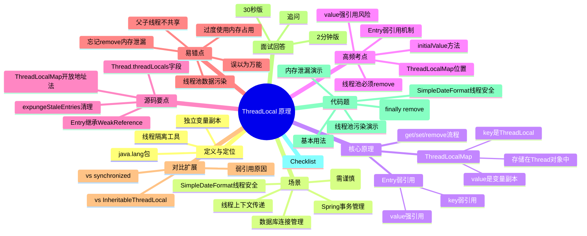

# ThreadLocal 原理

> [!summary] TL;DR
> - 一句话定义：为每个线程提供独立变量副本的工具类，实现线程隔离
> - 面试一句话结论：ThreadLocal 通过 ThreadLocalMap 为每个线程存储独立副本，避免同步开销
> - 关键点：ThreadLocalMap / 弱引用 Entry / 内存泄漏风险 / 必须 remove()
> - 常见坑：忘记 remove() 导致内存泄漏、线程池场景下数据污染

---

## 1. 定义与定位
- **它是什么**：Java 并发工具类，为每个线程提供独立的变量副本，实现线程间数据隔离
- **解决什么问题**：避免多线程共享变量的同步开销，同时保证线程安全
- **在体系中的位置**：java.lang 包，与 synchronized、volatile、Lock 并列的并发解决方案

---

## 2. 应用场景
- 场景 1：**线程上下文传递**（如用户身份、请求 ID、事务信息）
- 场景 2：**数据库连接管理**（每个线程持有独立的 Connection）
- 场景 3：**SimpleDateFormat 线程安全**（SimpleDateFormat 非线程安全，用 ThreadLocal 包装）
- 场景 4：**Spring 事务管理**（TransactionSynchronizationManager 使用 ThreadLocal 存储事务状态）
- 不适用：**线程池场景需谨慎**（线程复用会导致数据污染，必须手动 remove()）

---

## 3. 核心原理（面试够用版）
> [!note] 先给结论，再解释"怎么做到"
- **核心机制**（3-7 条要点）：
  1) 每个 Thread 对象内部持有一个 **ThreadLocalMap** 成员变量
  2) ThreadLocalMap 是一个定制的 HashMap，key 是 ThreadLocal 对象，value 是线程的变量副本
  3) ThreadLocal 的 get/set 方法通过当前线程获取其 ThreadLocalMap，然后存取数据
  4) Entry 使用 **弱引用**（WeakReference）持有 ThreadLocal 对象，防止 ThreadLocal 无法回收
  5) 但 value 是强引用，如果不手动 remove()，可能导致**内存泄漏**

### 3.1 关键流程（用步骤描述）
**set 流程**：
1. 获取当前线程 Thread.currentThread()
2. 获取线程的 ThreadLocalMap（threadLocals 字段）
3. 如果 map 为 null，创建新的 ThreadLocalMap
4. 以 ThreadLocal 对象为 key，存入 value

**get 流程**：
1. 获取当前线程的 ThreadLocalMap
2. 以 ThreadLocal 对象为 key 查找 Entry
3. 如果找到，返回 value；否则调用 initialValue() 初始化

**remove 流程**：
1. 获取当前线程的 ThreadLocalMap
2. 移除以 ThreadLocal 对象为 key 的 Entry

### 3.2 关键数据结构/概念
- **ThreadLocalMap**：Thread 类的成员变量，每个线程独有
- **Entry**：ThreadLocalMap 的内部类，继承 WeakReference<ThreadLocal<?>>
- **弱引用 key**：Entry 的 key（ThreadLocal）是弱引用，value 是强引用
- **开放地址法**：ThreadLocalMap 使用线性探测解决哈希冲突（不是链表）

---

## 4. 关键细节清单（高频考点）
- 考点 1：**ThreadLocalMap 存储在 Thread 对象中**，不是 ThreadLocal 中
- 考点 2：**Entry 的 key 是弱引用**，GC 时可以回收 ThreadLocal 对象
- 考点 3：**value 是强引用**，如果不 remove()，线程不销毁则 value 不会回收
- 考点 4：**线程池场景必须 remove()**，否则线程复用会导致数据污染和内存泄漏
- 考点 5：**initialValue() 方法**用于设置初始值，默认返回 null

---

## 5. 源码/实现要点
> [!tip] 目标：回答"源码层面为什么是这样"
- **关键类/组件**：
  - Thread 类：持有 `ThreadLocal.ThreadLocalMap threadLocals` 字段
  - ThreadLocal 类：提供 get/set/remove 方法
  - ThreadLocalMap 类：定制的 HashMap，使用开放地址法
  - Entry 类：`static class Entry extends WeakReference<ThreadLocal<?>>`
- **关键方法/流程**：
  - `ThreadLocal.get()`：获取当前线程的 map，然后查找 Entry
  - `ThreadLocal.set(T value)`：获取当前线程的 map，然后存入 Entry
  - `ThreadLocalMap.getEntry(ThreadLocal<?> key)`：线性探测查找
  - `ThreadLocalMap.set(ThreadLocal<?> key, Object value)`：线性探测插入，触发 rehash
- **关键策略**：
  - **弱引用 key**：防止 ThreadLocal 对象无法回收
  - **开放地址法**：ThreadLocalMap 不使用链表，而是线性探测（性能更好）
  - **expungeStaleEntries**：清理 key 为 null 的 Entry（弱引用被回收后）
- **实现细节的面试说法**：ThreadLocal 本身不存储数据，数据存在每个线程的 ThreadLocalMap 中。Entry 的 key 用弱引用持有 ThreadLocal，防止 ThreadLocal 无法回收；但 value 是强引用，需要手动 remove() 避免内存泄漏

---

## 6. 易错点与陷阱（至少 5 条）
1) **忘记 remove() 导致内存泄漏**：线程池场景下，线程不销毁，value 无法回收
2) **线程池数据污染**：线程复用时，上一个任务的 ThreadLocal 数据可能被下一个任务读到
3) **误以为 ThreadLocal 是线程安全的万能药**：ThreadLocal 只解决线程隔离，不解决共享变量同步
4) **父子线程无法共享**：ThreadLocal 数据不会传递给子线程（需要用 InheritableThreadLocal）
5) **过度使用导致内存占用**：每个 ThreadLocal 变量都会在每个线程中占用空间
6) **initialValue() 只调用一次**：第一次 get() 时调用，后续 get() 不会再调用（除非 remove() 后再 get()）
7) **弱引用 key 被回收后 value 仍存在**：虽然 key 被回收，但 value 仍是强引用，需要 expungeStaleEntries 清理

---

## 7. 对比与扩展（至少 2 组）
- **ThreadLocal vs synchronized**：
  - 机制：ThreadLocal 是线程隔离（每个线程独立副本），synchronized 是互斥锁（共享变量同步）
  - 性能：ThreadLocal 无锁，性能更好；synchronized 有锁竞争
  - 适用场景：ThreadLocal 适合线程上下文传递，synchronized 适合共享资源保护
- **ThreadLocal vs InheritableThreadLocal**：
  - 继承性：ThreadLocal 不传递给子线程，InheritableThreadLocal 可以传递
  - 实现：InheritableThreadLocal 使用 Thread.inheritableThreadLocals 字段
  - 适用场景：需要父子线程共享数据时用 InheritableThreadLocal
- **扩展问题**：为什么 Entry 的 key 用弱引用？
  - 防止 ThreadLocal 对象无法回收。如果 key 是强引用，即使外部没有引用 ThreadLocal，线程的 ThreadLocalMap 仍持有引用，导致 ThreadLocal 无法回收

---

## 8. 标准面试回答（可直接背）
### 8.1 30 秒版本（电梯回答）
> [!quote]
> ThreadLocal 为每个线程提供独立的变量副本，实现线程隔离。原理是每个 Thread 对象内部持有一个 ThreadLocalMap，key 是 ThreadLocal 对象，value 是变量副本。Entry 的 key 用弱引用防止 ThreadLocal 无法回收，但 value 是强引用，必须手动 remove() 避免内存泄漏。线程池场景下必须 remove()，否则线程复用会导致数据污染。

### 8.2 2 分钟版本（结构化展开）
> [!quote]
> 1) 定义：ThreadLocal 是 Java 并发工具类，为每个线程提供独立变量副本，避免同步开销。
> 2) 场景：线程上下文传递（用户身份、请求 ID）、数据库连接管理、SimpleDateFormat 线程安全。
> 3) 原理：每个 Thread 对象持有 ThreadLocalMap，ThreadLocal 的 get/set 方法通过当前线程获取 map 并存取数据。Entry 的 key 是弱引用（ThreadLocal），value 是强引用（变量副本）。
> 4) 易错点：忘记 remove() 导致内存泄漏、线程池数据污染、误以为能解决所有并发问题。
> 5) 对比：ThreadLocal 是线程隔离，synchronized 是互斥锁；InheritableThreadLocal 可传递给子线程。

### 8.3 深挖追问（面试官继续问什么）
- **追问 1**：为什么 Entry 的 key 用弱引用？
  - 回答：防止 ThreadLocal 对象无法回收。如果 key 是强引用，即使外部没有引用 ThreadLocal，线程的 ThreadLocalMap 仍持有引用，导致内存泄漏
- **追问 2**：为什么还会内存泄漏？
  - 回答：虽然 key 是弱引用，但 value 是强引用。如果线程不销毁（如线程池），value 无法回收，导致内存泄漏。必须手动 remove()
- **追问 3**：线程池场景如何正确使用 ThreadLocal？
  - 回答：在 finally 块中调用 remove()，确保任务结束后清理数据，避免下一个任务读到脏数据

---

## 9. 代码题与代码示例（必须有详注）
> [!important] 要求：代码必须清晰注释，解释关键点与坑点

### 9.1 面试代码题（2-3 题）
- 题 1：演示 ThreadLocal 的基本用法（set/get/remove）
- 题 2：演示线程池场景下忘记 remove() 导致的数据污染
- 题 3：用 ThreadLocal 实现线程安全的 SimpleDateFormat

### 9.2 参考代码（Java）
```java
import java.text.SimpleDateFormat;
import java.util.Date;
import java.util.concurrent.ExecutorService;
import java.util.concurrent.Executors;

public class ThreadLocalDemo {

    // 示例 1：基本用法
    // 目标：演示 ThreadLocal 如何为每个线程提供独立副本
    private static ThreadLocal<Integer> threadLocal = ThreadLocal.withInitial(() -> 0);

    public static void basicUsage() {
        // 线程 1
        new Thread(() -> {
            threadLocal.set(100);
            System.out.println("Thread 1: " + threadLocal.get()); // 100
        }).start();

        // 线程 2
        new Thread(() -> {
            threadLocal.set(200);
            System.out.println("Thread 2: " + threadLocal.get()); // 200
        }).start();

        // 主线程
        System.out.println("Main: " + threadLocal.get()); // 0（初始值）
        // 关键点：每个线程看到的值都是独立的，互不影响
    }

    // 示例 2：线程池场景下的数据污染（常见坑）
    // 原因：线程池复用线程，如果不 remove()，上一个任务的数据会被下一个任务读到
    private static ThreadLocal<String> userContext = new ThreadLocal<>();

    public static void threadPoolPollution() {
        ExecutorService executor = Executors.newFixedThreadPool(1); // 只有 1 个线程

        // 任务 1：设置用户为 Alice
        executor.submit(() -> {
            userContext.set("Alice");
            System.out.println("Task 1: " + userContext.get()); // Alice
            // 坑：忘记 remove()
        });

        // 任务 2：期望用户为空，但实际读到 Alice（数据污染）
        executor.submit(() -> {
            System.out.println("Task 2: " + userContext.get()); // Alice（脏数据！）
            // 正确做法：在 finally 中 remove()
        });

        executor.shutdown();
    }

    // 示例 3：正确使用 ThreadLocal（在 finally 中 remove）
    public static void correctUsage() {
        ExecutorService executor = Executors.newFixedThreadPool(2);

        for (int i = 0; i < 5; i++) {
            final int taskId = i;
            executor.submit(() -> {
                try {
                    // 设置任务 ID
                    userContext.set("Task-" + taskId);
                    // 执行业务逻辑
                    System.out.println(Thread.currentThread().getName() + ": " + userContext.get());
                } finally {
                    // 关键：必须在 finally 中 remove()，确保清理
                    userContext.remove();
                }
            });
        }

        executor.shutdown();
    }

    // 示例 4：用 ThreadLocal 实现线程安全的 SimpleDateFormat
    // 原因：SimpleDateFormat 非线程安全，多线程共享会出错
    // 解决方案：每个线程持有独立的 SimpleDateFormat 实例
    private static ThreadLocal<SimpleDateFormat> dateFormat =
        ThreadLocal.withInitial(() -> new SimpleDateFormat("yyyy-MM-dd HH:mm:ss"));

    public static String formatDate(Date date) {
        // 每个线程获取自己的 SimpleDateFormat 实例，线程安全
        return dateFormat.get().format(date);
    }

    // 示例 5：演示内存泄漏风险
    // 场景：线程池 + 大对象 + 忘记 remove()
    private static ThreadLocal<byte[]> largeData = new ThreadLocal<>();

    public static void memoryLeakDemo() {
        ExecutorService executor = Executors.newFixedThreadPool(10);

        for (int i = 0; i < 100; i++) {
            executor.submit(() -> {
                // 每个任务存储 10MB 数据
                largeData.set(new byte[10 * 1024 * 1024]);
                // 坑：忘记 remove()
                // 结果：10 个线程各持有 10MB，共 100MB 无法回收
                // 即使任务结束，线程不销毁，数据仍在内存中
            });
        }

        executor.shutdown();
        // 正确做法：在 finally 中调用 largeData.remove()
    }

    // 示例 6：InheritableThreadLocal（父子线程共享）
    private static InheritableThreadLocal<String> inheritableContext = new InheritableThreadLocal<>();

    public static void inheritableDemo() {
        inheritableContext.set("Parent Value");

        new Thread(() -> {
            // 子线程可以读到父线程的值
            System.out.println("Child: " + inheritableContext.get()); // Parent Value
        }).start();

        // 注意：InheritableThreadLocal 在线程池场景下也有坑
        // 因为线程池的线程不是每次都新建，无法继承最新的父线程值
    }

    public static void main(String[] args) {
        // 测试基本用法
        basicUsage();

        // 测试线程池数据污染
        threadPoolPollution();

        // 测试正确用法
        correctUsage();

        // 测试 SimpleDateFormat 线程安全
        System.out.println(formatDate(new Date()));

        // 测试 InheritableThreadLocal
        inheritableDemo();
    }
}
```

---

## 10. 复习 Checklist（可勾选）
- [ ] 我能用一句话定义 ThreadLocal（线程隔离、独立副本）
- [ ] 我能说出 2-3 个典型场景（线程上下文、数据库连接、SimpleDateFormat）
- [ ] 我能解释 ThreadLocalMap 的存储位置（Thread 对象中）
- [ ] 我能指出至少 5 个坑（忘记 remove、线程池污染、内存泄漏等）
- [ ] 我能写出正确使用 ThreadLocal 的代码（try-finally-remove）
- [ ] 我能解释为什么 Entry 的 key 用弱引用

---

## 11. Mermaid 思维导图（Obsidian 可渲染）


---

## 参考与建议（可选）
- 官方/规范：JDK ThreadLocal 源码（java.lang.ThreadLocal）
- 经典资料：《Java 并发编程实战》第 3 章 - 对象的共享
- 高质量站点：JavaGuide ThreadLocal 详解、美团技术博客 ThreadLocal 内存泄漏分析
