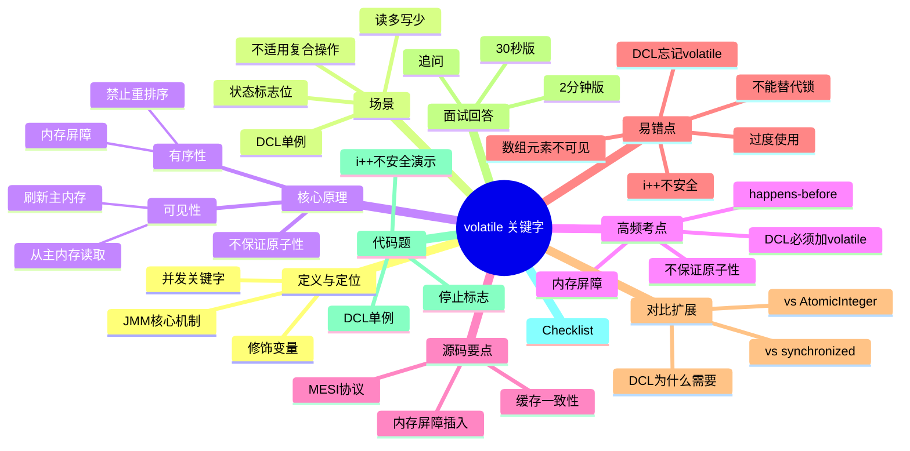

# volatile 关键字

> [!summary] TL;DR
> - 一句话定义：Java 并发关键字，保证变量的可见性和有序性（禁止重排序）
> - 面试一句话结论：volatile 解决可见性和有序性，但不保证原子性
> - 关键点：内存屏障 / happens-before / 不适合复合操作
> - 常见坑：误以为 volatile 能保证线程安全（i++ 不安全）

---

## 1. 定义与定位
- **它是什么**：Java 并发编程中的轻量级同步机制，修饰变量
- **解决什么问题**：解决多线程下变量的可见性和有序性问题
- **在体系中的位置**：JMM（Java Memory Model）的核心机制之一，与 synchronized、Lock 并列

---

## 2. 应用场景
- 场景 1：状态标志位（如 `volatile boolean running`，一个线程写，多个线程读）
- 场景 2：双重检查锁定（DCL）中的单例对象引用（防止指令重排序）
- 场景 3：读多写少的共享变量（如配置项）
- 不适用：复合操作（如 i++）、需要原子性的场景（应用 AtomicInteger 或 synchronized）

---

## 3. 核心原理（面试够用版）
> [!note] 先给结论，再解释"怎么做到"
- **核心机制**（3-7 条要点）：
  1) **可见性**：写 volatile 变量会立即刷新到主内存，读 volatile 变量会从主内存读取最新值
  2) **有序性**：禁止指令重排序（通过内存屏障实现）
  3) **不保证原子性**：volatile 只保证单次读/写的原子性，不保证复合操作（如 i++）
  4) **happens-before 规则**：对 volatile 变量的写操作 happens-before 后续的读操作
  5) **内存屏障**：编译器和 CPU 会在 volatile 读写前后插入内存屏障指令

### 3.1 关键流程（用步骤描述）
1. 线程 A 写 volatile 变量 → 触发 StoreLoad 屏障 → 刷新到主内存
2. 线程 B 读 volatile 变量 → 触发 LoadLoad 屏障 → 从主内存读取
3. 保证线程 B 能看到线程 A 的最新写入

### 3.2 关键数据结构/概念
- **工作内存 vs 主内存**：每个线程有自己的工作内存（缓存），volatile 强制与主内存同步
- **内存屏障**：LoadLoad、LoadStore、StoreLoad、StoreStore 四种屏障
- **happens-before**：JMM 定义的偏序关系，保证可见性

---

## 4. 关键细节清单（高频考点）
- 考点 1：volatile 保证可见性和有序性，但不保证原子性
- 考点 2：volatile 写操作 happens-before 后续读操作（JMM 规则）
- 考点 3：volatile 通过内存屏障禁止重排序
- 考点 4：volatile 不能替代锁（复合操作不安全）
- 考点 5：DCL 单例必须用 volatile 修饰实例变量（防止半初始化对象）

---

## 5. 源码/实现要点
> [!tip] 目标：回答"源码层面为什么是这样"
- **关键类/组件**：JVM 层面实现，涉及 C++ 代码和 CPU 指令
- **关键方法/流程**：字节码层面无特殊指令，但 JVM 会在 volatile 读写处插入内存屏障
- **关键策略**：
  - **内存屏障**：volatile 写后插入 StoreLoad 屏障，volatile 读前插入 LoadLoad 屏障
  - **缓存一致性协议**：底层依赖 MESI 等协议保证多核 CPU 缓存一致性
- **实现细节的面试说法**：volatile 通过内存屏障和缓存一致性协议，保证写操作立即对其他线程可见，并禁止编译器和 CPU 重排序

---

## 6. 易错点与陷阱（至少 5 条）
1) **误以为 volatile 保证原子性**：`volatile int i; i++;` 不是线程安全的（i++ 是三步操作：读-改-写）
2) **忘记 DCL 单例加 volatile**：不加 volatile 可能导致其他线程看到半初始化对象
3) **过度使用 volatile**：volatile 有性能开销（内存屏障），不要滥用
4) **volatile 不能替代锁**：复杂的同步逻辑仍需 synchronized 或 Lock
5) **volatile 数组只保证引用可见**：`volatile int[] arr` 只保证 arr 引用可见，不保证数组元素可见
6) **误以为 volatile 能解决所有并发问题**：volatile 只是轻量级同步，不能替代完整的同步机制

---

## 7. 对比与扩展（至少 2 组）
- **volatile vs synchronized**：
  - 粒度：volatile 修饰变量，synchronized 修饰方法/代码块
  - 原子性：volatile 不保证，synchronized 保证
  - 性能：volatile 更轻量，synchronized 有锁开销
  - 适用场景：volatile 适合状态标志，synchronized 适合复合操作
- **volatile vs AtomicInteger**：
  - 原子性：volatile 不保证，AtomicInteger 通过 CAS 保证
  - 适用场景：volatile 适合读多写少，AtomicInteger 适合计数器
- **扩展问题**：为什么 DCL 单例必须用 volatile？
  - 因为 `instance = new Singleton()` 不是原子操作，可能重排序为：分配内存 → 赋值引用 → 初始化对象，导致其他线程看到未初始化的对象

---

## 8. 标准面试回答（可直接背）
### 8.1 30 秒版本（电梯回答）
> [!quote]
> volatile 是 Java 并发关键字，保证变量的可见性和有序性。可见性指写操作立即刷新到主内存，读操作从主内存读取；有序性指通过内存屏障禁止重排序。但 volatile 不保证原子性，i++ 这种复合操作不安全。常用于状态标志位和 DCL 单例。

### 8.2 2 分钟版本（结构化展开）
> [!quote]
> 1) 定义：volatile 是 Java 并发关键字，修饰变量，保证可见性和有序性。
> 2) 场景：状态标志位（一写多读）、DCL 单例、读多写少的共享变量。
> 3) 原理：通过内存屏障实现，写操作刷新到主内存，读操作从主内存读取，禁止重排序。遵循 happens-before 规则。
> 4) 易错点：不保证原子性（i++ 不安全）、DCL 必须加 volatile、不能替代锁。
> 5) 对比：比 synchronized 轻量但功能弱，适合简单场景；AtomicInteger 通过 CAS 保证原子性，适合计数器。

### 8.3 深挖追问（面试官继续问什么）
- **追问 1**：为什么 volatile 不保证原子性？
  - 回答：volatile 只保证单次读/写的可见性，但 i++ 是三步操作（读-改-写），中间可能被其他线程打断
- **追问 2**：volatile 的内存屏障是什么？
  - 回答：内存屏障是 CPU 指令，禁止指令重排序。volatile 写后插入 StoreLoad 屏障，读前插入 LoadLoad 屏障
- **追问 3**：DCL 单例为什么必须用 volatile？
  - 回答：`new Singleton()` 可能重排序为"分配内存 → 赋值引用 → 初始化"，导致其他线程看到未初始化对象。volatile 禁止重排序

---

## 9. 代码题与代码示例（必须有详注）
> [!important] 要求：代码必须清晰注释，解释关键点与坑点

### 9.1 面试代码题（2-3 题）
- 题 1：为什么 `volatile int i; i++;` 不是线程安全的？
- 题 2：实现一个线程安全的 DCL 单例
- 题 3：用 volatile 实现一个停止线程的标志位

### 9.2 参考代码（Java）
```java
public class VolatileDemo {

    // 示例 1：volatile 不保证原子性（i++ 不安全）
    // 原因：i++ 是三步操作：1) 读取 i  2) i+1  3) 写回 i
    // 多线程下，步骤 1 和 3 之间可能被其他线程打断，导致丢失更新
    static volatile int counter = 0;

    public static void unsafeIncrement() {
        for (int i = 0; i < 1000; i++) {
            counter++; // 不安全！虽然 counter 是 volatile
        }
    }

    // 示例 2：DCL 单例（必须用 volatile）
    // 关键点：volatile 防止指令重排序，避免其他线程看到半初始化对象
    static class Singleton {
        // 必须用 volatile！否则可能出现半初始化对象
        private static volatile Singleton instance;

        private Singleton() {}

        public static Singleton getInstance() {
            if (instance == null) { // 第一次检查（无锁）
                synchronized (Singleton.class) {
                    if (instance == null) { // 第二次检查（有锁）
                        // 关键：new Singleton() 可能重排序为：
                        // 1) 分配内存
                        // 2) instance 指向内存（此时对象未初始化）
                        // 3) 初始化对象
                        // volatile 禁止 2 和 3 重排序
                        instance = new Singleton();
                    }
                }
            }
            return instance;
        }
    }

    // 示例 3：用 volatile 实现线程停止标志
    // 场景：一个线程写 running，另一个线程读 running 并决定是否停止
    static volatile boolean running = true;

    public static void stopThread() {
        new Thread(() -> {
            while (running) {
                // 执行任务
                // volatile 保证能及时看到 running 的变化
            }
            System.out.println("线程停止");
        }).start();

        // 主线程修改 running
        try { Thread.sleep(1000); } catch (InterruptedException e) {}
        running = false; // volatile 保证立即对其他线程可见
    }

    // 示例 4：演示 volatile 不保证原子性
    public static void main(String[] args) throws InterruptedException {
        // 启动 10 个线程，每个线程执行 1000 次 counter++
        Thread[] threads = new Thread[10];
        for (int i = 0; i < 10; i++) {
            threads[i] = new Thread(VolatileDemo::unsafeIncrement);
            threads[i].start();
        }

        // 等待所有线程结束
        for (Thread t : threads) {
            t.join();
        }

        // 期望：10000，实际：小于 10000（因为 volatile 不保证原子性）
        System.out.println("Counter: " + counter); // 可能输出 9876（丢失更新）

        // 正确做法：使用 AtomicInteger 或 synchronized
    }
}
```

---

## 10. 复习 Checklist（可勾选）
- [ ] 我能用一句话定义 volatile（可见性 + 有序性）
- [ ] 我能说出 2-3 个典型场景（状态标志、DCL、读多写少）
- [ ] 我能解释为什么 volatile 不保证原子性
- [ ] 我能指出至少 5 个坑（i++ 不安全、DCL 必须加 volatile 等）
- [ ] 我能写出 DCL 单例代码
- [ ] 我能解释内存屏障和 happens-before

---

## 11. Mermaid 思维导图（Obsidian 可渲染）


---

## 参考与建议（可选）
- 官方/规范：Java Language Specification (JLS) 第 17 章 - Threads and Locks
- 经典资料：《Java 并发编程实战》第 3 章 - 对象的共享
- 高质量站点：JavaGuide volatile 详解、美团技术博客 Java 内存模型
