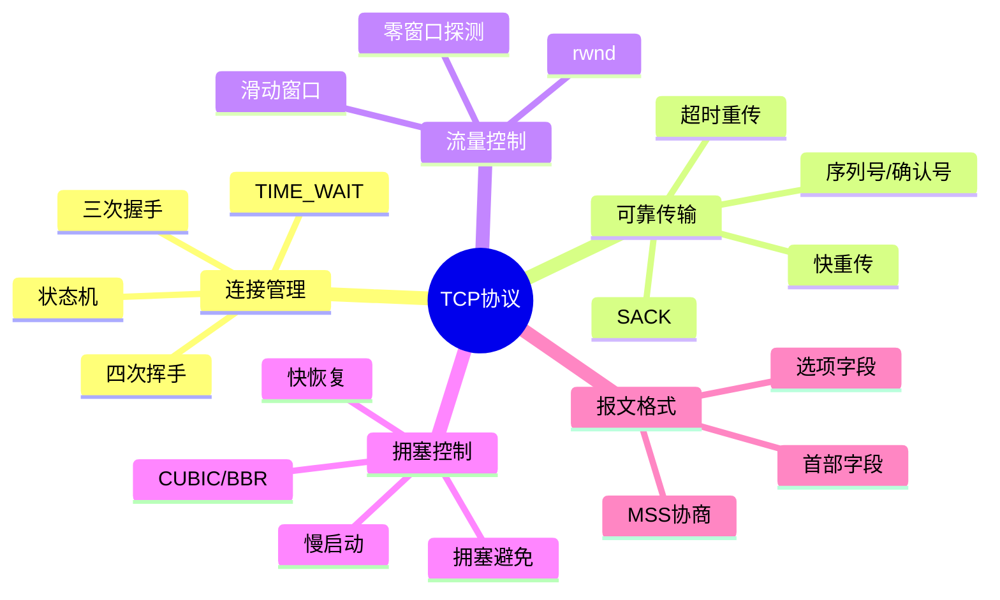

## TL;DR

- TCP 是面向连接的、可靠的、基于字节流的传输层协议
- 核心机制：三次握手、四次挥手、滑动窗口、拥塞控制、超时重传
- 面试高频：握手挥手状态机、TIME_WAIT、拥塞控制算法、粘包拆包

---

## 知识图谱

---

## 章节目录

| 章节 | 文件 | 核心内容 |
|------|------|----------|
| 1 | [[01-报文格式]] | 首部结构、标志位、选项字段 |
| 2 | [[02-三次握手]] | 连接建立、状态转换、SYN攻击 |
| 3 | [[03-四次挥手]] | 连接释放、TIME_WAIT、半关闭 |
| 4 | [[04-滑动窗口]] | 流量控制、零窗口、Nagle算法 |
| 5 | [[05-拥塞控制]] | 慢启动、AIMD、CUBIC、BBR |
| 6 | [[06-超时重传]] | RTO计算、快重传、SACK |
| 7 | [[practice-problems]] | 面试题 + 场景分析 |

---

## 学习路径

**建议顺序**：先理解报文格式，再学连接管理，最后深入可靠传输机制。

---

## 核心概念速查

| 概念 | 一句话解释 |
|------|-----------|
| MSS | 最大报文段长度，不含 TCP/IP 首部 |
| RTT | 往返时延，影响超时重传计算 |
| cwnd | 拥塞窗口，发送方维护 |
| rwnd | 接收窗口，接收方通告 |
| ssthresh | 慢启动阈值，区分慢启动和拥塞避免 |
| SACK | 选择性确认，提升重传效率 |

---

## 面试高频 TOP 5

1. **三次握手为什么不是两次？** → [[02-三次握手#为什么是三次]]
2. **TIME_WAIT 存在的意义？** → [[03-四次挥手#TIME_WAIT]]
3. **拥塞控制四大算法？** → [[05-拥塞控制]]
4. **TCP 如何保证可靠传输？** → [[06-超时重传]]
5. **粘包拆包怎么解决？** → [[01-报文格式#粘包拆包]]

---

## 关联笔记

- [[TCP拥塞控制]] - 已有详细笔记
- [[UDP协议]] - 对比学习
- [[HTTP协议]] - 应用层依赖
- [[Socket编程]] - 实践应用

---

## 参考资料

- RFC 793 - TCP 规范
- RFC 5681 - 拥塞控制
- 《TCP/IP 详解 卷1》
- 《计算机网络：自顶向下方法》第 3 章

---

## Checkpoint

> [!tip] 请确认
> 这是 TCP 协议学习库的总览（Chapter 1）。请检查：
> 1. 章节划分是否合理？
> 2. 是否需要增减章节？
> 3. 格式和结构是否符合预期？
>
> 确认后我将继续生成各章节内容。
