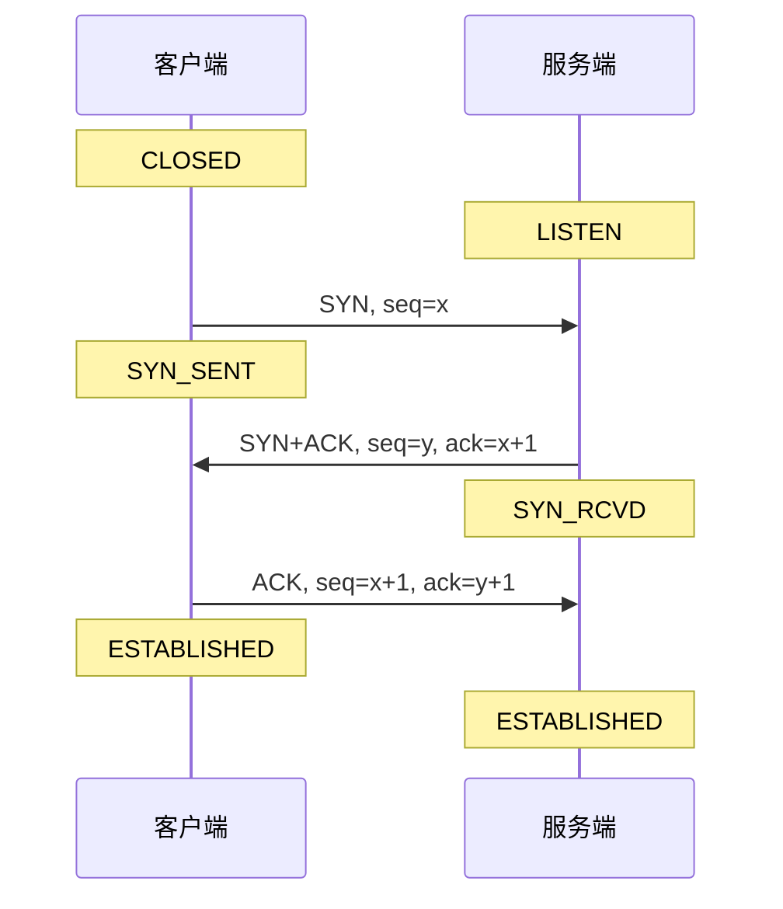
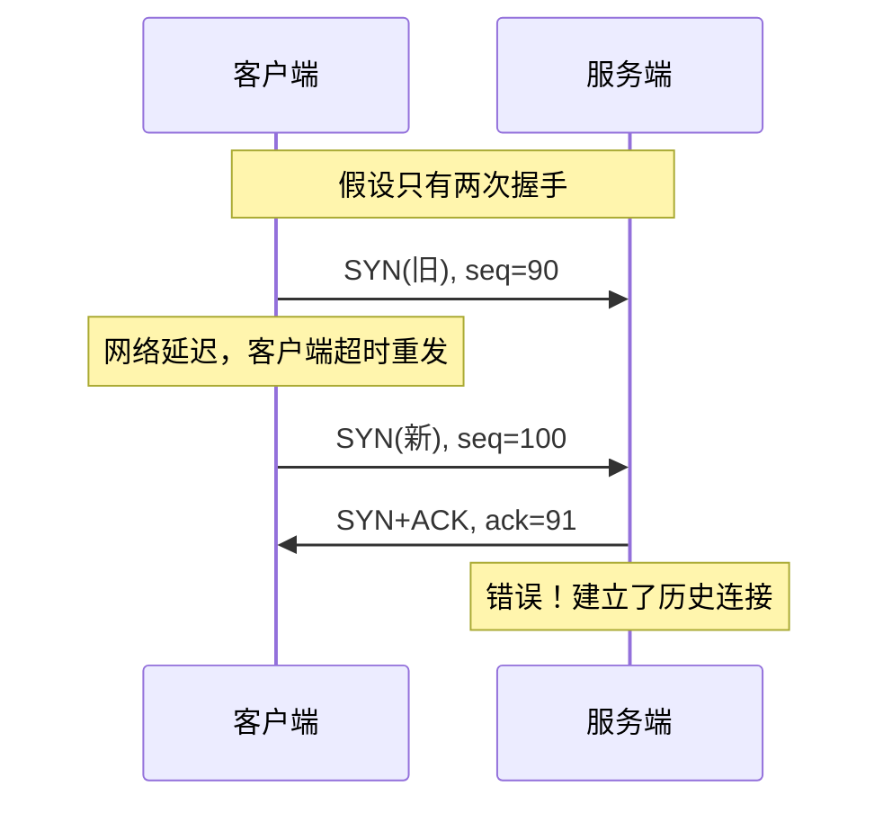
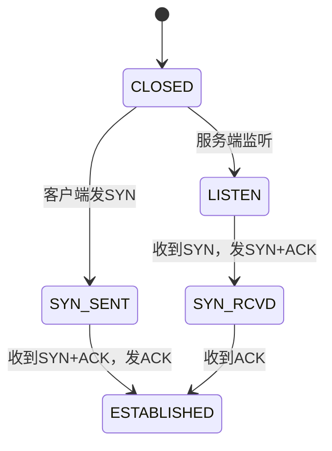

## TL;DR

- 三次握手建立 TCP 连接：SYN → SYN+ACK → ACK
- 目的：同步序列号、协商参数、防止历史连接
- 关键状态：CLOSED → SYN_SENT → ESTABLISHED

---

## 握手流程



---

## 详细步骤

### 第一次握手（客户端 → 服务端）

| 字段 | 值 |
|------|-----|
| SYN | 1 |
| seq | x（客户端 ISN） |

客户端发送 SYN 报文，进入 `SYN_SENT` 状态。

### 第二次握手（服务端 → 客户端）

| 字段 | 值 |
|------|-----|
| SYN | 1 |
| ACK | 1 |
| seq | y（服务端 ISN） |
| ack | x+1 |

服务端发送 SYN+ACK，进入 `SYN_RCVD` 状态。

### 第三次握手（客户端 → 服务端）

| 字段 | 值 |
|------|-----|
| ACK | 1 |
| seq | x+1 |
| ack | y+1 |

客户端发送 ACK，双方进入 `ESTABLISHED` 状态。

> [!tip] 第三次握手可携带数据
> ACK 报文可以携带应用层数据，减少一个 RTT。

---

## 为什么是三次

### 核心原因：防止历史连接



**三次握手解决方案**：
- 客户端收到 SYN+ACK 后检查 ack 值
- 发现 ack=91 不符合预期，发送 RST 拒绝

### 其他原因

1. **同步双方序列号**：需要双向确认（2+1=3）
2. **协商参数**：MSS、窗口缩放、SACK 等
3. **确认双方收发能力**：证明双向通信正常

---

## 状态机



---

## ISN 初始序列号

### 为什么要随机

1. **防止历史报文干扰**：避免旧连接的延迟报文被误认
2. **安全考虑**：防止 TCP 序列号预测攻击

### 生成算法

```
ISN = M + F(localhost, localport, remotehost, remoteport, secret)
```
- M：4 微秒递增计数器
- F：加密哈希函数

---

## SYN 攻击

### 原理

攻击者伪造大量 SYN 报文（随机源 IP），服务端：
1. 为每个 SYN 分配资源（半连接队列）
2. 发送 SYN+ACK 后等待 ACK
3. 永远收不到 ACK，资源耗尽

### 防护措施

| 措施 | 原理 |
|------|------|
| **SYN Cookie** | 不分配资源，将状态编码到 seq 中 |
| **增大半连接队列** | `net.ipv4.tcp_max_syn_backlog` |
| **减少重试次数** | `net.ipv4.tcp_synack_retries` |
| **防火墙限速** | 限制单 IP 的 SYN 速率 |

---

## 面试追问

**Q: 三次握手可以变成四次吗？**

> 可以，但没必要。第二次握手的 SYN+ACK 可以拆成两个报文，但会增加一个 RTT。

**Q: 第三次握手丢失会怎样？**

> 服务端停留在 SYN_RCVD，超时重传 SYN+ACK。客户端已进入 ESTABLISHED，发送数据时服务端会回复 RST。

**Q: 初始序列号为什么不从 0 开始？**

> 1）防止历史连接的延迟报文被误认；2）防止 TCP 序列号预测攻击。

---

## 知识网络

- [[00-overview|TCP 协议总览]]
- [[01-报文格式]]
- [[03-四次挥手]]

## References

- RFC 793 - TCP 规范 Section 3.4
- 《TCP/IP 详解 卷1》第 18 章
