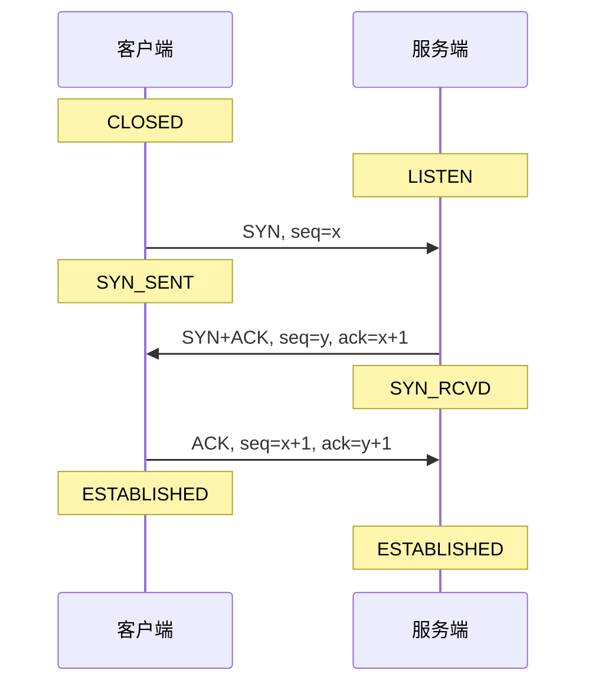

# TCP - 三次握手过程是什么

## 一句话结论
TCP 通过三次握手建立连接：SYN → SYN+ACK → ACK，目的是同步序列号、协商参数、防止历史连接。

## 标准回答
- **第一次握手**：客户端发送 SYN 包（seq=x），进入 SYN_SENT 状态
- **第二次握手**：服务端发送 SYN+ACK 包（seq=y, ack=x+1），进入 SYN_RCVD 状态
- **第三次握手**：客户端发送 ACK 包（seq=x+1, ack=y+1），进入 ESTABLISHED 状态
- 服务端收到 ACK 后也进入 ESTABLISHED 状态

## 为什么
TCP 是面向连接的可靠协议，需要在数据传输前建立连接。三次握手的核心目的是：
1. 同步双方的序列号
2. 协商连接参数
3. 防止过期连接请求导致错误建立

## 对比
| 握手 | 客户端 | 服务端 |
|---|---|---|
| 状态变化 | CLOSED → SYN_SENT → ESTABLISHED | LISTEN → SYN_RCVD → ESTABLISHED |
| 发送 | SYN, seq=x | SYN+ACK, seq=y, ack=x+1 |

## 流程图

```mermaid
sequenceDiagram
    participant C as 客户端
    participant S as 服务端

    Note over C: CLOSED
    Note over S: LISTEN

    C->>S: SYN, seq=x
    Note over C: SYN_SENT

    S->>C: SYN+ACK, seq=y, ack=x+1
    Note over S: SYN_RCVD

    C->>S: ACK, seq=x+1, ack=y+1
    Note over C: ESTABLISHED
    Note over S: ESTABLISHED
```

## 字段说明
| 字段 | 作用 |
|---|---|
| SYN | 连接建立标志 |
| seq | 序列号，ISN（初始序列号） |
| ack | 确认号 = 对方 seq + 1 |

## 易错点
- 为什么是三次而不是两次？
  - 两次握手无法防止历史连接（服务端无法确认客户端是否收到 SYN+ACK）
- ISN（初始序列号）为什么要随机？
  - 防止旧连接的数据被误认为新连接的数据
- 第三次握手时可以携带数据吗？
  - 可以，但第一次和第二次不行

## 延伸链接
- [[TCP - 四次挥手过程是什么]]
- [[TCP - TIME_WAIT 状态]]

## 参考来源
- RFC 793
- 《计算机网络：自顶向下方法》
