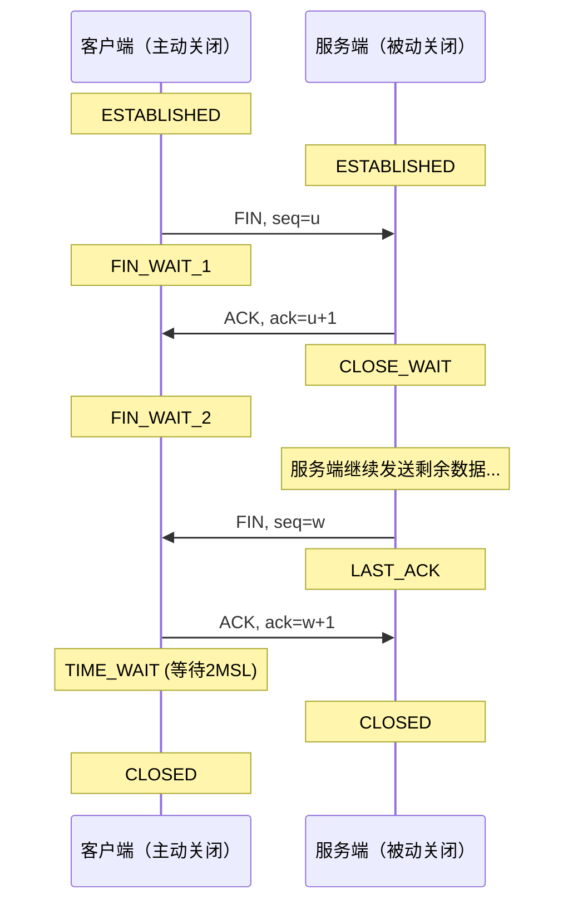
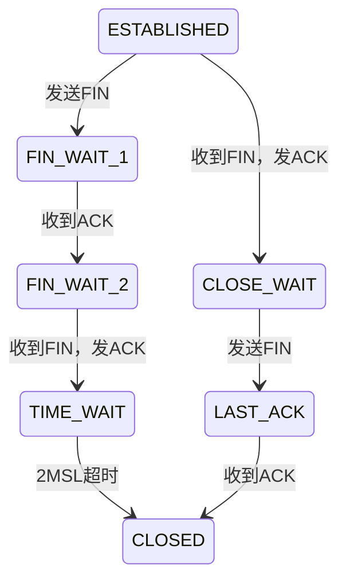

## TL;DR

- 四次挥手释放 TCP 连接：FIN → ACK → FIN → ACK
- TIME_WAIT 等待 2MSL 确保连接彻底关闭
- 关键状态：FIN_WAIT_1 → FIN_WAIT_2 → TIME_WAIT → CLOSED

---

## 挥手流程



---

## 详细步骤

### 第一次挥手（主动方 → 被动方）

| 字段 | 值 |
|------|-----|
| FIN | 1 |
| seq | u |

主动方发送 FIN，进入 `FIN_WAIT_1`，表示"我没有数据要发了"。

### 第二次挥手（被动方 → 主动方）

| 字段 | 值 |
|------|-----|
| ACK | 1 |
| ack | u+1 |

被动方确认 FIN，进入 `CLOSE_WAIT`。主动方进入 `FIN_WAIT_2`。

> [!warning] 半关闭状态
> 此时主动方 → 被动方方向已关闭，但被动方仍可发送数据。

### 第三次挥手（被动方 → 主动方）

| 字段 | 值 |
|------|-----|
| FIN | 1 |
| seq | w |

被动方发送完剩余数据后，发送 FIN，进入 `LAST_ACK`。

### 第四次挥手（主动方 → 被动方）

| 字段 | 值 |
|------|-----|
| ACK | 1 |
| ack | w+1 |

主动方确认 FIN，进入 `TIME_WAIT`，等待 2MSL 后关闭。

---

## 为什么是四次

**核心原因：TCP 是全双工协议**

- 关闭连接需要双向都确认
- 被动方收到 FIN 后可能还有数据要发送
- 不能像握手那样合并 SYN+ACK

| 对比 | 握手 | 挥手 |
|------|------|------|
| 第二步 | SYN+ACK 合并 | ACK 和 FIN 分开 |
| 原因 | 服务端无数据要发 | 被动方可能还有数据 |

> [!tip] 特殊情况：三次挥手
> 如果被动方没有数据要发，可以将 ACK 和 FIN 合并（延迟确认机制），变成三次挥手。

---

## TIME_WAIT 状态

### 为什么需要

1. **确保最后 ACK 到达**
   - 如果 ACK 丢失，被动方会重传 FIN
   - TIME_WAIT 期间可以重发 ACK

2. **等待旧报文消失**
   - 2MSL 确保本连接的所有报文从网络消失
   - 防止干扰后续新连接

### MSL 值

- MSL = Maximum Segment Lifetime（最大报文生存时间）
- Linux 默认 60 秒，2MSL = 120 秒
- 可通过 `net.ipv4.tcp_fin_timeout` 调整

### TIME_WAIT 过多问题

**症状**：
```bash
netstat -an | grep TIME_WAIT | wc -l
# 输出几万个连接
```

**原因**：高并发短连接（如 HTTP/1.0）

**解决方案**：

| 方案 | 配置 | 说明 |
|------|------|------|
| 复用 TIME_WAIT | `net.ipv4.tcp_tw_reuse=1` | 客户端复用连接 |
| 快速回收 | `net.ipv4.tcp_tw_recycle=1` | ⚠️ NAT 环境慎用 |
| 连接池 | 应用层实现 | 减少连接创建销毁 |
| 长连接 | HTTP/1.1 Keep-Alive | 减少挥手次数 |

---

## 状态机



---

## 常见异常状态

| 状态 | 原因 | 处理 |
|------|------|------|
| **CLOSE_WAIT 堆积** | 应用层未调用 close() | 检查代码，确保资源释放 |
| **FIN_WAIT_2 堆积** | 对方未发送 FIN | 设置 `tcp_fin_timeout` 超时 |
| **TIME_WAIT 过多** | 短连接高并发 | 连接池/长连接/复用 |

---

## 面试追问

**Q: 服务端出现大量 CLOSE_WAIT 怎么办？**

> CLOSE_WAIT 说明收到了客户端 FIN 但应用层未调用 close()。检查代码是否有连接泄漏，确保 finally 块中释放资源。

**Q: 为什么 TIME_WAIT 是 2MSL 而不是 1MSL？**

> 考虑最坏情况：最后一个 ACK 在快到达时丢失（接近 1MSL），对方重传 FIN 也需要 1MSL 到达，共 2MSL。

**Q: 能不能跳过 TIME_WAIT？**

> 可以设置 SO_LINGER 选项为 0，发送 RST 强制关闭。但可能导致数据丢失，不推荐。

---

## 知识网络

- [[00-overview|TCP 协议总览]]
- [[02-三次握手]]
- [[04-滑动窗口]]

## References

- RFC 793 - TCP 规范 Section 3.5
- 《TCP/IP 详解 卷1》第 18 章
