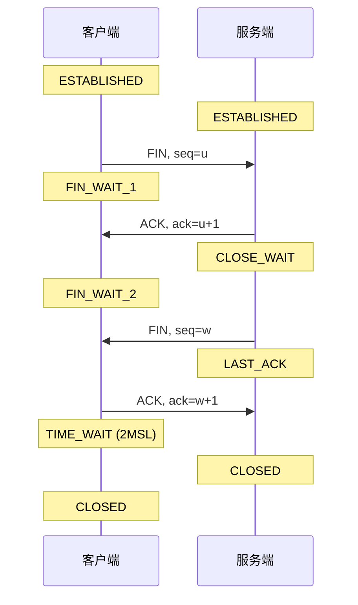

# TCP - 四次挥手过程是什么

## 一句话结论
TCP 通过四次挥手释放连接：FIN → ACK → FIN → ACK。主动关闭方会进入 TIME_WAIT 状态，等待 2MSL 确保连接彻底关闭。

## 标准回答
- **第一次挥手**：主动关闭方发送 FIN 包（seq=u），进入 FIN_WAIT_1 状态
- **第二次挥手**：被动关闭方发送 ACK 包（ack=u+1），进入 CLOSE_WAIT 状态
- **第三次挥手**：被动关闭方完成数据发送后，发送 FIN 包（seq=w），进入 LAST_ACK 状态
- **第四次挥手**：主动关闭方发送 ACK 包（ack=w+1），进入 TIME_WAIT 状态
- 等待 2MSL 后，双方进入 CLOSED 状态

## 为什么
TCP 是全双工通信，需要双方都关闭连接。四次挥手确保：
1. 双方数据都传输完毕
2. 被动关闭方收到确认
3. 防止旧数据被新连接误读

## 流程图

```mermaid
sequenceDiagram
    participant C as 客户端
    participant S as 服务端

    Note over C: ESTABLISHED
    Note over S: ESTABLISHED

    C->>S: FIN, seq=u
    Note over C: FIN_WAIT_1

    S->>C: ACK, ack=u+1
    Note over S: CLOSE_WAIT
    Note over C: FIN_WAIT_2

    S->>C: FIN, seq=w
    Note over S: LAST_ACK

    C->>S: ACK, ack=w+1
    Note over C: TIME_WAIT (2MSL)
    Note over S: CLOSED

    Note over C: CLOSED
```

## 状态对比
| 状态 | 角色 | 说明 |
|---|---|---|
| FIN_WAIT_1 | 主动关闭 | 已发送 FIN |
| FIN_WAIT_2 | 主动关闭 | 收到对方 ACK，等待 FIN |
| CLOSE_WAIT | 被动关闭 | 收到 FIN，已回复 ACK |
| LAST_ACK | 被动关闭 | 数据发完，准备关闭 |
| TIME_WAIT | 主动关闭 | 等待 2MSL |
| CLOSED | 双方 | 连接关闭 |

## 易错点
- 为什么是四次而不是三次？
  - 被动关闭方可能还有数据要发送，不能立即关闭
- TIME_WAIT 为什么要等 2MSL？
  - 确保被动关闭方收到最后的 ACK
  - 防止旧连接的数据被新连接误读
- 常见问题：服务器出现大量 CLOSE_WAIT 状态？
  - 代码问题：没有及时调用 socket.close()

## 延伸链接
- [[TCP - 三次握手过程]]
- [[TCP - TIME_WAIT 和 CLOSE_WAIT]]

## 参考来源
- RFC 793
- 《计算机网络：自顶向下方法》
