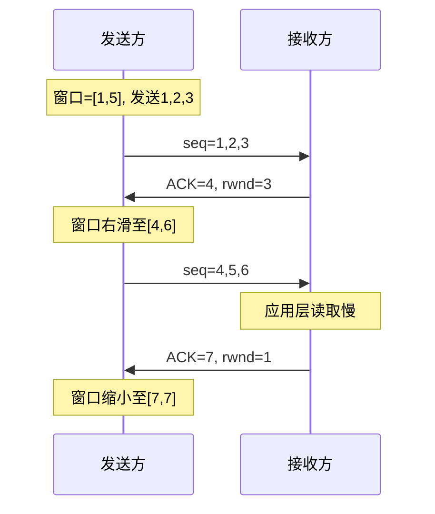

## TL;DR

- 滑动窗口实现流量控制，防止发送方压垮接收方
- 接收方通过 rwnd 通告可接收的数据量
- 发送窗口 = min(cwnd, rwnd)

---

## 流量控制 vs 拥塞控制

| 对比 | 流量控制 | 拥塞控制 |
|------|----------|----------|
| 目的 | 防止压垮**接收方** | 防止压垮**网络** |
| 控制变量 | rwnd（接收窗口） | cwnd（拥塞窗口） |
| 通告方 | 接收方 → 发送方 | 发送方自行估算 |
| 详见 | 本文 | [[05-拥塞控制]] |

**实际发送窗口 = min(cwnd, rwnd)**

---

## 窗口结构

### 发送方窗口

```
        已发送已确认    已发送未确认     可发送        不可发送
       ←──────────→←─────────────→←──────────→←────────────→
      [  已完成    |   在途数据   |  可用窗口  |   超出窗口   ]
                   ↑              ↑            ↑
               SND.UNA        SND.NXT     SND.UNA+SND.WND
```

| 指针 | 含义 |
|------|------|
| SND.UNA | 最早未确认的序列号 |
| SND.NXT | 下一个要发送的序列号 |
| SND.WND | 发送窗口大小 |

### 接收方窗口

```
        已接收已确认    可接收范围       不可接收
       ←──────────→←───────────────→←────────────→
      [  已完成    |   接收缓冲区   |   超出窗口   ]
                   ↑                ↑
               RCV.NXT         RCV.NXT+RCV.WND
```

| 指针 | 含义 |
|------|------|
| RCV.NXT | 期望接收的下一个序列号 |
| RCV.WND | 接收窗口大小（即 rwnd） |

---

## 窗口滑动过程



---

## 零窗口问题

### 场景

接收方缓冲区满，通告 rwnd=0，发送方停止发送。

### 问题

如果接收方的"窗口更新"报文丢失，双方陷入死锁。

### 解决：零窗口探测

```
发送方启动持续定时器（Persist Timer）
定时发送 1 字节探测报文
接收方回复当前 rwnd
```

探测间隔指数退避：1s → 2s → 4s → ... → 60s

---

## 糊涂窗口综合症

### 问题

接收方每次只腾出几个字节就通告，发送方频繁发送小报文，效率极低。

### 解决方案

**接收方**：Clark 算法
- 窗口 < min(MSS, 缓冲区/2) 时通告 rwnd=0
- 直到腾出足够空间再更新

**发送方**：Nagle 算法
- 小数据攒够再发，或等待 ACK 后再发
- 禁用：`TCP_NODELAY`（低延迟场景）

---

## Nagle 算法

### 规则

```
if 有未确认数据:
    缓存新数据，不立即发送
else:
    if 数据 >= MSS:
        立即发送
    else:
        等待 ACK 或凑够 MSS
```

### 适用场景

| 场景 | Nagle |
|------|-------|
| 批量传输 | ✅ 开启，减少小包 |
| 交互式应用（SSH/游戏） | ❌ 关闭，要求低延迟 |
| RPC 调用 | ❌ 关闭，避免延迟 |

### 禁用方式

```c
int flag = 1;
setsockopt(sock, IPPROTO_TCP, TCP_NODELAY, &flag, sizeof(flag));
```

---

## 窗口缩放选项

### 问题

rwnd 字段只有 16 位，最大 65535 字节，高带宽链路不够用。

### 解决

三次握手时协商 Window Scale 选项：
```
实际窗口 = rwnd << scale_factor
scale_factor 最大 14，窗口最大 1GB
```

---

## 面试追问

**Q: 发送窗口和接收窗口大小相等吗？**

> 不一定。发送窗口 = min(cwnd, rwnd)，取决于拥塞控制和流量控制的共同约束。

**Q: 为什么需要 Nagle 算法？**

> 减少小包数量，提高带宽利用率。每个 TCP 报文至少 40 字节首部（IP+TCP），发送 1 字节数据效率只有 1/41。

**Q: Nagle 和延迟确认一起用会有什么问题？**

> 可能导致 200ms 延迟。发送方等 ACK，接收方等凑数据再 ACK，互相等待。解决：关闭其中一个。

---

## 知识网络

- [[00-overview|TCP 协议总览]]
- [[05-拥塞控制]]
- [[06-超时重传]]

## References

- RFC 793 - TCP 规范
- RFC 1122 - Nagle 算法
- 《TCP/IP 详解 卷1》第 20 章
