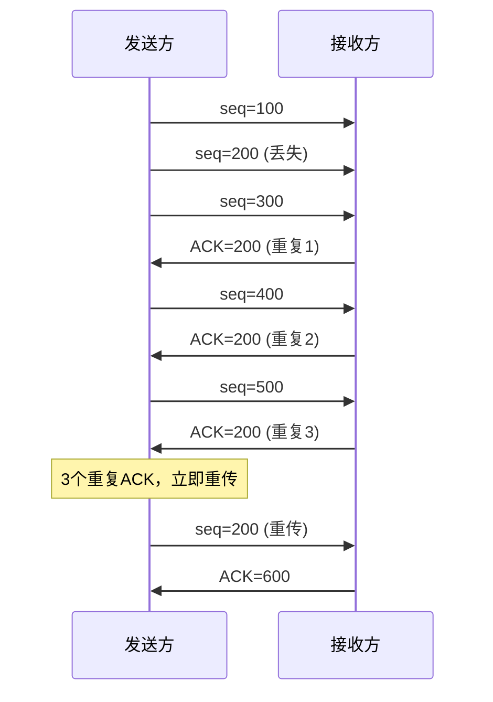

## TL;DR

- TCP 通过超时重传和快重传保证可靠传输
- RTO 动态计算，基于 RTT 测量
- SACK 选择性确认提升重传效率

---

## 重传机制概览

| 机制 | 触发条件 | 特点 |
|------|----------|------|
| **超时重传** | RTO 定时器到期 | 保底机制，延迟较高 |
| **快重传** | 收到 3 个重复 ACK | 快速响应，不等超时 |
| **SACK** | 选择性确认 | 精确指示丢失报文 |

---

## 超时重传

### RTO 计算（RFC 6298）

**核心公式**：

```
SRTT = (1 - α) × SRTT + α × RTT        // 平滑 RTT
RTTVAR = (1 - β) × RTTVAR + β × |SRTT - RTT|  // RTT 方差
RTO = SRTT + 4 × RTTVAR                // 超时时间
```

- α = 1/8，β = 1/4
- RTO 下限 1 秒，上限 60 秒

### 指数退避

```
第 1 次超时: RTO
第 2 次超时: 2 × RTO
第 3 次超时: 4 × RTO
...
直到达到上限或放弃
```

### Karn 算法

> [!warning] 重传二义性
> 重传后收到 ACK，无法确定是原报文还是重传报文的 ACK。

**解决**：重传的报文不参与 RTT 采样。

---

## 快重传

### 触发条件

收到 **3 个重复 ACK**（即连续 4 个相同 ACK）。

### 工作流程



### 为什么是 3 个

| 数量 | 问题 |
|------|------|
| 1-2 个 | 可能是乱序导致，不一定丢包 |
| 3 个 | 高概率丢包，立即重传 |

---

## SACK 选择性确认

### 问题

传统累积确认只能告知"期望的下一个字节"，无法表达"中间哪些收到了"。

### 解决

SACK 选项携带已收到的不连续数据块：

```
ACK=100, SACK=300-400, 500-600
表示：期望100，但300-400和500-600已收到
```

### 报文格式

```
+--------+--------+
| Kind=5 | Length |
+--------+--------+
| Left Edge 1     |
+-----------------+
| Right Edge 1    |
+-----------------+
| Left Edge 2     |
+-----------------+
| Right Edge 2    |
+-----------------+
```

最多 4 个 SACK 块（受 TCP 选项长度限制）。

### 优势

| 对比 | 无 SACK | 有 SACK |
|------|---------|---------|
| 丢包 1,3 | 重传 1,2,3... | 只重传 1,3 |
| 效率 | 低 | 高 |

---

## D-SACK

### 作用

报告**重复接收**的数据，帮助发送方判断：
- 是 ACK 丢失还是数据丢失
- 是否发生了不必要的重传

### 示例

```
收到 seq=100-200 两次
D-SACK: 100-200 (第一个块表示重复)
```

---

## 重传队列管理

### 发送方维护

```
重传队列: [未确认报文1, 未确认报文2, ...]
每个条目记录:
  - 序列号范围
  - 发送时间
  - 重传次数
  - 是否被 SACK 确认
```

### 确认处理

```
收到 ACK=N:
    移除 seq < N 的所有报文
收到 SACK=A-B:
    标记 A-B 范围报文为"已确认"，但不移除
    （等待累积 ACK 到达后移除）
```

---

## 常见问题与优化

### 伪重传

**原因**：RTT 突然增大导致 RTO 误判。

**解决**：
- Eifel 检测算法：用时间戳判断是否伪重传
- 伪重传后恢复 cwnd

### 尾部丢包

**问题**：最后几个包丢失，没有后续数据触发重复 ACK。

**解决**：
- 只能等待超时重传
- TLP（Tail Loss Probe）：发送探测包触发 ACK

---

## 面试追问

**Q: 没有 SACK 时如何知道哪些包丢了？**

> 只能通过超时或快重传，且必须重传从丢失点开始的所有数据（Go-Back-N）。效率较低。

**Q: RTO 设置过大或过小有什么问题？**

> 过大：丢包后等待时间长，吞吐量下降。过小：容易误判导致不必要重传，加剧拥塞。

**Q: 快重传和快恢复的关系？**

> 快重传是检测机制（3 个重复 ACK），快恢复是响应策略（ssthresh = cwnd/2，cwnd = ssthresh + 3）。

---

## 知识网络

- [[00-overview|TCP 协议总览]]
- [[04-滑动窗口]]
- [[05-拥塞控制]]

## References

- RFC 6298 - RTO 计算
- RFC 2018 - SACK
- RFC 2883 - D-SACK
