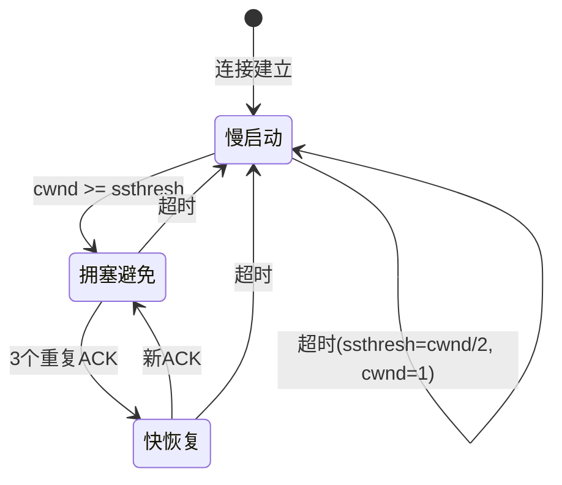

## TL;DR

- TCP 拥塞控制通过动态调整发送速率，避免网络过载
- 四大核心算法：慢启动、拥塞避免、快重传、快恢复
- 核心变量：cwnd（拥塞窗口）、ssthresh（慢启动阈值）
- 发送速率 = min(cwnd, rwnd) / RTT

---

## 背景与问题定义

> [!warning] 【需要人工复核】
> 以下内容未经 NotebookLM 来源验证，需人工核实

**为什么需要拥塞控制？**

网络是共享资源。当多个发送方同时发送大量数据时，中间路由器的缓冲区会溢出，导致：
1. 丢包率上升
2. 延迟剧增
3. 网络吞吐量反而下降（拥塞崩溃）

**拥塞 vs 流量控制的区别：**
- [[流量控制]]：防止发送方压垮**接收方**（基于 rwnd）
- [[拥塞控制]]：防止发送方压垮**网络**（基于 cwnd）

---

## 核心机制拆解

### 1. 慢启动（Slow Start）【C】

```
初始: cwnd = 1 MSS
每收到一个 ACK: cwnd = cwnd + 1 MSS
效果: 每个 RTT，cwnd 翻倍（指数增长）
终止条件: cwnd >= ssthresh 或 丢包
```

**核验关键词**: RFC 5681, slow start, initial window

### 2. 拥塞避免（Congestion Avoidance）【C】

```
当 cwnd >= ssthresh:
每收到一个 ACK: cwnd = cwnd + 1/cwnd MSS
效果: 每个 RTT，cwnd 增加 1 MSS（线性增长）
```

**核验关键词**: AIMD, additive increase

### 3. 快重传（Fast Retransmit）【C】

```
收到 3 个重复 ACK → 立即重传丢失的报文段
不等待超时定时器触发
```

**核验关键词**: duplicate ACK, fast retransmit, RFC 2581

### 4. 快恢复（Fast Recovery）【C】

```
收到 3 个重复 ACK 后:
  ssthresh = cwnd / 2
  cwnd = ssthresh + 3 MSS
  进入拥塞避免阶段（不回到慢启动）
```

**核验关键词**: fast recovery, NewReno, RFC 3782

---

## 状态机流程图



---

## 示例：cwnd 变化过程【C】

假设 ssthresh = 16 MSS：

| RTT | 阶段 | cwnd |
|-----|------|------|
| 1 | 慢启动 | 1 → 2 |
| 2 | 慢启动 | 2 → 4 |
| 3 | 慢启动 | 4 → 8 |
| 4 | 慢启动 | 8 → 16 |
| 5 | 拥塞避免 | 16 → 17 |
| 6 | 拥塞避免 | 17 → 18 |
| ... | 3×重复ACK | ssthresh=9, cwnd=12 |
| ... | 快恢复→拥塞避免 | 继续线性增长 |

---

## 常见坑与边界

> [!danger] 易混淆点

1. **慢启动不慢**：名字有误导，实际是指数增长，只是初始窗口小
2. **超时 vs 3×重复ACK**：超时更严重，回到 cwnd=1；重复ACK 进入快恢复
3. **cwnd 单位是字节还是 MSS**：RFC 规范用字节，教科书常用 MSS 简化
4. **rwnd 和 cwnd 的关系**：实际发送窗口 = min(cwnd, rwnd)

---

## 面试追问

1. **为什么用 3 个重复 ACK 而不是 1 个？**
   - 1-2 个可能是乱序导致，3 个基本确认丢包【C】

2. **TCP Tahoe vs Reno vs NewReno vs CUBIC 的区别？**
   - Tahoe：无快恢复，丢包就回慢启动
   - Reno：加入快恢复
   - NewReno：改进多包丢失场景
   - CUBIC：Linux 默认，基于三次函数，对高 BDP 友好【C】

3. **BBR 算法和传统算法有什么区别？**
   - 传统基于丢包感知拥塞，BBR 基于带宽和 RTT 建模【C】

---

## 术语表

| 术语 | 解释 |
|------|------|
| cwnd | Congestion Window，拥塞窗口 |
| rwnd | Receive Window，接收窗口 |
| ssthresh | Slow Start Threshold，慢启动阈值 |
| MSS | Maximum Segment Size，最大报文段长度 |
| RTT | Round-Trip Time，往返时延 |
| AIMD | Additive Increase Multiplicative Decrease |
| BDP | Bandwidth-Delay Product，带宽时延积 |

---

## References

> [!warning] 来源缺失
> 本笔记未从 NotebookLM 获取引用，所有内容均需人工复核

- 【待补充】RFC 5681 - TCP Congestion Control
- 【待补充】RFC 2581 - TCP Slow Start
- 【待补充】RFC 3782 - NewReno Modification
- 【待补充】《计算机网络：自顶向下方法》第 3 章

---

## 【需要人工复核】清单

| 条目 | 核验关键词 |
|------|-----------|
| 慢启动指数增长机制 | RFC 5681, initial window |
| 拥塞避免线性增长公式 | AIMD, cwnd increment |
| 快重传 3×ACK 阈值 | duplicate ACK threshold |
| 快恢复状态转换 | NewReno, RFC 3782 |
| Tahoe/Reno/CUBIC 对比 | TCP variants comparison |
| BBR 算法原理 | BBR, bottleneck bandwidth |

---

## 下一步 TODO

- [ ] 绑定包含 TCP 协议文档的 NotebookLM，重新同步获取引用
- [ ] 补充 RFC 5681 原文关键段落
- [ ] 添加 Wireshark 抓包示例
- [ ] 链接到 [[TCP三次握手]] [[TCP四次挥手]] [[滑动窗口]]
- [ ] 整理 CUBIC/BBR 单独笔记
