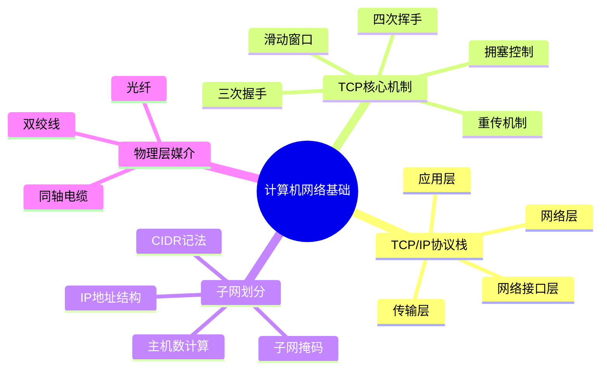
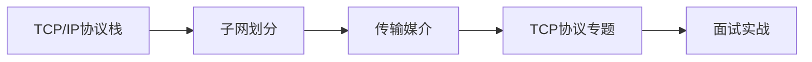

## TL;DR

- TCP/IP 四层模型是互联网通信的实际标准
- TCP 通过握手/挥手/重传/滑动窗口/拥塞控制保证可靠传输
- 子网划分通过 CIDR 灵活分配 IP 地址空间
- 物理层媒介决定传输距离和速度（双绞线→同轴电缆→光纤）

---

## 知识图谱

---

## 章节目录

| 章节 | 文件 | 核心内容 |
|------|------|----------|
| 1 | [[01-TCP-IP协议栈]] | 四层模型、各层职责、封装解封装 |
| 2 | [[02-子网划分]] | 掩码计算、CIDR、主机数公式 |
| 3 | [[03-传输媒介]] | 双绞线、同轴电缆、光纤对比 |
| 4 | [[../TCP协议/00-overview\|TCP协议专题]] | 握手挥手、重传、滑动窗口、拥塞控制 |

---

## 来源文档（19个）

| 类别 | 来源 |
|------|------|
| **TCP专题** | 小林coding《30张图解TCP》、JavaGuide《TCP三次握手》 |
| **教材** | 《计算机网络-自顶向下方法》第6版、《现代操作系统》第5版 |
| **算法/架构** | 《算法导论》第4版、《计算机体系结构》第6版 |
| **数据库/ML** | 《数据库系统概念》第6版、《模式识别与机器学习》 |
| **在线课程** | Coursera/edX 网络课程推荐 |
| **实用工具** | 爱快iKuai子网换算、CS自学指南 |

---

## 学习路径

---

## 关联笔记

- [[../TCP协议/00-overview|TCP 协议总览]]
- [[../TCP拥塞控制|TCP 拥塞控制]]

---

## References

^[1] 计算机网络-自顶向下方法-第6版
^[2-6] TCP/IP 分层模型相关
^[7-11] TCP 三次握手/四次挥手 (JavaGuide)
^[12-22] TCP 重传/滑动窗口/拥塞控制 (小林coding)
^[23-26] 子网划分 (爱快iKuai)
^[27] 传输媒介对比
