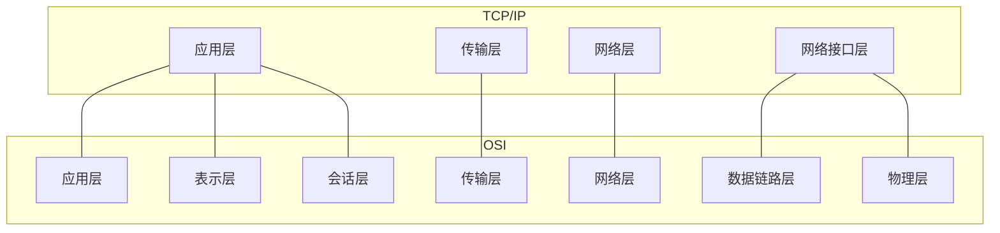
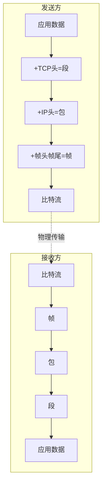

## TL;DR

- TCP/IP 四层模型是互联网的实际标准（vs OSI 七层理论模型）
- 各层职责明确：应用层处理程序、传输层保证可靠、网络层负责路由、接口层处理物理传输
- 数据发送时逐层封装，接收时逐层解封装

---

## 四层模型 vs OSI 七层

---

## 各层详解

### 1. 应用层 (Application Layer)

| 职责 | 直接为用户程序提供网络服务 |
|------|--------------------------|
| 核心协议 | HTTP、HTTPS、DNS、SMTP、FTP、SSH |
| 数据单位 | 报文 (Message) |

**作用**：处理特定的应用程序细节，如网页浏览、邮件发送^[1,2]

### 2. 传输层 (Transport Layer)

| 职责 | 端到端的进程通信 |
|------|-----------------|
| 核心协议 | TCP（可靠）、UDP（高效） |
| 数据单位 | 段 (Segment) |

**作用**：解决可靠性、顺序、错误校验问题^[1,3]

| 对比 | TCP | UDP |
|------|-----|-----|
| 连接 | 面向连接 | 无连接 |
| 可靠性 | 保证送达 | 尽力而为 |
| 场景 | HTTP/邮件 | DNS/视频 |

### 3. 网络层 (Network Layer)

| 职责 | 源到目的的路由选择 |
|------|-------------------|
| 核心协议 | IP、ICMP、ARP |
| 数据单位 | 包/数据报 (Packet/Datagram) |

**作用**：逻辑寻址（IP地址）+ 路径选择（路由）^[1,4]

### 4. 网络接口层 (Network Interface Layer)

| 职责 | 物理传输 |
|------|---------|
| 对应OSI | 数据链路层 + 物理层 |
| 数据单位 | 帧 (Frame) / 比特 (Bit) |

**作用**：MAC寻址 + 比特流与物理信号转换^[1,5]

---

## 封装与解封装

^[6]

---

## 分层的优势

> [!tip] 解耦设计
> 更换物理层介质（如铜线→光纤）时，只需更换物理设备，上层软件（浏览器、微信）完全不需要修改^[2]

---

## 面试追问

**Q: TCP/IP 和 OSI 模型的主要区别？**

> TCP/IP 是 4 层实用模型，OSI 是 7 层理论模型。TCP/IP 将 OSI 的应用/表示/会话层合并，将数据链路/物理层合并。

**Q: 为什么需要分层？**

> 1）各层独立演进，互不影响；2）便于标准化；3）降低复杂度；4）便于排错定位。

---

## 知识网络

- [[00-overview|网络基础总览]]
- [[02-子网划分]]
- [[../TCP协议/00-overview|TCP 协议专题]]

## References

^[1] 计算机网络-自顶向下方法-第6版
^[2-6] NotebookLM 引用
