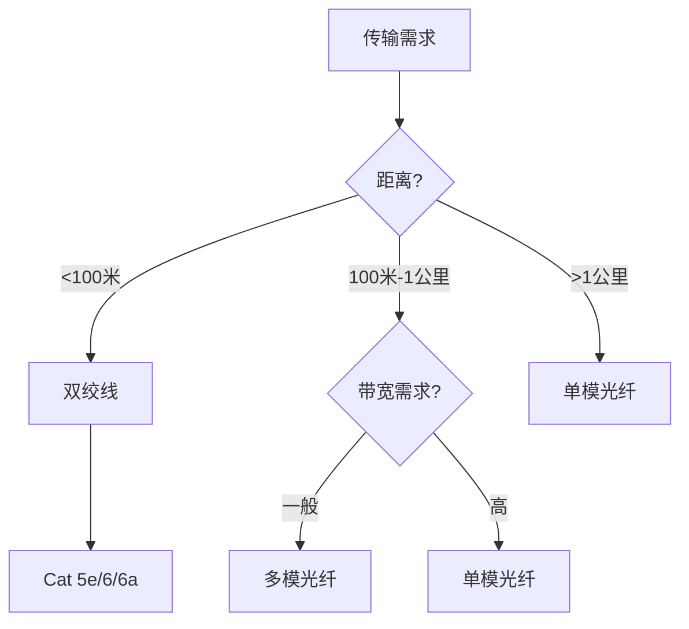

## TL;DR

- 双绞线：成本低、100米限制，局域网首选
- 同轴电缆：抗干扰强，早期以太网/有线电视
- 光纤：速度快、距离远，骨干网/数据中心首选

---

## 三种媒介对比

| 特性 | 双绞线 | 同轴电缆 | 光纤 |
|------|--------|----------|------|
| **传输介质** | 电信号 | 电信号 | 光信号 |
| **传输距离** | 100米 | 数公里 | 数十公里 |
| **带宽** | 高（Cat6a 10Gbps） | 中等 | 极高（100Gbps+） |
| **抗干扰** | 一般 | 较强 | 极强 |
| **成本** | 低 | 中 | 高 |
| **应用场景** | 办公室/家庭LAN | 有线电视 | 骨干网/数据中心 |

^[27]

---

## 1. 双绞线 (Twisted Pair)

### 结构

两根绝缘铜线扭绞在一起，扭绞可抵消电磁干扰。

### 分类

| 类别 | 带宽 | 速率 | 应用 |
|------|------|------|------|
| Cat 5 | 100MHz | 100Mbps | 已淘汰 |
| Cat 5e | 100MHz | 1Gbps | 家用主流 |
| Cat 6 | 250MHz | 1Gbps | 办公主流 |
| Cat 6a | 500MHz | 10Gbps | 数据中心 |
| Cat 7 | 600MHz | 10Gbps | 屏蔽型 |

### 接口

- **RJ-45**：标准以太网接口（8芯）
- 线序：T568A / T568B

### 限制

> [!warning] 100米限制
> 双绞线传输距离不超过 100 米，超过需加中继设备

---

## 2. 同轴电缆 (Coaxial Cable)

### 结构（由内向外）

```
┌─────────────────────────────┐
│  外护套（橡胶）              │
│  ┌─────────────────────┐   │
│  │ 屏蔽层（金属网）      │   │
│  │  ┌───────────────┐  │   │
│  │  │ 绝缘层（塑料） │  │   │
│  │  │  ┌─────────┐  │  │   │
│  │  │  │ 内导体  │  │  │   │
│  │  │  │ （铜线） │  │  │   │
│  │  │  └─────────┘  │  │   │
│  │  └───────────────┘  │   │
│  └─────────────────────┘   │
└─────────────────────────────┘
```

### 两种类型

| 类型 | 阻抗 | 用途 |
|------|------|------|
| 50Ω（基带） | 数字传输 | 早期以太网（已淘汰） |
| 75Ω（宽带） | 模拟传输 | 有线电视、广电宽带 |

### 接口

- **BNC**：旋转卡扣，早期网络/监控
- **F型**：螺旋拧入，电视机顶盒

### 历史

- **粗缆（10BASE5）**：500米，已淘汰
- **细缆（10BASE2）**：185米，已淘汰

---

## 3. 光纤 (Fiber Optics)

### 原理

利用**全反射**原理，光在玻璃纤芯中传输，不会泄漏。

### 结构

```
┌──────────────────┐
│   外护套         │
│  ┌────────────┐  │
│  │  包层      │  │
│  │ ┌────────┐ │  │
│  │ │ 纤芯   │ │  │
│  │ │（玻璃）│ │  │
│  │ └────────┘ │  │
│  └────────────┘  │
└──────────────────┘
```

### 两种类型

| 类型 | 纤芯直径 | 传输距离 | 外皮颜色 | 应用 |
|------|----------|----------|----------|------|
| **单模 (SMF)** | 9μm | 数十公里 | 黄色 | 运营商骨干网 |
| **多模 (MMF)** | 50μm+ | 数百米 | 橙色/水蓝 | 数据中心内部 |

### 关键设备

| 设备 | 说明 |
|------|------|
| **OLT** | 光线路终端，运营商机房 |
| **ONU/ONT** | 光猫，用户家中 |
| **光模块** | 插入交换机的光电转换模块 |

### 优势

> [!tip] 为什么光纤最快
> 1. 光速传输
> 2. 不受电磁干扰
> 3. 带宽极高（单根可达 Tbps 级）
> 4. 信号衰减小

---

## 选型建议



---

## 面试追问

**Q: 为什么局域网不用同轴电缆了？**

> 双绞线成本更低、更易布线、带宽足够。同轴电缆又硬又贵，升级潜力不如光纤。

**Q: 单模和多模光纤怎么选？**

> 看距离：数据中心内部（几百米）用多模，成本低；跨楼宇或城市骨干网用单模，距离远。

---

## 知识网络

- [[00-overview|网络基础总览]]
- [[01-TCP-IP协议栈]]
- [[02-子网划分]]

## References

^[27] 传输媒介对比 (NotebookLM)
