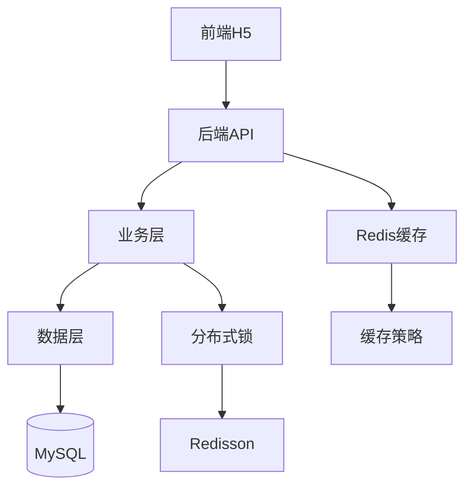

# hmdp-黑马点评 | 项目主页

## 1. 项目目标
- 用项目串联：登录鉴权、缓存、分布式锁、热点数据、消息队列、限流等高频面试点
- 形成可复用输出：面试回答 + 源码/架构画布
- 深入理解 Redis 在实际项目中的应用

**学习重点**：缓存策略、分布式锁、秒杀系统、会话管理

## 2. 本周里程碑
- [ ] 完成登录/鉴权模块梳理并输出面试回答
- [ ] 整理 Redis 缓存策略：穿透/击穿/雪崩 + 项目落地
- [ ] 梳理秒杀系统设计演进路径

## 3. 技术栈
- **后端**：Spring Boot 2.x、MyBatis-Plus
- **中间件**：Redis（缓存、分布式锁、消息队列）
- **数据库**：MySQL 8.0
- **工具**：Hutool、Redisson

## 4. 模块地图

**核心模块**：
- **用户模块**：短信登录、session共享、用户信息缓存
- **店铺模块**：店铺查询、缓存更新、地理位置
- **点评模块**：点评发布、点赞、Feed流
- **优惠券/秒杀模块**：库存扣减、分布式锁、异步秒杀
- **缓存与一致性模块**：缓存策略、缓存击穿/穿透/雪崩

## 5. 关键笔记索引

### 学习笔记
- [[20-项目实战/01-在做/hmdp-黑马点评/01-学习笔记/skill使用指南|Skill使用指南]]

### 源码分析
- [[20-项目实战/01-在做/hmdp-黑马点评/02-源码分析/数据库设计分析|数据库设计分析]]
- [[20-项目实战/01-在做/hmdp-黑马点评/02-源码分析/短信登录注册-Redis+Token方案|短信登录注册-Redis+Token方案]]
- [[20-项目实战/01-在做/hmdp-黑马点评/02-源码分析/秒杀系统六步进化-从单机到分布式|秒杀系统六步进化-从单机到分布式]]

### Canvas 可视化
- [[20-项目实战/01-在做/hmdp-黑马点评/02-源码分析/数据库架构图|数据库架构图]]
- [[20-项目实战/01-在做/hmdp-黑马点评/02-源码分析/数据流向图|数据流向图]]
- [[20-项目实战/01-在做/hmdp-黑马点评/02-源码分析/短信登录注册-Redis+Token方案|登录流程Canvas]]
- [[20-项目实战/01-在做/hmdp-黑马点评/02-源码分析/秒杀系统六步进化-从单机到分布式|秒杀系统Canvas]]

## 6. 踩坑索引（持续追加）

| 问题 | 解决方案 | 笔记链接 |
|------|---------|---------|
| Redis 缓存击穿问题 | 互斥锁 + 逻辑过期方案 | [[10-领域知识/01-计算机/Java/00-面试题库/缓存击穿问题与解决方案]] |
| _待补充_ | _待补充_ | _待补充_ |

## 7. 输出作品（可投递/可复习）

### 面试回答
- [[30-输出作品/01-面试回答/缓存击穿-面试题速查|缓存击穿-面试题速查]]

### 技术文章（待产出）
- [ ] Redis 缓存三大问题在实际项目中的应用
- [ ] 从单机到分布式：秒杀系统设计演进
- [ ] Spring Boot + Redis 实现分布式会话管理

## 8. 项目进度追踪

### 已完成功能
- ✅ 数据库设计分析
- ✅ 短信登录注册流程（Redis+Token）
- ✅ 秒杀系统设计（6个版本演进）
- ✅ 缓存击穿问题研究

### 进行中
- 🔄 整理知识点为面试回答
- 🔄 补充项目相关的知识卡

### 计划中
- [ ] Feed流设计与实现
- [ ] 地理位置功能（GEO）
- [ ] UV统计（HyperLogLog）
- [ ] 点赞功能（Set/Sorted Set）

## 9. 每周复盘（每周追加 3 行）

### 2026-02-01
- ✅ 本周做对了什么：完成了PKM系统v2.0重构，建立了完整的项目主页
- ❌ 本周卡住的点：Skill系统在重构中丢失，Canvas文件路径需要验证
- ▶ 下周最小行动：重建6个核心Skill，清空收集箱，产出2篇面试回答

---

## 🔗 快速导航

- [[01-导航索引/02-项目总览-MOC|返回项目总览]]
- [[10-领域知识/01-计算机/Java/Java-MOC|Java知识地图]]
- [[30-输出作品/01-面试回答/面试回答索引|面试回答总览]]
- [[01-导航索引/00-总仪表盘|返回总仪表盘]]
