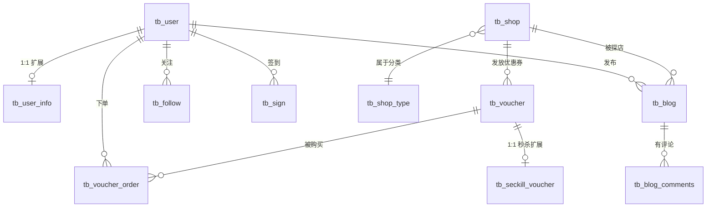

# 黑马点评 - 数据库设计分析

> 源文件: `hmdp.sql` | MySQL 5.6+ | 字符集: utf8mb4

## 数据库概览

| 表名 | 中文名 | 核心功能 | 记录数 |
|------|--------|----------|--------|
| `tb_user` | 用户表 | 用户基础信息、登录 | 5 |
| `tb_user_info` | 用户详情表 | 粉丝、积分、会员等级 | 0 |
| `tb_shop` | 商铺表 | 商铺信息、坐标、评分 | 14 |
| `tb_shop_type` | 商铺类型表 | 美食、KTV等分类 | 10 |
| `tb_blog` | 探店笔记表 | 用户发布的探店内容 | 4 |
| `tb_blog_comments` | 笔记评论表 | 评论、回复 | 0 |
| `tb_follow` | 关注表 | 用户关注关系 | 0 |
| `tb_voucher` | 优惠券表 | 代金券信息 | 1 |
| `tb_seckill_voucher` | 秒杀券表 | 秒杀库存、时间 | 0 |
| `tb_voucher_order` | 优惠券订单表 | 购买记录 | 0 |
| `tb_sign` | 签到表 | 用户签到记录 | 0 |

---

## ER 关系图 (Mermaid)

---

## 核心表详解

### 1. tb_user (用户表)

| 字段 | 类型 | 说明 |
|------|------|------|
| `id` | bigint(20) | 主键，自增 |
| `phone` | varchar(11) | 手机号，**唯一索引** |
| `password` | varchar(128) | 密码（加密存储） |
| `nick_name` | varchar(32) | 昵称 |
| `icon` | varchar(255) | 头像URL |

> [!note] Redis 关联点
> - 登录验证码: `login:code:{phone}` → 存验证码
> - 用户Token: `login:token:{token}` → 存用户信息 (Hash)

---

### 2. tb_shop (商铺表)

| 字段 | 类型 | 说明 |
|------|------|------|
| `id` | bigint(20) | 主键 |
| `name` | varchar(128) | 商铺名称 |
| `type_id` | bigint(20) | 关联 `tb_shop_type.id` |
| `x`, `y` | double | 经纬度坐标 |
| `avg_price` | bigint(10) | 人均价格（分） |
| `sold` | int(10) | 销量 |
| `score` | int(2) | 评分（×10存储，避免小数） |

> [!note] Redis 关联点
> - 商铺缓存: `cache:shop:{id}` → 存商铺JSON
> - 缓存穿透: 空值缓存 + 布隆过滤器
> - 缓存击穿: 互斥锁 / 逻辑过期
> - 附近商铺: `shop:geo:{typeId}` → GEO类型

---

### 3. tb_voucher + tb_seckill_voucher (优惠券)

**tb_voucher (基础信息)**
| 字段 | 类型 | 说明 |
|------|------|------|
| `id` | bigint(20) | 主键 |
| `shop_id` | bigint(20) | 关联商铺 |
| `pay_value` | bigint(10) | 支付金额（分） |
| `actual_value` | bigint(10) | 抵扣金额（分） |
| `type` | tinyint(1) | 0普通券，1秒杀券 |

**tb_seckill_voucher (秒杀扩展)**
| 字段 | 类型 | 说明 |
|------|------|------|
| `voucher_id` | bigint(20) | 主键，关联优惠券 |
| `stock` | int(8) | **库存** (高并发核心) |
| `begin_time` | timestamp | 秒杀开始时间 |
| `end_time` | timestamp | 秒杀结束时间 |

> [!warning] 高并发场景
> - 库存超卖: 乐观锁 (CAS) / Redis预扣库存
> - 一人一单: `seckill:order:{voucherId}` → Set存userId
> - 分布式锁: Redisson 实现

---

### 4. tb_blog (探店笔记)

| 字段 | 类型 | 说明 |
|------|------|------|
| `id` | bigint(20) | 主键 |
| `shop_id` | bigint(20) | 关联商铺 |
| `user_id` | bigint(20) | 发布用户 |
| `title` | varchar(255) | 标题 |
| `images` | varchar(2048) | 图片URL，逗号分隔 |
| `liked` | int(8) | 点赞数 |

> [!note] Redis 关联点
> - 点赞功能: `blog:liked:{blogId}` → SortedSet (时间戳排序)
> - Feed流推送: `feed:{userId}` → SortedSet (收件箱)

---

### 5. tb_follow (关注关系)

| 字段 | 类型 | 说明 |
|------|------|------|
| `user_id` | bigint(20) | 当前用户 |
| `follow_user_id` | bigint(20) | 被关注用户 |

> [!note] Redis 关联点
> - 共同关注: `follows:{userId}` → Set
> - 求交集: `SINTER follows:A follows:B`

---

## 设计亮点与注意事项

### 亮点
1. **金额存分**: `pay_value`, `actual_value` 用分存储，避免浮点精度问题
2. **评分×10**: `score` 存 37 表示 3.7 分，避免小数
3. **1:1扩展表**: `tb_user` + `tb_user_info` 分离冷热数据

### 注意事项
1. **无外键约束**: 依赖业务层保证一致性
2. **images字段**: 逗号分隔多图，查询时需Split处理
3. **时间戳默认值**: 需注意 MySQL 5.6 的 timestamp 限制

---

## Redis 数据结构对照表

| 业务场景 | Redis Key | 数据类型 | 存储内容 |
|----------|-----------|----------|----------|
| 验证码 | `login:code:{phone}` | String | 6位验证码 |
| 用户Token | `login:token:{token}` | Hash | 用户信息 |
| 商铺缓存 | `cache:shop:{id}` | String | 商铺JSON |
| 商铺类型 | `cache:shop-type` | String | 类型列表JSON |
| 秒杀库存 | `seckill:stock:{voucherId}` | String | 库存数量 |
| 一人一单 | `seckill:order:{voucherId}` | Set | 已购用户ID |
| 点赞记录 | `blog:liked:{blogId}` | ZSet | userId:时间戳 |
| 关注列表 | `follows:{userId}` | Set | 关注的用户ID |
| Feed收件箱 | `feed:{userId}` | ZSet | blogId:时间戳 |
| 附近商铺 | `shop:geo:{typeId}` | GEO | 经纬度坐标 |
| 用户签到 | `sign:{userId}:{yyyyMM}` | BitMap | 按天签到 |
| UV统计 | `uv:{yyyyMMdd}` | HyperLogLog | 用户访问 |
