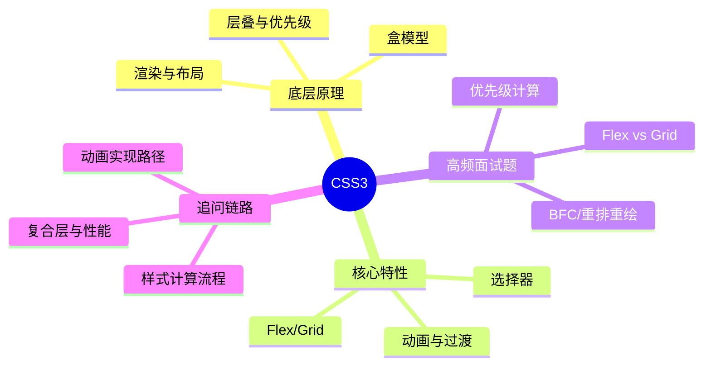

# Java 八股｜CSS3



## 核心概念

- 层叠规则决定最终样式。
- 选择器优先级影响覆盖关系。
- 盒模型决定尺寸与布局边界。
- Flex 解决一维布局，Grid 解决二维布局。
- 重排与重绘直接影响性能。

## 源码/机制复盘（文字流程）

1) 浏览器解析 CSS 生成 CSSOM。
2) DOM 与 CSSOM 合成渲染树。
3) 计算样式与布局，生成几何信息。
4) 绘制图层并提交合成器。
5) 动画可走合成层减少重排。

## 对比表

| 维度 | Flex | Grid |
| --- | --- | --- |
| 维度 | 一维 | 二维 |
| 适用场景 | 行/列对齐 | 网格布局 |
| 控制粒度 | 容器主轴/交叉轴 | 行列轨道 |

## 可运行 Java 示例

```java
public class CssSpecificityDemo {
    static int specificity(int id, int cls, int tag) {
        // 为什么：用三元组模拟优先级；底层：优先级按 id>class>标签 比较
        return id * 100 + cls * 10 + tag;
    }

    public static void main(String[] args) {
        int a = specificity(1, 0, 1); // 为什么：#id + tag；底层：id 权重最高
        int b = specificity(0, 2, 1); // 为什么：.class.class + tag；底层：类权重中等
        System.out.println(a > b); // true
    }
}
```

## 面试专栏

### ✅ 面试怎么问
- CSS 优先级怎么计算？
- Flex 和 Grid 的核心区别？
- 什么是重排与重绘？
- 如何减少动画的性能开销？

### ⚠️ 坑点/误区
- 只记住权重，不理解层叠规则。
- 把重绘当成重排，忽略布局成本。
- 过度使用 box-shadow/filter 造成性能问题。

### 追问链路
- 为什么 transform 更适合做动画？
- BFC 能解决哪些问题？
- 复合层如何创建与回收？
- 选择器性能优化有哪些策略？
- CSSOM 与渲染树的关系？

## 一分钟背诵版

1. 层叠规则决定最终样式生效。
2. 优先级比较顺序是 id > class > 标签。
3. 盒模型决定元素尺寸与边界。
4. DOM+CSSOM 生成渲染树。
5. 布局与绘制决定页面呈现。
6. Flex 适合一维布局，Grid 适合二维。
7. 重排影响布局，重绘影响像素。
8. transform/opacity 动画可走合成层。
9. 复杂阴影与滤镜会增加绘制成本。
10. 性能优化核心是减少重排与重绘。

## 面试 Checklist

- [ ] 能计算选择器优先级
- [ ] 能解释层叠覆盖规则
- [ ] 能区分重排与重绘
- [ ] 能对比 Flex/Grid
- [ ] 能说明盒模型差异
- [ ] 能解释渲染流水线
- [ ] 能描述合成层优势
- [ ] 能举例性能优化手段

[[CSS]] [[盒模型]] [[Flex]] [[Grid]] [[重排]] [[重绘]] [[渲染树]]
