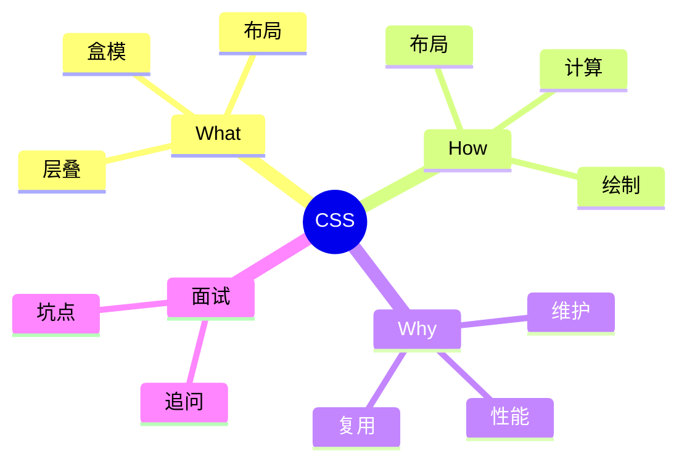
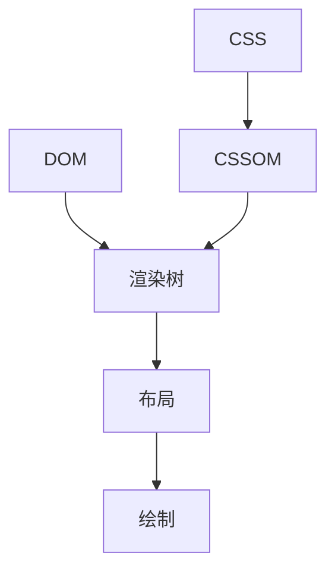

# 面试笔记｜Java｜CSS3

按 Java 视角组织。



## What — 费曼解释

类比：CSS 像“装修规则”，决定颜色、位置与摆放。

- 层叠：优先级决定最终样式。
- 盒模：content/padding/border/margin。
- 布局：Flex 一维，Grid 二维。

## How — 机制流程

1) 解析 CSS 生成 CSSOM。
2) DOM + CSSOM 生成渲染树。
3) 计算样式与布局。
4) 绘制与合成。



## How — 工业级代码 (可运行)

```java
public class CssSpecificityDemo {
    static int specificity(int id, int cls, int tag) {
        // 为什么：用三元组模拟优先级；底层：id>class>tag 的权重比较
        return id * 100 + cls * 10 + tag;
    }

    public static void main(String[] args) {
        int a = specificity(1, 0, 1); // 为什么：#id + tag；底层：id 权重最高
        int b = specificity(0, 2, 1); // 为什么：.class.class + tag；底层：类权重中等
        System.out.println(a > b);
    }
}
```

## Why & Interview — 机制复盘

步骤复盘：
1) 层叠与继承决定最终样式。
2) 触发布局会导致重排。
3) transform/opacity 可走合成层。

对比表：

| 维度 | Flex | Grid |
| --- | --- | --- |
| 维度 | 一维 | 二维 |
| 适用 | 行列对齐 | 网格布局 |
| 控制 | 主轴/交叉轴 | 行列轨道 |

### ✅ 面试怎么问
- CSS 优先级如何计算？
- Flex 与 Grid 的差别？
- 重排与重绘区别？
- 如何做动画性能优化？

### ⚠️ 坑点/误区
- 只背权重不理解层叠。
- 把重绘当重排。
- 滥用阴影/滤镜导致卡顿。

### 🔍 递进追问链路
1. BFC 解决哪些问题？
2. 复合层如何创建？
3. 选择器性能优化策略？
4. 盒模型有哪些差异？
5. CSSOM 与渲染树关系？

## 一分钟背诵版

1. 层叠规则决定样式生效。
2. 优先级顺序 id>class>tag。
3. 盒模型决定尺寸与边界。
4. DOM+CSSOM 生成渲染树。
5. 布局与绘制决定呈现。
6. Flex 适合一维布局。
7. Grid 适合二维布局。
8. 重排影响布局，重绘影响像素。
9. transform 动画更省性能。
10. 关键是减少重排与重绘。

## 面试 Checklist

- [ ] 能计算优先级
- [ ] 能解释层叠规则
- [ ] 能区分重排/重绘
- [ ] 能对比 Flex/Grid
- [ ] 能说明盒模型
- [ ] 能描述渲染流程
- [ ] 能解释合成层
- [ ] 能举例优化策略

[[CSS]] [[盒模型]] [[Flex]] [[Grid]] [[重排]] [[重绘]] [[渲染树]]
