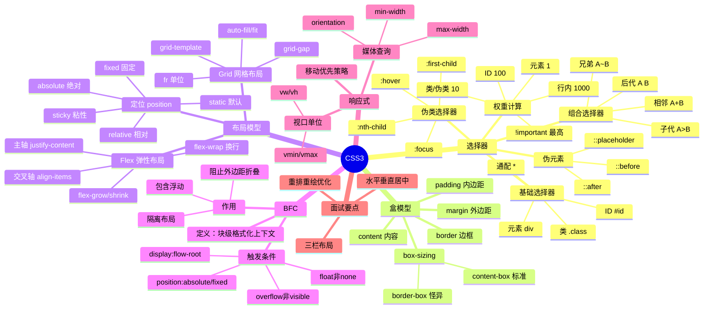

# CSS3 全局内容结构化梳理

> [!summary] TL;DR（3-5 行）
> - 一句话定义：CSS3 是页面样式与布局的规则体系。
> - 面试一句话结论：布局与层叠是 CSS 的核心，BFC/弹性盒要会讲。
> - 关键点：选择器、层叠规则、布局模型、响应式。
> - 常见坑：权重冲突、盒模型混淆。

> [!tip]
> **工程师思维自检**：
> 1. 我能解释为什么样式未生效吗？
> 2. 我能用弹性盒或网格快速布局吗？

---

## 1. 定义与定位

- **它是什么**：用规则描述 HTML 的样式与布局。
- **解决什么问题**：分离结构与样式，提高复用与维护性。
- **体系中的位置**：前端表现层核心。[[HTML5全局内容结构化梳理|HTML]] [[JavaScript与jQuery核心梳理|JavaScript]]

---

## 2. 应用场景

- 场景 1：页面布局与视觉设计。
- 场景 2：响应式与自适应页面。
- 不适用：仅处理数据逻辑的场景。

---

## 3. 核心原理（面试够用版）

> [!note] 先给结论，再解释“怎么做到”

- **核心机制**（5-7 条要点）：
  1) 选择器匹配元素，定义样式规则。
  2) 层叠与继承决定最终样式。
  3) 盒模型决定尺寸与边距。
  4) 布局模型（Flex/Grid）控制排列。
  5) 媒体查询实现响应式。

### 3.1 关键流程（步骤）

1. 选择器匹配。
2. 计算权重与层叠。
3. 布局与绘制。

### 3.2 关键概念

- **层叠规则**：权重 + 顺序 + 重要性。
- **BFC**：布局与浮动隔离机制。

### 3.3 费曼类比

> [!tip] 用人话解释
> 像给文档加“格式规则”，字体、位置、大小都由规则决定。

---

## 4. 关键细节清单（高频考点）

- 考点 1：权重计算与覆盖规则。
- 考点 2：盒模型（content/padding/border/margin）。
- 考点 3：Flex 与 Grid 的应用场景。
- 考点 4：BFC 作用与触发条件。

---

## 5. 源码/实现要点（不装行号，只抓关键）

> [!tip] 目标：回答“样式如何计算出来”

- **关键组件**：选择器匹配、层叠计算、布局引擎。
- **关键流程**：样式计算 → 布局 → 绘制。
- **关键策略**：减少复杂选择器与重排。
- **面试话术**：样式最终由层叠与权重决定。

---

## 6. 易错点与陷阱（至少 5 条）

1) 权重不足导致样式不生效。
2) 忽略继承导致样式丢失。
3) 盒模型混淆导致布局错位。
4) 频繁重排影响性能。
5) Flex 与 Grid 使用不当。

---

## 7. 对比与扩展（至少 2 组）

- **Flex vs Grid**：一维布局 vs 二维布局。
- **BFC vs 非 BFC**：是否隔离浮动。
- 扩展问题：如何减少重排重绘？

### 对比表

| 特性 | Flex | Grid |
| :--- | :--- | :--- |
| 维度 | 一维 | 二维 |
| 适用 | 线性排列 | 网格布局 |
| 学习成本 | 低 | 中 |

---

## 8. 标准面试回答（可直接背）

### 8.1 30 秒版本（电梯回答）

> [!quote]
> CSS3 通过选择器与层叠规则决定样式，盒模型定义尺寸，Flex/Grid 负责布局。常见问题是权重冲突与盒模型混淆，理解层叠规则和 BFC 能快速排查问题。

### 8.2 2 分钟版本（结构化展开）

> [!quote]
> 1) 定义与定位：CSS3 负责样式与布局。 
> 2) 场景：页面视觉与响应式。 
> 3) 原理：选择器匹配 → 层叠计算 → 布局绘制。 
> 4) 易错点：权重与盒模型。 
> 5) 扩展：性能优化与重排控制。

### 8.3 深挖追问（面试官继续问什么）

- 追问 1：如何计算权重？→ 行内/ID/类/标签。
- 追问 2：BFC 有什么作用？→ 解决浮动与高度塌陷。
- 追问 3：Flex 与 Grid 区别？→ 一维 vs 二维。

---

## 9. 代码题与代码示例（必须有详注）

> [!important] 要求：注释解释“为什么这样写”，不是解释语法

### 9.1 面试代码题（2-3 题）

- 题 1：写一个三栏布局（Flex）。
- 题 2：解释 BFC 的触发条件。
- 题 3：如何避免样式覆盖问题？

### 9.2 参考代码（CSS3）

#### Flex 三栏布局

```css
/* 目标：实现经典三栏布局（左右固定，中间自适应） */
/* 为什么用 Flex：一维布局最简洁的方案 */
.container {
    display: flex;
    min-height: 100vh;
}

.left, .right {
    /* 固定宽度：不参与伸缩 */
    width: 200px;
    flex-shrink: 0;
    background: #f0f0f0;
}

.center {
    /* flex: 1 让中间区域自动填充剩余空间 */
    flex: 1;
    background: #fff;
}
```

#### Grid 网格布局

```css
/* 目标：创建响应式网格布局 */
/* 为什么用 Grid：二维布局的最佳选择 */
.grid-container {
    display: grid;
    /* 自动填充列，最小 200px，最大 1fr */
    grid-template-columns: repeat(auto-fill, minmax(200px, 1fr));
    gap: 20px; /* 网格间距 */
}

.grid-item {
    padding: 20px;
    background: #e0e0e0;
}
```

#### BFC 触发与应用

```css
/* 目标：解决浮动导致的高度塌陷 */
/* BFC 触发条件：overflow 非 visible */
.clearfix {
    overflow: hidden; /* 触发 BFC，包含浮动子元素 */
}

/* 或使用伪元素清除浮动 */
.clearfix::after {
    content: "";
    display: block;
    clear: both;
}

/* 其他触发 BFC 的方式 */
.bfc-example {
    /* display: flow-root; 最语义化的触发方式 */
    display: flow-root;
}
```

#### 水平垂直居中

```css
/* 方案一：Flex 居中（推荐） */
.flex-center {
    display: flex;
    justify-content: center; /* 水平居中 */
    align-items: center;     /* 垂直居中 */
}

/* 方案二：Grid 居中 */
.grid-center {
    display: grid;
    place-items: center; /* 一行搞定水平垂直居中 */
}

/* 方案三：绝对定位 + transform */
.absolute-center {
    position: absolute;
    top: 50%;
    left: 50%;
    /* 为什么用 translate：基于自身尺寸偏移，无需知道具体宽高 */
    transform: translate(-50%, -50%);
}
```

#### 响应式媒体查询

```css
/* 目标：根据屏幕宽度切换布局 */
/* 移动优先：先写小屏样式，再用 min-width 扩展 */
.container {
    padding: 10px;
}

/* 平板及以上 */
@media (min-width: 768px) {
    .container {
        padding: 20px;
        max-width: 720px;
        margin: 0 auto;
    }
}

/* 桌面端 */
@media (min-width: 1024px) {
    .container {
        max-width: 960px;
    }
}
```

---

## 10. 复习 Checklist（可勾选）

- [ ] 我能解释 CSS 权重规则。
- [ ] 我能区分盒模型与 BFC。
- [ ] 我能使用 Flex/Grid 完成布局。
- [ ] 我能说明重排与重绘。
- [ ] 我能排查样式覆盖问题。

---

## 11. Mermaid 思维导图（Obsidian 可渲染）



---

## 相关笔记（双向链接）

- [[前端基础]]
- [[HTML5全局内容结构化梳理|HTML5]]
- [[JavaScript与jQuery核心梳理|JavaScript]]
