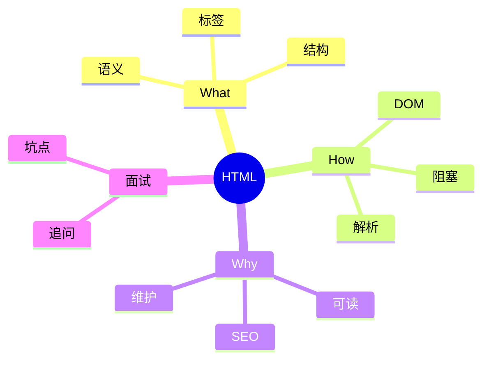
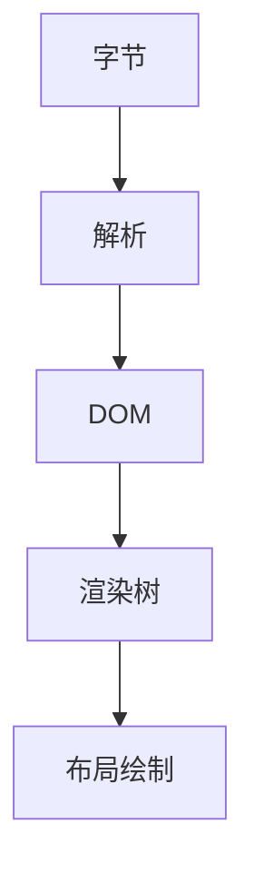

# 面试笔记｜Java｜HTML5

按 Java 视角组织。



## What — 费曼解释

类比：HTML 像“房屋结构图”，决定房间与家具的位置。

- 语义：标签表达内容含义。
- 结构：层级关系决定 DOM 树。
- 标签：成对/自闭合。

## How — 机制流程

1) 字节流解码为字符。
2) 词法/语法分析构建 DOM。
3) 同步 script 会阻塞解析。
4) DOM 与 CSSOM 合成渲染树。



## How — 工业级代码 (可运行)

```java
import java.util.ArrayDeque;
import java.util.Deque;

public class HtmlTagChecker {
    static boolean isPairedTag(String tag) {
        // 为什么：区分成对与空元素；底层：成对标签需要入栈匹配
        return !tag.endsWith("/") && !tag.equals("img") && !tag.equals("br") && !tag.equals("hr");
    }

    static boolean isValidNesting(String[] tokens) {
        Deque<String> stack = new ArrayDeque<>();
        for (String t : tokens) {
            if (t.startsWith("</")) {
                String name = t.substring(2, t.length() - 1);
                // 为什么：结束标签需匹配栈顶；底层：DOM 结构依赖正确嵌套
                if (stack.isEmpty() || !stack.pop().equals(name)) return false;
            } else {
                String name = t.substring(1, t.length() - 1).replace("/", "");
                if (isPairedTag(name)) {
                    // 为什么：成对标签入栈；底层：解析器维护层级
                    stack.push(name);
                }
            }
        }
        return stack.isEmpty();
    }

    public static void main(String[] args) {
        String[] ok = {"<header>", "<h1>", "</h1>", "</header>", "", "<main>", "</main>"};
        System.out.println(isValidNesting(ok));
    }
}
```

## Why & Interview — 机制复盘

步骤复盘：
1) 语义标签提升可读性与搜索引擎理解。
2) 解析阻塞影响首屏渲染。
3) 结构合理有利于维护与协作。

对比表：

| 维度 | 语义标签 | div/span |
| --- | --- | --- |
| 可读 | 高 | 低 |
| SEO | 友好 | 依赖补充 |
| 维护 | 清晰 | 易堆叠 |

### ✅ 面试怎么问
- 语义化标签的价值？
- script 放 head 与 body 的差别？
- DOM 如何构建？
- 可访问性如何体现？

### ⚠️ 坑点/误区
- 全部用 div/span。
- 同步脚本阻塞解析。
- 忽略表单类型校验。

### 🔍 递进追问链路
1. defer 与 async 区别？
2. DOM 与渲染树关系？
3. 空元素为何无需闭合？
4. 表单校验能否替代后端？
5. SEO 依赖哪些语义？

## 一分钟背诵版

1. HTML 负责结构与语义。
2. 语义标签提升可读与 SEO。
3. 解析构建 DOM 树。
4. 同步 script 阻塞解析。
5. DOM 与 CSSOM 合成渲染树。
6. 空元素无需闭合标签。
7. 结构清晰更易维护。
8. 表单类型带基础校验。
9. 可访问性依赖语义与属性。
10. 结构是前端工程基础。

## 面试 Checklist

- [ ] 能解释 HTML 职责
- [ ] 能说清语义化价值
- [ ] 能描述 DOM 构建
- [ ] 能解释阻塞原因
- [ ] 能区分 async/defer
- [ ] 能举例语义标签
- [ ] 能说明 SEO 影响
- [ ] 能说明可访问性

[[HTML]] [[DOM]] [[浏览器渲染]] [[语义化]] [[SEO]] [[可访问性]]
