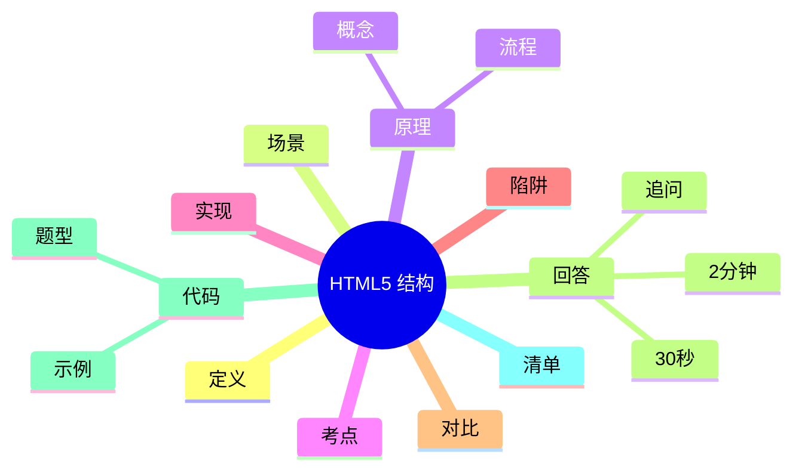

---
title: "HTML5 全局内容结构化梳理"
aliases: ["HTML5 全局内容结构化梳理 八股", "HTML5 全局内容结构化梳理 面试"]
tags: [Frontend, 八股, Interview/高频, HTML5, 结构化]
created: 2026-01-21
level: interview
status: draft
---

# HTML5 全局内容结构化梳理

> [!summary] TL;DR（3-5 行）
> - 一句话定义：HTML5 用语义化标签组织页面结构与内容。
> - 面试一句话结论：语义化提升可读性、SEO 与可访问性。
> - 关键点：语义标签、表单增强、多媒体与结构化内容。
> - 常见坑：滥用 div、忽略可访问性。

> [!tip]
> **工程师思维自检**：
> 1. 我能解释“为什么用语义标签”吗？
> 2. 我能在不看 CSS 的情况下理解页面结构吗？

---

## 1. 定义与定位

- **它是什么**：HTML5 提供的语义化结构与内容组织方式。
- **解决什么问题**：提升结构清晰度、SEO 与可访问性。
- **体系中的位置**：前端基础层，连接 [[CSS]] 与 [[JavaScript]]。

---

## 2. 应用场景

- 场景 1：页面结构与布局设计。
- 场景 2：SEO 与无障碍优化。
- 不适用：纯数据接口或非页面输出场景。

---

## 3. 核心原理（面试够用版）

> [!note] 先给结论，再解释“怎么做到”

- **核心机制**（5-7 条要点）：
  1) 语义标签描述内容含义（header/nav/main/article）。
  2) 表单类型扩展（email/date/number）。
  3) 多媒体标签原生支持（audio/video）。
  4) 结构化内容更利于解析与搜索。

### 3.1 关键流程（步骤）

1. 用语义标签搭建页面骨架。
2. 用表单元素表达输入类型。
3. 用多媒体标签嵌入内容。

### 3.2 关键概念

- **语义化**：标签表达内容意义。
- **可访问性**：结构化便于读屏。

### 3.3 费曼类比

> [!tip] 用人话解释
> 像写文章：标题、段落、引用都用不同格式，阅读更清晰。

---

## 4. 关键细节清单（高频考点）

- 考点 1：常见语义标签（header/main/section/article/footer）。
- 考点 2：表单类型与校验。
- 考点 3：多媒体与资源加载。
- 考点 4：SEO 与结构化数据的关系。

---

## 5. 源码/实现要点（不装行号，只抓关键）

> [!tip] 目标：回答“为什么要语义化”

- **关键组件**：语义标签、表单控件、多媒体标签。
- **关键流程**：结构 → 表单 → 交互增强。
- **关键策略**：语义优先，再用 CSS 控制样式。
- **面试话术**：语义化提高可读性与可维护性。

---

## 6. 易错点与陷阱（至少 5 条）

1) 用 div 代替所有语义标签。
2) 忽略 label 与表单的关联。
3) 音视频不提供备用方案。
4) 结构混乱导致 SEO 下降。
5) 忽略可访问性属性（aria）。

---

## 7. 对比与扩展（至少 2 组）

- **语义标签 vs div**：前者表达含义，后者仅容器。
- **HTML5 表单 vs HTML4**：前者内置校验，后者依赖 JS。
- 扩展问题：如何用 Schema 标记提升 SEO？

### 对比表

| 特性 | 语义标签 | div |
| :--- | :--- | :--- |
| 可读性 | 高 | 低 |
| SEO 友好 | 高 | 低 |
| 样式控制 | 相同 | 相同 |

---

## 8. 标准面试回答（可直接背）

### 8.1 30 秒版本（电梯回答）

> [!quote]
> HTML5 通过语义化标签和增强表单/多媒体支持，帮助我们更清晰地组织页面结构。语义化提升可读性、SEO 与无障碍体验，是现代前端开发的基础。

### 8.2 2 分钟版本（结构化展开）

> [!quote]
> 1) 定义与定位：HTML5 提供语义化结构与增强标签。 
> 2) 场景：页面结构、SEO、可访问性。 
> 3) 原理：用语义标签表达含义，表单与媒体内置支持。 
> 4) 易错点：滥用 div、忽略 aria。 
> 5) 扩展：结构化数据提升搜索效果。

### 8.3 深挖追问（面试官继续问什么）

- 追问 1：为什么语义化能提升 SEO？→ 搜索引擎更易理解内容结构。
- 追问 2：表单类型有什么优势？→ 内置校验与移动端优化。
- 追问 3：如何保证可访问性？→ label/aria 属性。

---

## 9. 代码题与代码示例（必须有详注）

> [!important] 要求：注释解释“为什么这样写”，不是解释语法

### 9.1 面试代码题（2-3 题）

- 题 1：用语义标签搭建博客页结构。
- 题 2：表单输入如何利用 HTML5 类型校验？
- 题 3：如何嵌入视频并提供降级方案？

### 9.2 参考代码（Java）

```java
// 目标：用 Java 拼接一个最小 HTML5 语义结构
// 注意：这里只演示结构，不涉及样式
public class HtmlBuilderDemo {
    public static void main(String[] args) {
        // 为什么用 StringBuilder：避免多次字符串拼接开销
        StringBuilder html = new StringBuilder();
        html.append("<header><h1>Blog</h1></header>");
        html.append("<main><article><p>Hello</p></article></main>");
        html.append("<footer>2026</footer>");

        System.out.println(html.toString());
    }
}
```

---

## 10. 复习 Checklist（可勾选）

- [ ] 我能列举常见语义标签。
- [ ] 我能解释语义化的价值。
- [ ] 我能说明表单增强特性。
- [ ] 我能处理多媒体降级方案。
- [ ] 我能兼顾 SEO 与可访问性。

---

## 11. Mermaid 思维导图（Obsidian 可渲染）



---

## 相关笔记（双向链接）

- [[CSS]]
- [[JavaScript]]
- [[Web 可访问性]]
