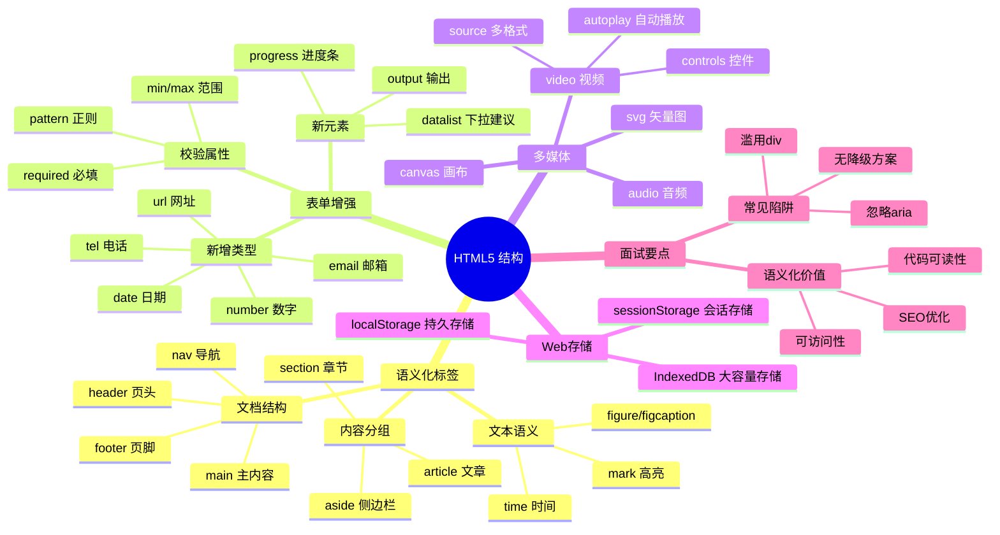

# HTML5 全局内容结构化梳理

> [!summary] TL;DR（3-5 行）
> - 一句话定义：HTML5 用语义化标签组织页面结构与内容。
> - 面试一句话结论：语义化提升可读性、SEO 与可访问性。
> - 关键点：语义标签、表单增强、多媒体与结构化内容。
> - 常见坑：滥用 div、忽略可访问性。

> [!tip]
> **工程师思维自检**：
> 1. 我能解释“为什么用语义标签”吗？
> 2. 我能在不看 CSS 的情况下理解页面结构吗？

---

## 1. 定义与定位

- **它是什么**：HTML5 提供的语义化结构与内容组织方式。
- **解决什么问题**：提升结构清晰度、SEO 与可访问性。
- **体系中的位置**：前端基础层，连接 [[CSS3全局内容结构化梳理|CSS]] 与 [[JavaScript与jQuery核心梳理|JavaScript]]。

---

## 2. 应用场景

- 场景 1：页面结构与布局设计。
- 场景 2：SEO 与无障碍优化。
- 不适用：纯数据接口或非页面输出场景。

---

## 3. 核心原理（面试够用版）

> [!note] 先给结论，再解释“怎么做到”

- **核心机制**（5-7 条要点）：
  1) 语义标签描述内容含义（header/nav/main/article）。
  2) 表单类型扩展（email/date/number）。
  3) 多媒体标签原生支持（audio/video）。
  4) 结构化内容更利于解析与搜索。

### 3.1 关键流程（步骤）

1. 用语义标签搭建页面骨架。
2. 用表单元素表达输入类型。
3. 用多媒体标签嵌入内容。

### 3.2 关键概念

- **语义化**：标签表达内容意义。
- **可访问性**：结构化便于读屏。

### 3.3 费曼类比

> [!tip] 用人话解释
> 像写文章：标题、段落、引用都用不同格式，阅读更清晰。

---

## 4. 关键细节清单（高频考点）

- 考点 1：常见语义标签（header/main/section/article/footer）。
- 考点 2：表单类型与校验。
- 考点 3：多媒体与资源加载。
- 考点 4：SEO 与结构化数据的关系。

---

## 5. 源码/实现要点（不装行号，只抓关键）

> [!tip] 目标：回答“为什么要语义化”

- **关键组件**：语义标签、表单控件、多媒体标签。
- **关键流程**：结构 → 表单 → 交互增强。
- **关键策略**：语义优先，再用 CSS 控制样式。
- **面试话术**：语义化提高可读性与可维护性。

---

## 6. 易错点与陷阱（至少 5 条）

1) 用 div 代替所有语义标签。
2) 忽略 label 与表单的关联。
3) 音视频不提供备用方案。
4) 结构混乱导致 SEO 下降。
5) 忽略可访问性属性（aria）。

---

## 7. 对比与扩展（至少 2 组）

- **语义标签 vs div**：前者表达含义，后者仅容器。
- **HTML5 表单 vs HTML4**：前者内置校验，后者依赖 JS。
- 扩展问题：如何用 Schema 标记提升 SEO？

### 对比表

| 特性 | 语义标签 | div |
| :--- | :--- | :--- |
| 可读性 | 高 | 低 |
| SEO 友好 | 高 | 低 |
| 样式控制 | 相同 | 相同 |

---

## 8. 标准面试回答（可直接背）

### 8.1 30 秒版本（电梯回答）

> [!quote]
> HTML5 通过语义化标签和增强表单/多媒体支持，帮助我们更清晰地组织页面结构。语义化提升可读性、SEO 与无障碍体验，是现代前端开发的基础。

### 8.2 2 分钟版本（结构化展开）

> [!quote]
> 1) 定义与定位：HTML5 提供语义化结构与增强标签。 
> 2) 场景：页面结构、SEO、可访问性。 
> 3) 原理：用语义标签表达含义，表单与媒体内置支持。 
> 4) 易错点：滥用 div、忽略 aria。 
> 5) 扩展：结构化数据提升搜索效果。

### 8.3 深挖追问（面试官继续问什么）

- 追问 1：为什么语义化能提升 SEO？→ 搜索引擎更易理解内容结构。
- 追问 2：表单类型有什么优势？→ 内置校验与移动端优化。
- 追问 3：如何保证可访问性？→ label/aria 属性。

---

## 9. 代码题与代码示例（必须有详注）

> [!important] 要求：注释解释“为什么这样写”，不是解释语法

### 9.1 面试代码题（2-3 题）

- 题 1：用语义标签搭建博客页结构。
- 题 2：表单输入如何利用 HTML5 类型校验？
- 题 3：如何嵌入视频并提供降级方案？

### 9.2 参考代码（HTML5）

```html
<!-- 目标：展示完整的 HTML5 语义化页面结构 -->
<!-- 为什么用语义标签：提升可读性、SEO、可访问性 -->
<!DOCTYPE html>
<html lang="zh-CN">
<head>
    <meta charset="UTF-8">
    <!-- viewport 用于响应式适配移动端 -->
    <meta name="viewport" content="width=device-width, initial-scale=1.0">
    <title>博客页面</title>
</head>
<body>
    <!-- header：页面头部，通常包含 logo 和导航 -->
    <header>
        <h1>我的博客</h1>
        <!-- nav：导航区域，便于屏幕阅读器识别 -->
        <nav>
            <ul>
                <li><a href="#home">首页</a></li>
                <li><a href="#about">关于</a></li>
            </ul>
        </nav>
    </header>

    <!-- main：主内容区，每个页面只能有一个 -->
    <main>
        <!-- article：独立完整的内容块 -->
        <article>
            <h2>文章标题</h2>
            <!-- time 标签便于搜索引擎解析日期 -->
            <time datetime="2026-01-26">2026年1月26日</time>
            <p>这是文章内容...</p>
        </article>

        <!-- aside：侧边栏，与主内容相关但可独立存在 -->
        <aside>
            <h3>相关链接</h3>
        </aside>
    </main>

    <!-- footer：页脚，通常包含版权信息 -->
    <footer>
        <p>&copy; 2026 博客版权所有</p>
    </footer>
</body>
</html>
```

### 9.3 表单增强示例

```html
<!-- HTML5 表单：内置校验，无需额外 JS -->
<form action="/submit" method="post">
    <!-- required：必填校验 -->
    <!-- type="email"：自动校验邮箱格式 -->
    <label for="email">邮箱：</label>
    <input type="email" id="email" name="email" required
           placeholder="请输入邮箱">

    <!-- type="number"：限制只能输入数字 -->
    <label for="age">年龄：</label>
    <input type="number" id="age" name="age" min="0" max="150">

    <!-- type="date"：调起日期选择器 -->
    <label for="birthday">生日：</label>
    <input type="date" id="birthday" name="birthday">

    <!-- pattern：正则校验 -->
    <label for="phone">手机：</label>
    <input type="tel" id="phone" name="phone"
           pattern="1[3-9]\d{9}" placeholder="11位手机号">

    <button type="submit">提交</button>
</form>
```

### 9.4 多媒体与降级方案

```html
<!-- video 标签：原生视频支持 -->
<video controls width="640" height="360">
    <!-- 多个 source 提供格式降级 -->
    <source src="video.mp4" type="video/mp4">
    <source src="video.webm" type="video/webm">
    <!-- 不支持 video 标签时的降级文案 -->
    <p>您的浏览器不支持视频播放，请<a href="video.mp4">下载视频</a></p>
</video>

<!-- audio 标签：原生音频支持 -->
<audio controls>
    <source src="audio.mp3" type="audio/mpeg">
    <source src="audio.ogg" type="audio/ogg">
    <p>您的浏览器不支持音频播放</p>
</audio>
```

---

## 10. 复习 Checklist（可勾选）

- [ ] 我能列举常见语义标签。
- [ ] 我能解释语义化的价值。
- [ ] 我能说明表单增强特性。
- [ ] 我能处理多媒体降级方案。
- [ ] 我能兼顾 SEO 与可访问性。

---

## 11. Mermaid 思维导图（Obsidian 可渲染）



---

## 相关笔记（双向链接）

- [[前端基础]]
- [[CSS3全局内容结构化梳理|CSS3]]
- [[JavaScript与jQuery核心梳理|JavaScript]]
