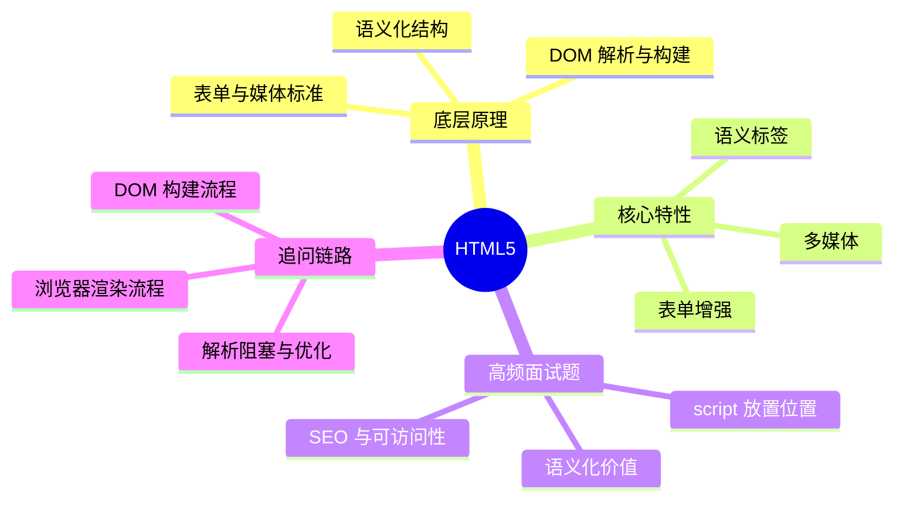

# Java 八股｜HTML5



## 核心概念

- HTML5 是结构层，负责语义与内容组织。
- 语义化标签让机器与人更易理解页面结构。
- DOM 是浏览器对 HTML 的对象化表示。
- 表单类型与属性内置基础校验与交互。
- 多媒体标签减少对插件依赖。

## 源码/机制复盘（文字流程）

1) 浏览器读取 HTML 字节流并进行字符解码。
2) 词法分析产生 Token，语法分析构建 DOM 树。
3) 遇到阻塞资源(同步 script)会暂停解析。
4) DOM 与 CSSOM 合并为渲染树，进入布局与绘制。
5) 语义标签影响可访问性与搜索引擎理解。

## 对比表

| 维度 | 语义标签 | 非语义标签(div/span) |
| --- | --- | --- |
| 可读性 | 高 | 低 |
| SEO/可访问性 | 更友好 | 依赖额外语义说明 |
| 维护性 | 更清晰 | 易堆叠且难理解 |

## 可运行 Java 示例

```java
import java.util.ArrayDeque;
import java.util.Deque;

public class HtmlTagChecker {
    static boolean isPairedTag(String tag) {
        // 为什么：区分成对标签与自闭合；底层：解析时成对标签需要入栈匹配
        return !tag.endsWith("/") && !tag.equals("img") && !tag.equals("br") && !tag.equals("hr");
    }

    static boolean isValidNesting(String[] tokens) {
        Deque<String> stack = new ArrayDeque<>();
        for (String t : tokens) {
            if (t.startsWith("</")) {
                String name = t.substring(2, t.length() - 1);
                // 为什么：遇到结束标签必须与栈顶匹配；底层：DOM 构建依赖正确嵌套
                if (stack.isEmpty() || !stack.pop().equals(name)) return false;
            } else {
                String name = t.substring(1, t.length() - 1).replace("/", "");
                if (isPairedTag(name)) {
                    // 为什么：成对标签入栈；底层：解析器维护元素层级关系
                    stack.push(name);
                }
            }
        }
        return stack.isEmpty();
    }

    public static void main(String[] args) {
        String[] ok = {"<header>", "<h1>", "</h1>", "</header>", "", "<main>", "</main>"};
        System.out.println(isValidNesting(ok));
    }
}
```

## 面试专栏

### ✅ 面试怎么问
- HTML5 语义化标签的价值是什么？
- script 放在 head 和 body 底部有什么区别？
- DOM 是如何构建的？
- SEO 与可访问性在 HTML 层面如何体现？

### ⚠️ 坑点/误区
- 只会用 div/span，不考虑语义结构。
- 把所有 script 放 head 导致阻塞渲染。
- 忽略表单类型带来的校验能力。

### 追问链路
- DOM 构建与渲染树构建的关系？
- defer 与 async 的差别？
- 为什么 img 没有闭合标签？
- HTML5 表单校验能替代后端校验吗？
- 可访问性需要哪些语义或属性支持？

## 一分钟背诵版

1. HTML5 负责结构与语义，不负责样式与行为。
2. 语义标签提升可读性与 SEO/可访问性。
3. 浏览器解析字节流并构建 DOM 树。
4. 同步 script 会阻塞 DOM 解析。
5. DOM 与 CSSOM 合并为渲染树。
6. 表单类型内置基础校验能力。
7. 多媒体标签减少插件依赖。
8. img 等空元素不需要成对标签。
9. 正确嵌套决定 DOM 结构是否稳定。
10. 结构清晰是前端工程化的基础。

## 面试 Checklist

- [ ] 能说明 HTML5 的职责范围
- [ ] 能解释语义化的价值
- [ ] 能描述 DOM 构建流程
- [ ] 能解释脚本阻塞原因
- [ ] 能区分 async/defer
- [ ] 能说明表单增强特性
- [ ] 能举例说明可访问性改进
- [ ] 能给出常用语义标签

[[HTML]] [[DOM]] [[浏览器渲染]] [[语义化]] [[SEO]] [[可访问性]]
