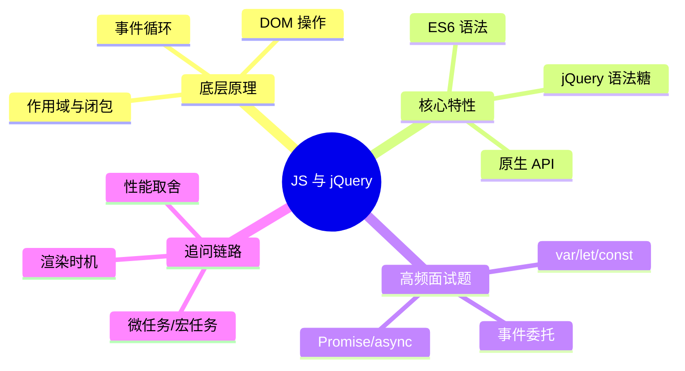

# Java 八股｜JavaScript 与 jQuery



## 核心概念

- JS 是单线程语言，通过事件循环处理异步。
- 作用域与闭包是函数级核心机制。
- DOM 操作是 UI 更新入口。
- jQuery 提供语法糖与兼容封装。
- 事件委托减少绑定数量。

## 源码/机制复盘（文字流程）

1) JS 执行栈按同步顺序执行。
2) 异步任务进入任务队列等待。
3) 事件循环在栈空时取队列执行。
4) 微任务优先于宏任务。
5) DOM 变更触发布局与渲染流程。

## 对比表

| 维度 | 原生 JS | jQuery |
| --- | --- | --- |
| 选择元素 | querySelector | $() |
| 事件绑定 | addEventListener | on() |
| 兼容性 | 需处理 | 封装好 |
| 体积 | 轻量 | 依赖库 |

## 可运行 Java 示例

```java
import java.util.ArrayDeque;
import java.util.Deque;

public class EventLoopDemo {
    public static void main(String[] args) {
        Deque<String> microTasks = new ArrayDeque<>();
        Deque<String> macroTasks = new ArrayDeque<>();

        // 为什么：用两个队列区分优先级；底层：微任务优先于宏任务
        microTasks.add("promise-then");
        macroTasks.add("setTimeout");

        // 为什么：先清空微任务再执行宏任务；底层：事件循环调度规则
        while (!microTasks.isEmpty()) {
            System.out.println(microTasks.poll());
        }
        while (!macroTasks.isEmpty()) {
            System.out.println(macroTasks.poll());
        }
    }
}
```

## 面试专栏

### ✅ 面试怎么问
- var/let/const 有什么区别？
- 事件循环的流程是什么？
- 事件委托解决了什么问题？
- Promise 与 async/await 的关系？

### ⚠️ 坑点/误区
- 把 JS 的异步当成多线程并行。
- 忽略闭包导致内存泄漏。
- 过度依赖 jQuery 忽视原生 API。

### 追问链路
- 微任务和宏任务的执行顺序？
- DOM 更新何时触发渲染？
- 事件委托的原理是什么？
- 为什么 JS 单线程还能高并发？
- jQuery 在现代项目的取舍？

## 一分钟背诵版

1. JS 单线程，通过事件循环调度异步。
2. 执行栈清空后才处理任务队列。
3. 微任务优先于宏任务。
4. 作用域决定变量可见性，闭包保留环境。
5. DOM 操作会触发布局与渲染。
6. 事件委托减少监听器数量。
7. Promise 抽象异步流程，async/await 更易读。
8. 原生 API 足够强大，jQuery 是兼容封装。
9. 过度 DOM 操作会导致性能问题。
10. 现代前端更强调性能与可维护性。

## 面试 Checklist

- [ ] 能对比 var/let/const
- [ ] 能解释事件循环顺序
- [ ] 能说明微任务/宏任务
- [ ] 能解释事件委托
- [ ] 能说明闭包的作用与风险
- [ ] 能描述 DOM 更新触发点
- [ ] 能对比原生与 jQuery
- [ ] 能举例异步处理方案

[[JavaScript]] [[jQuery]] [[DOM]] [[事件循环]] [[Promise]] [[async/await]]
