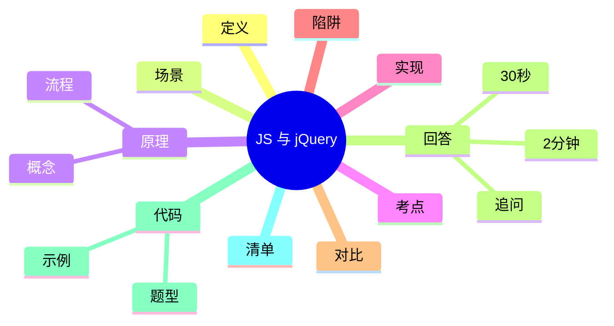

# JavaScript 与 jQuery 核心梳理

> [!summary] TL;DR（3-5 行）
> - 一句话定义：JavaScript 是浏览器脚本语言，jQuery 是 DOM 操作的封装库。
> - 面试一句话结论：jQuery 通过链式 API 简化 DOM 操作，现代项目更依赖原生或框架。
> - 关键点：作用域/闭包、事件模型、DOM 操作、AJAX。
> - 常见坑：this 绑定、异步回调地狱、全局污染。

> [!tip]
> **工程师思维自检**：
> 1. 我能解释“闭包为什么存在”吗？
> 2. 我能描述事件冒泡与委托吗？

---

## 1. 定义与定位

- **它是什么**：JS 负责页面交互与逻辑，jQuery 封装 DOM 与 AJAX 操作。
- **解决什么问题**：简化跨浏览器 DOM 与事件处理。
- **体系中的位置**：前端交互层核心。[[HTML]] [[CSS]]

---

## 2. 应用场景

- 场景 1：页面交互、事件绑定。
- 场景 2：简单数据请求与渲染。
- 不适用：复杂 SPA，更适合框架（React/Vue）。

---

## 3. 核心原理（面试够用版）

> [!note] 先给结论，再解释“怎么做到”

- **核心机制**（5-7 条要点）：
  1) JS 基于作用域与闭包管理变量。
  2) 事件模型支持捕获/冒泡。
  3) jQuery 用选择器定位 DOM 元素。
  4) 链式 API 提升可读性。
  5) AJAX 通过异步请求更新页面。

### 3.1 关键流程（步骤）

1. 选择元素并绑定事件。
2. 事件触发后执行回调。
3. 更新 DOM 或发起 AJAX。

### 3.2 关键概念

- **闭包**：函数携带外部变量。
- **事件委托**：利用冒泡减少绑定。

### 3.3 费曼类比

> [!tip] 用人话解释
> jQuery 像一个“工具箱”，把原本繁琐的 DOM 操作包装成简单接口。

---

## 4. 关键细节清单（高频考点）

- 考点 1：this 指向规则。
- 考点 2：事件冒泡与委托。
- 考点 3：AJAX 请求与回调。
- 考点 4：jQuery 链式调用的原理。

---

## 5. 源码/实现要点（不装行号，只抓关键）

> [!tip] 目标：回答“jQuery 为什么能链式调用”

- **关键组件**：选择器返回对象集合。
- **关键流程**：方法返回当前对象以支持链式调用。
- **关键策略**：封装浏览器差异。
- **面试话术**：链式调用本质是返回自身。

---

## 6. 易错点与陷阱（至少 5 条）

1) this 绑定错误导致取不到元素。
2) 忽略事件冒泡导致重复绑定。
3) AJAX 未处理失败回调。
4) 全局变量污染命名空间。
5) 过度依赖 jQuery 在现代框架中不适用。

---

## 7. 对比与扩展（至少 2 组）

- **jQuery vs 原生 DOM**：前者简化但依赖库。
- **同步 vs 异步**：异步避免阻塞但复杂度高。
- 扩展问题：Promise 如何改善回调地狱？

### 对比表

| 特性 | jQuery | 原生 DOM |
| :--- | :--- | :--- |
| 易用性 | 高 | 中 |
| 体积 | 大 | 小 |
| 现代框架兼容 | 低 | 高 |

---

## 8. 标准面试回答（可直接背）

### 8.1 30 秒版本（电梯回答）

> [!quote]
> JavaScript 是页面逻辑核心，jQuery 封装 DOM 与事件操作，提供链式 API。JS 的关键是作用域、闭包和事件模型，jQuery 的价值在于简化跨浏览器操作，但现代开发更多使用原生或框架。

### 8.2 2 分钟版本（结构化展开）

> [!quote]
> 1) 定义与定位：JS 负责交互，jQuery 是 DOM 封装。 
> 2) 场景：页面事件与 AJAX。 
> 3) 原理：闭包/事件模型 + 选择器与链式调用。 
> 4) 易错点：this 与回调。 
> 5) 扩展：Promise/async 解决异步复杂度。

### 8.3 深挖追问（面试官继续问什么）

- 追问 1：链式调用为什么能实现？→ 返回自身。
- 追问 2：事件委托优势？→ 减少绑定，提高性能。
- 追问 3：如何避免回调地狱？→ Promise/async。

---

## 9. 代码题与代码示例（必须有详注）

> [!important] 要求：注释解释“为什么这样写”，不是解释语法

### 9.1 面试代码题（2-3 题）

- 题 1：实现一个简化版链式调用对象。
- 题 2：用事件委托处理动态列表。
- 题 3：封装一个 AJAX 请求并处理异常。

### 9.2 参考代码（Java）

```java
// 目标：用 Java 模拟“链式调用”的设计
// 注意：链式调用的核心是方法返回自身
public class ChainDemo {
    static class Query {
        private String selector;

        Query select(String s) {
            // 为什么返回 this：支持连续调用
            this.selector = s;
            return this;
        }

        Query addClass(String cls) {
            // 模拟 DOM 操作记录
            System.out.println("Add class " + cls + " to " + selector);
            return this;
        }
    }

    public static void main(String[] args) {
        new Query().select("#btn").addClass("active");
    }
}
```

---

## 10. 复习 Checklist（可勾选）

- [ ] 我能解释闭包与作用域。
- [ ] 我能说明事件冒泡与委托。
- [ ] 我能解释 jQuery 链式调用原理。
- [ ] 我能处理 AJAX 异常。
- [ ] 我能区分 jQuery 与现代框架。

---

## 11. Mermaid 思维导图（Obsidian 可渲染）



---

## 相关笔记（双向链接）

- [[HTML]]
- [[CSS]]
- [[事件模型]]
