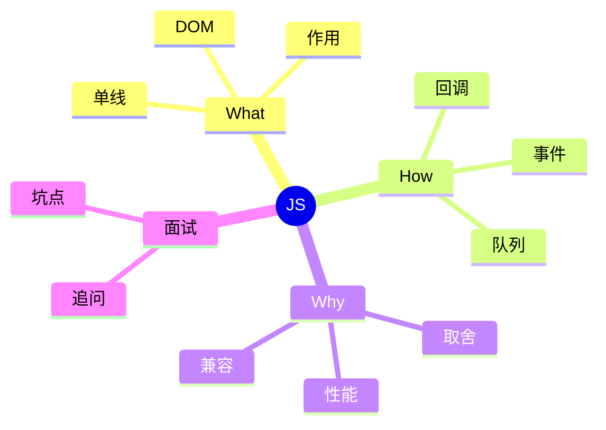
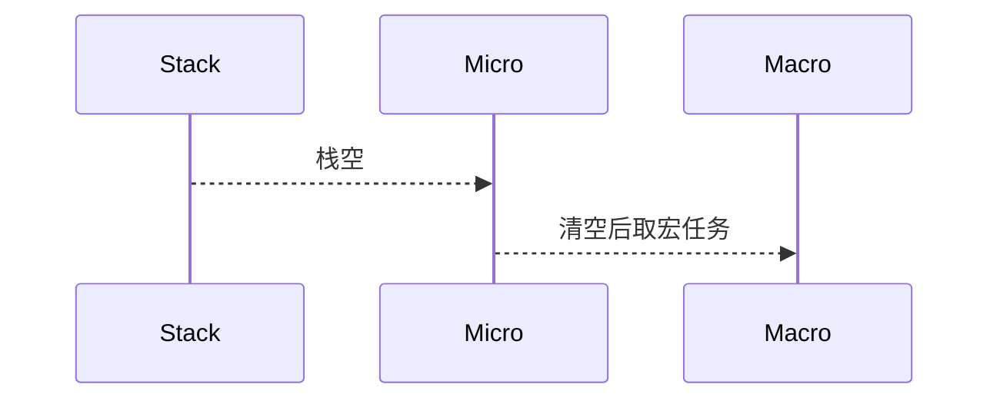

# 面试笔记｜Java｜JavaScript 与 jQuery

按 Java 视角组织。



## What — 费曼解释

类比：JS 像“单线程调度员”，按队列处理任务。

- 单线程：同一时刻只执行一个任务。
- 作用域/闭包：保存上下文。
- DOM 操作：驱动 UI 变化。

## How — 机制流程

1) 同步代码进入执行栈。
2) 异步任务进入队列。
3) 栈空后事件循环取任务。
4) 微任务优先于宏任务。



## How — 工业级代码 (可运行)

```java
import java.util.ArrayDeque;
import java.util.Deque;

public class EventLoopDemo {
    public static void main(String[] args) {
        Deque<String> microTasks = new ArrayDeque<>();
        Deque<String> macroTasks = new ArrayDeque<>();

        // 为什么：区分优先级队列；底层：微任务优先于宏任务
        microTasks.add("promise-then");
        macroTasks.add("setTimeout");

        // 为什么：先清空微任务；底层：事件循环调度规则
        while (!microTasks.isEmpty()) {
            System.out.println(microTasks.poll());
        }
        while (!macroTasks.isEmpty()) {
            System.out.println(macroTasks.poll());
        }
    }
}
```

## Why & Interview — 机制复盘

步骤复盘：
1) 单线程避免并发复杂度。
2) 事件循环保证异步执行。
3) DOM 变更触发布局与渲染。

对比表：

| 维度 | 原生 JS | jQuery |
| --- | --- | --- |
| 选择 | querySelector | $() |
| 事件 | addEventListener | on() |
| 兼容 | 需处理 | 封装 |
| 体积 | 轻量 | 依赖 |

### ✅ 面试怎么问
- var/let/const 区别？
- 事件循环流程？
- 事件委托解决什么？
- Promise 与 async/await 关系？

### ⚠️ 坑点/误区
- 把异步当多线程并行。
- 忽略闭包导致内存泄漏。
- 过度依赖 jQuery。

### 🔍 递进追问链路
1. 微任务与宏任务顺序？
2. DOM 更新何时触发渲染？
3. 事件委托原理？
4. 单线程如何高并发？
5. jQuery 现代项目取舍？

## 一分钟背诵版

1. JS 单线程用事件循环调度。
2. 执行栈清空后取队列。
3. 微任务优先于宏任务。
4. 作用域决定变量可见性。
5. 闭包保留上下文。
6. DOM 操作触发布局渲染。
7. 事件委托减少监听。
8. Promise 抽象异步。
9. jQuery 是兼容封装。
10. 性能关键在减少 DOM 操作。

## 面试 Checklist

- [ ] 能对比 var/let/const
- [ ] 能解释事件循环
- [ ] 能说明微/宏任务
- [ ] 能解释事件委托
- [ ] 能说明闭包风险
- [ ] 能描述 DOM 渲染
- [ ] 能对比原生/jQuery
- [ ] 能举例异步方案

[[JavaScript]] [[jQuery]] [[DOM]] [[事件循环]] [[Promise]] [[async/await]]
