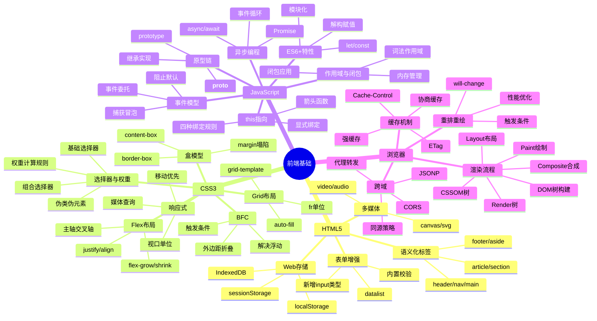
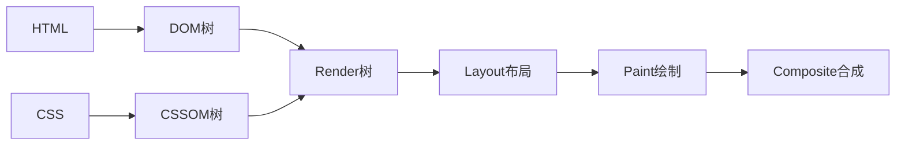
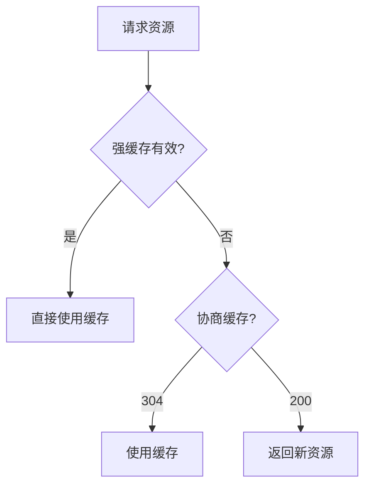
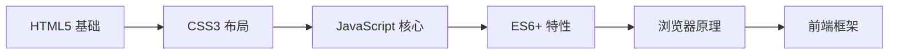

# 前端基础

> [!summary] TL;DR
> - 一句话定义：前端是构建用户界面的技术栈，包括结构（HTML）、样式（CSS）、交互（JavaScript）。
> - 面试一句话结论：HTML 语义化、CSS 布局、JS 核心机制是基础必考点。
> - 关键点：语义化、盒模型、Flex/Grid、闭包、事件模型、异步编程。

> [!tip]
> **工程师思维自检**：
> 1. 我能用 HTML/CSS/JS 三件套快速搭建页面吗？
> 2. 我能解释浏览器渲染流程吗？

---

## 知识体系总览



---

## 核心模块导航

### 1. HTML5

| 笔记 | 核心内容 | 面试频率 |
| :--- | :--- | :--- |
| [[HTML5全局内容结构化梳理]] | 语义化标签/表单/多媒体 | ⭐⭐⭐ |

**高频考点**：
- 语义化标签有哪些？为什么要语义化？
- HTML5 新增了哪些特性？
- 本地存储 localStorage/sessionStorage 区别？

### 2. CSS3

| 笔记 | 核心内容 | 面试频率 |
| :--- | :--- | :--- |
| [[CSS3全局内容结构化梳理]] | 选择器/盒模型/布局/BFC | ⭐⭐⭐⭐ |

**高频考点**：
- CSS 选择器优先级如何计算？
- 盒模型是什么？box-sizing 的区别？
- Flex 和 Grid 布局的区别？
- 什么是 BFC？如何触发？
- 如何实现水平垂直居中？

### 3. JavaScript

| 笔记 | 核心内容 | 面试频率 |
| :--- | :--- | :--- |
| [[JavaScript与jQuery核心梳理]] | 闭包/this/事件/异步 | ⭐⭐⭐⭐⭐ |

**高频考点**：
- 什么是闭包？有什么应用场景？
- this 的指向规则？
- 事件冒泡和事件捕获？事件委托？
- Promise/async/await 的使用？
- var/let/const 的区别？

---

## 浏览器相关

### 渲染流程



### 重排与重绘

| 操作类型 | 触发条件 | 性能影响 |
| :--- | :--- | :--- |
| **重排 Reflow** | 改变几何属性（宽高、位置、display） | 高 |
| **重绘 Repaint** | 改变外观属性（颜色、背景、visibility） | 中 |
| **合成 Composite** | transform、opacity | 低 |

**优化策略**：
- 批量修改样式，避免逐条修改
- 使用 `transform` 代替 `top/left`
- 使用 `will-change` 提示浏览器优化
- 避免强制同步布局（读写分离）

### 跨域解决方案

| 方案 | 原理 | 适用场景 |
| :--- | :--- | :--- |
| **CORS** | 服务端设置响应头 | 主流方案 |
| **JSONP** | script 标签不受同源限制 | 仅支持 GET |
| **代理转发** | 服务端代理请求 | 开发环境 |
| **postMessage** | 跨窗口通信 | iframe 通信 |

### 缓存机制



| 缓存类型 | 响应头 | 特点 |
| :--- | :--- | :--- |
| **强缓存** | `Cache-Control: max-age` | 不发请求 |
| **强缓存** | `Expires` | 绝对时间（已弃用） |
| **协商缓存** | `ETag` / `If-None-Match` | 内容哈希 |
| **协商缓存** | `Last-Modified` / `If-Modified-Since` | 修改时间 |

### 高频考点

| 主题 | 核心内容 | 面试频率 |
| :--- | :--- | :--- |
| 渲染流程 | DOM→CSSOM→Render→Layout→Paint | ⭐⭐⭐⭐ |
| 重排重绘 | 触发条件/优化方法 | ⭐⭐⭐⭐ |
| 跨域 | 同源策略/CORS/JSONP | ⭐⭐⭐⭐⭐ |
| 缓存 | 强缓存/协商缓存 | ⭐⭐⭐⭐ |

---

## 经典面试题速查

### HTML

| 问题 | 简答 |
| :--- | :--- |
| DOCTYPE 的作用？ | 声明文档类型，触发标准模式渲染 |
| meta viewport 是什么？ | 控制移动端视口宽度和缩放比例 |
| src 和 href 的区别？ | src 嵌入资源（阻塞），href 引用资源（并行） |
| 语义化标签的好处？ | SEO 友好、可访问性好、代码可读性高 |
| localStorage vs sessionStorage？ | 前者持久化，后者会话级别 |

### CSS

| 问题 | 简答 |
| :--- | :--- |
| 选择器优先级？ | !important > 行内 > ID > 类 > 元素 |
| box-sizing 区别？ | content-box 不含边距，border-box 包含 |
| Flex vs Grid？ | Flex 一维布局，Grid 二维布局 |
| BFC 是什么？ | 独立渲染区域，解决浮动和外边距折叠 |
| 水平垂直居中？ | Flex: justify-content + align-items |
| position 值？ | static/relative/absolute/fixed/sticky |
| 清除浮动？ | overflow:hidden 或 clearfix 伪元素 |

### JavaScript

| 问题 | 简答 |
| :--- | :--- |
| == vs ===？ | == 类型转换后比较，=== 严格相等 |
| 闭包是什么？ | 函数 + 其词法环境的引用 |
| this 指向规则？ | 默认/隐式/显式/new 绑定，箭头函数继承外层 |
| 事件委托原理？ | 利用事件冒泡，在父元素统一处理 |
| 防抖 vs 节流？ | 防抖：最后一次执行；节流：固定间隔执行 |
| 深拷贝实现？ | JSON.parse(JSON.stringify) 或递归复制 |
| var/let/const？ | var 函数作用域可提升，let/const 块级作用域 |
| Promise 状态？ | pending → fulfilled/rejected，不可逆 |
| 宏任务 vs 微任务？ | 微任务优先（Promise.then），宏任务后执行（setTimeout） |

---

## 学习路线建议



1. **第一阶段**：HTML5 语义化与表单
2. **第二阶段**：CSS3 布局（Flex/Grid）
3. **第三阶段**：JavaScript 核心机制
4. **第四阶段**：ES6+ 与异步编程
5. **第五阶段**：浏览器原理与性能优化

---

## 常用代码速查

### Flex 居中

```css
.center {
    display: flex;
    justify-content: center;
    align-items: center;
}
```

### 防抖函数

```javascript
function debounce(fn, delay) {
    let timer = null;
    return function(...args) {
        clearTimeout(timer);
        timer = setTimeout(() => fn.apply(this, args), delay);
    };
}
```

### 节流函数

```javascript
function throttle(fn, interval) {
    let lastTime = 0;
    return function(...args) {
        const now = Date.now();
        if (now - lastTime >= interval) {
            fn.apply(this, args);
            lastTime = now;
        }
    };
}
```

### 深拷贝

```javascript
function deepClone(obj) {
    if (obj === null || typeof obj !== 'object') return obj;
    const clone = Array.isArray(obj) ? [] : {};
    for (const key in obj) {
        if (obj.hasOwnProperty(key)) {
            clone[key] = deepClone(obj[key]);
        }
    }
    return clone;
}
```

### 数组去重

```javascript
// ES6 Set 方法（推荐）
const unique = arr => [...new Set(arr)];

// filter 方法
const unique2 = arr => arr.filter((item, index) => arr.indexOf(item) === index);
```

---

## 相关笔记（双向链接）

- [[HTML5全局内容结构化梳理]]
- [[CSS3全局内容结构化梳理]]
- [[JavaScript与jQuery核心梳理]]
