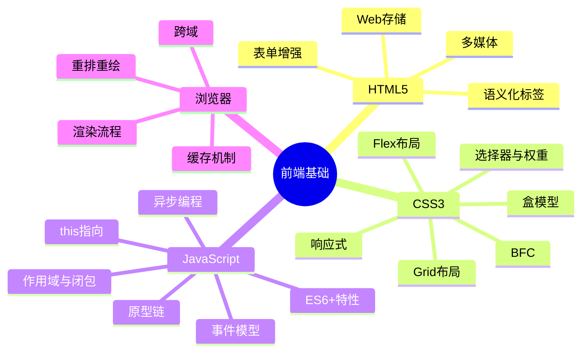
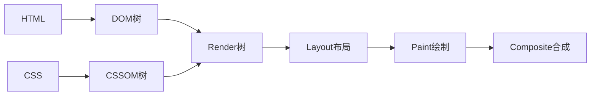
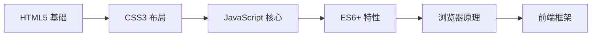

# 前端基础

> [!summary] TL;DR
> - 一句话定义：前端是构建用户界面的技术栈，包括结构（HTML）、样式（CSS）、交互（JavaScript）。
> - 面试一句话结论：HTML 语义化、CSS 布局、JS 核心机制是基础必考点。
> - 关键点：语义化、盒模型、Flex/Grid、闭包、事件模型、异步编程。

> [!tip]
> **工程师思维自检**：
> 1. 我能用 HTML/CSS/JS 三件套快速搭建页面吗？
> 2. 我能解释浏览器渲染流程吗？

---

## 知识体系总览

---

## 核心模块导航

### 1. HTML5

| 笔记 | 核心内容 | 面试频率 |
| :--- | :--- | :--- |
| [[HTML5全局内容结构化梳理]] | 语义化标签/表单/多媒体 | ⭐⭐⭐ |

**高频考点**：
- 语义化标签有哪些？为什么要语义化？
- HTML5 新增了哪些特性？
- 本地存储 localStorage/sessionStorage 区别？

### 2. CSS3

| 笔记 | 核心内容 | 面试频率 |
| :--- | :--- | :--- |
| [[CSS3全局内容结构化梳理]] | 选择器/盒模型/布局/BFC | ⭐⭐⭐⭐ |

**高频考点**：
- CSS 选择器优先级如何计算？
- 盒模型是什么？box-sizing 的区别？
- Flex 和 Grid 布局的区别？
- 什么是 BFC？如何触发？
- 如何实现水平垂直居中？

### 3. JavaScript

| 笔记 | 核心内容 | 面试频率 |
| :--- | :--- | :--- |
| [[JavaScript与jQuery核心梳理]] | 闭包/this/事件/异步 | ⭐⭐⭐⭐⭐ |

**高频考点**：
- 什么是闭包？有什么应用场景？
- this 的指向规则？
- 事件冒泡和事件捕获？事件委托？
- Promise/async/await 的使用？
- var/let/const 的区别？

---

## 浏览器相关

### 渲染流程

### 高频考点

| 主题 | 核心内容 | 面试频率 |
| :--- | :--- | :--- |
| 渲染流程 | DOM→CSSOM→Render→Layout→Paint | ⭐⭐⭐⭐ |
| 重排重绘 | 触发条件/优化方法 | ⭐⭐⭐⭐ |
| 跨域 | 同源策略/CORS/JSONP | ⭐⭐⭐⭐⭐ |
| 缓存 | 强缓存/协商缓存 | ⭐⭐⭐⭐ |

---

## 经典面试题速查

### HTML

1. DOCTYPE 的作用？
2. meta viewport 是什么？
3. src 和 href 的区别？

### CSS

1. 如何实现三栏布局（圣杯/双飞翼）？
2. position 有哪些值？区别是什么？
3. 如何清除浮动？

### JavaScript

1. == 和 === 的区别？
2. 深拷贝和浅拷贝？
3. 防抖和节流的区别？如何实现？
4. 数组去重的方法？

---

## 学习路线建议

1. **第一阶段**：HTML5 语义化与表单
2. **第二阶段**：CSS3 布局（Flex/Grid）
3. **第三阶段**：JavaScript 核心机制
4. **第四阶段**：ES6+ 与异步编程
5. **第五阶段**：浏览器原理与性能优化

---

## 相关笔记（双向链接）

- [[HTML5全局内容结构化梳理]]
- [[CSS3全局内容结构化梳理]]
- [[JavaScript与jQuery核心梳理]]
