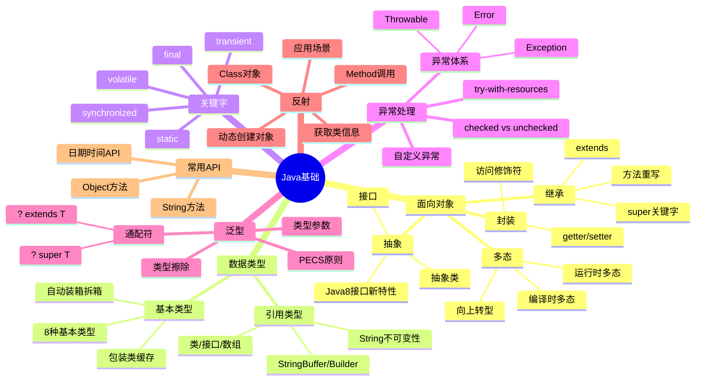

# Java基础

> [!summary] TL;DR
> - 一句话定义：Java 是面向对象的跨平台编程语言，基于 JVM 实现"一次编写，到处运行"。
> - 面试一句话结论：掌握面向对象、异常处理、泛型、反射是 Java 基础必考点。
> - 关键点：封装继承多态、异常体系、泛型擦除、反射机制、String 不可变性。

> [!tip]
> **工程师思维自检**：
> 1. 我能解释 Java 的面向对象三大特性吗？
> 2. 我能说清楚 == 和 equals 的区别吗？

---

## 知识体系总览

---

## 核心模块导航

### 1. 面向对象

| 笔记 | 核心内容 | 面试频率 |
| :--- | :--- | :--- |
| [[面向对象三大特性]] | 封装/继承/多态 | ⭐⭐⭐⭐⭐ |
| [[抽象类与接口]] | 区别与应用场景 | ⭐⭐⭐⭐ |

**高频考点**：
- 面向对象三大特性是什么？
- 抽象类和接口的区别？
- 重载和重写的区别？

### 2. 数据类型与String

| 笔记 | 核心内容 | 面试频率 |
| :--- | :--- | :--- |
| [[Java数据类型]] | 基本类型/包装类/自动装箱 | ⭐⭐⭐⭐ |
| [[String深入解析]] | 不可变性/常量池/intern | ⭐⭐⭐⭐⭐ |

**高频考点**：
- 基本类型和包装类的区别？
- String 为什么不可变？
- String、StringBuilder、StringBuffer 区别？

### 3. 异常处理

| 笔记 | 核心内容 | 面试频率 |
| :--- | :--- | :--- |
| [[Java异常体系]] | 异常分类/处理机制 | ⭐⭐⭐⭐ |

**高频考点**：
- Exception 和 Error 的区别？
- checked 和 unchecked 异常？
- try-with-resources 原理？

### 4. 泛型与反射

| 笔记 | 核心内容 | 面试频率 |
| :--- | :--- | :--- |
| [[Java泛型]] | 类型擦除/通配符/PECS | ⭐⭐⭐⭐ |
| [[Java反射机制]] | Class对象/动态调用 | ⭐⭐⭐⭐ |

**高频考点**：
- 什么是类型擦除？
- 泛型通配符 ? extends T 和 ? super T 区别？
- 反射的应用场景？

---

## 经典面试题速查

| 问题 | 简答 |
| :--- | :--- |
| == 和 equals 区别？ | == 比较地址，equals 比较内容（需重写） |
| hashCode 和 equals 关系？ | equals 相等则 hashCode 必须相等 |
| String 为什么不可变？ | final 类 + private final char[] + 无修改方法 |
| final 关键字作用？ | 修饰类不可继承、方法不可重写、变量不可修改 |
| static 关键字作用？ | 类级别共享，无需实例化访问 |
| 接口和抽象类区别？ | 接口多实现、抽象类单继承；Java8 接口可有默认方法 |
| 深拷贝和浅拷贝？ | 浅拷贝复制引用，深拷贝复制对象本身 |

---

## 相关笔记（双向链接）

- [[JVM基础]]
- [[Java集合框架]]
- [[Java并发编程]]
