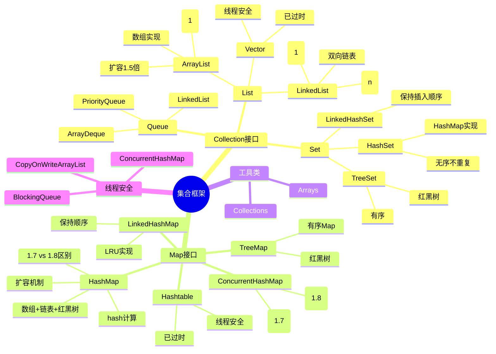

# Java集合框架

> [!summary] TL;DR
> - 一句话定义：Java 集合框架提供统一的数据结构接口与实现，包括 List、Set、Map 三大体系。
> - 面试一句话结论：ArrayList/HashMap 源码、线程安全集合是高频考点。
> - 关键点：底层数据结构、扩容机制、线程安全、fail-fast 机制。

> [!tip]
> **工程师思维自检**：
> 1. 我能说清楚 HashMap 的 put 流程吗？
> 2. 我能解释 ConcurrentHashMap 如何保证线程安全吗？

---

## 知识体系总览

---

## 核心模块导航

### 1. List

| 笔记 | 核心内容 | 面试频率 |
| :--- | :--- | :--- |
| [[ArrayList源码分析]] | 扩容机制/随机访问 | ⭐⭐⭐⭐⭐ |
| [[LinkedList源码分析]] | 双向链表/队列实现 | ⭐⭐⭐ |

**高频考点**：
- ArrayList 和 LinkedList 区别？
- ArrayList 扩容机制？
- 如何实现线程安全的 List？

### 2. Map

| 笔记 | 核心内容 | 面试频率 |
| :--- | :--- | :--- |
| [[HashMap源码分析]] | put流程/扩容/红黑树 | ⭐⭐⭐⭐⭐ |
| [[ConcurrentHashMap源码分析]] | 线程安全实现 | ⭐⭐⭐⭐⭐ |
| [[LinkedHashMap与LRU]] | 顺序Map/LRU缓存 | ⭐⭐⭐⭐ |

**高频考点**：
- HashMap 的 put 过程？
- HashMap 1.7 和 1.8 的区别？
- ConcurrentHashMap 如何保证线程安全？

### 3. Set

| 笔记 | 核心内容 | 面试频率 |
| :--- | :--- | :--- |
| [[HashSet实现原理]] | 基于HashMap | ⭐⭐⭐ |
| [[TreeSet与比较器]] | 红黑树/Comparable | ⭐⭐⭐ |

---

## 经典面试题速查

| 问题 | 简答 |
| :--- | :--- |
| ArrayList vs LinkedList？ | 数组 vs 链表，随机访问 vs 增删效率 |
| HashMap 底层结构？ | 数组 + 链表 + 红黑树（链表长度>8且数组>64转红黑树） |
| HashMap 扩容？ | 容量翻倍，重新 hash 分配位置 |
| HashMap 为什么线程不安全？ | 1.7 扩容死循环，1.8 数据覆盖 |
| ConcurrentHashMap 原理？ | 1.7 分段锁，1.8 CAS + synchronized 锁节点 |
| fail-fast 是什么？ | 迭代时修改集合抛 ConcurrentModificationException |

---

## 相关笔记（双向链接）

- [[Java基础]]
- [[Java并发编程]]
- [[数据结构与算法]]
