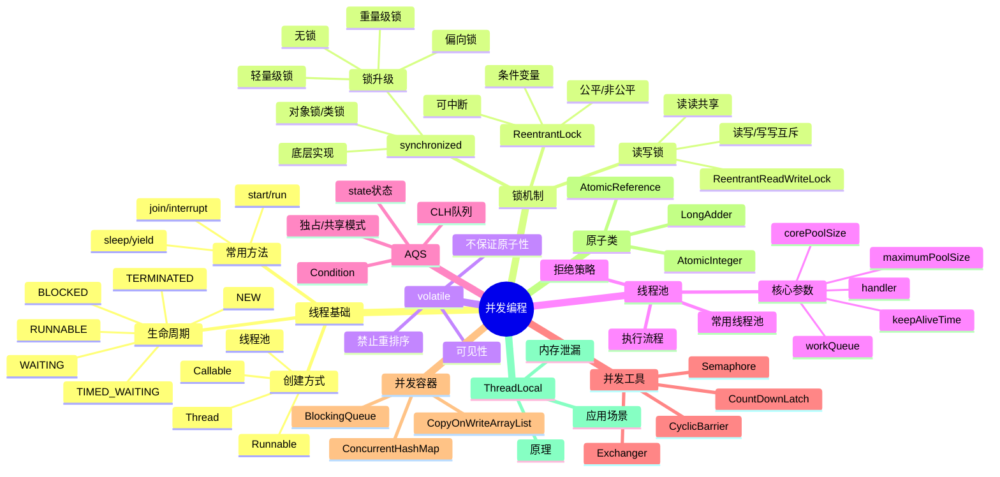

# Java并发编程

> [!summary] TL;DR
> - 一句话定义：Java 并发编程通过多线程实现程序的并行执行，JUC 包提供丰富的并发工具。
> - 面试一句话结论：线程生命周期、锁机制、线程池是必考核心。
> - 关键点：synchronized/ReentrantLock、volatile、线程池、AQS、并发容器。

> [!tip]
> **工程师思维自检**：
> 1. 我能解释 synchronized 的锁升级过程吗？
> 2. 我能说清楚线程池的核心参数吗？

---

## 知识体系总览

---

## 核心模块导航

### 1. 线程基础

| 笔记 | 核心内容 | 面试频率 |
| :--- | :--- | :--- |
| [[线程创建与生命周期]] | 创建方式/状态转换 | ⭐⭐⭐⭐ |
| [[线程通信机制]] | wait/notify/join | ⭐⭐⭐⭐ |

### 2. 锁机制

| 笔记 | 核心内容 | 面试频率 |
| :--- | :--- | :--- |
| [[synchronized深入解析]] | 锁升级/底层实现 | ⭐⭐⭐⭐⭐ |
| [[ReentrantLock详解]] | 公平锁/AQS实现 | ⭐⭐⭐⭐⭐ |
| [[volatile关键字]] | 可见性/内存屏障 | ⭐⭐⭐⭐⭐ |

### 3. 线程池

| 笔记 | 核心内容 | 面试频率 |
| :--- | :--- | :--- |
| [[线程池核心原理]] | 参数/执行流程/拒绝策略 | ⭐⭐⭐⭐⭐ |
| [[线程池最佳实践]] | 参数配置/监控 | ⭐⭐⭐⭐ |

### 4. JUC工具

| 笔记 | 核心内容 | 面试频率 |
| :--- | :--- | :--- |
| [[AQS原理解析]] | CLH队列/state | ⭐⭐⭐⭐ |
| [[并发工具类]] | CountDownLatch/CyclicBarrier | ⭐⭐⭐⭐ |
| [[ThreadLocal原理]] | 实现/内存泄漏 | ⭐⭐⭐⭐⭐ |

---

## 经典面试题速查

| 问题 | 简答 |
| :--- | :--- |
| 线程创建方式？ | Thread/Runnable/Callable/线程池 |
| synchronized vs ReentrantLock？ | 前者JVM层面自动释放，后者API层面需手动释放，支持公平锁 |
| synchronized 锁升级？ | 无锁→偏向锁→轻量级锁→重量级锁，不可降级 |
| volatile 作用？ | 保证可见性和禁止重排序，不保证原子性 |
| 线程池核心参数？ | 核心线程数/最大线程数/存活时间/队列/拒绝策略 |
| 线程池执行流程？ | 核心线程→队列→非核心线程→拒绝策略 |
| ThreadLocal 原理？ | Thread 持有 ThreadLocalMap，key 是弱引用 |
| ThreadLocal 内存泄漏？ | key 被回收但 value 未清理，需手动 remove |

---

## 相关笔记（双向链接）

- [[Java基础]]
- [[JVM基础]]
- [[Java集合框架]]
