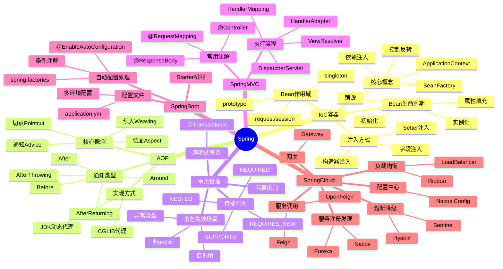

# Spring框架

> [!summary] TL;DR
> - 一句话定义：Spring 是企业级 Java 开发框架，核心是 IoC 容器和 AOP 面向切面编程。
> - 面试一句话结论：IoC/DI 原理、AOP 实现、Bean 生命周期、事务管理是必考点。
> - 关键点：依赖注入、动态代理、Bean 生命周期、事务传播、SpringBoot 自动配置。

> [!tip]
> **工程师思维自检**：
> 1. 我能解释 Spring IoC 容器的工作原理吗？
> 2. 我能说清楚 Spring 事务失效的场景吗？

---

## 知识体系总览

---

## 核心模块导航

### 1. IoC容器

| 笔记 | 核心内容 | 面试频率 |
| :--- | :--- | :--- |
| [[IoC原理与实现]] | 容器/依赖注入 | ⭐⭐⭐⭐⭐ |
| [[Bean生命周期]] | 创建/初始化/销毁 | ⭐⭐⭐⭐⭐ |
| [[循环依赖解决]] | 三级缓存 | ⭐⭐⭐⭐ |

### 2. AOP

| 笔记 | 核心内容 | 面试频率 |
| :--- | :--- | :--- |
| [[AOP原理与实现]] | 动态代理/切面 | ⭐⭐⭐⭐⭐ |
| [[JDK动态代理vs CGLIB]] | 实现对比 | ⭐⭐⭐⭐ |

### 3. 事务管理

| 笔记 | 核心内容 | 面试频率 |
| :--- | :--- | :--- |
| [[Spring事务原理]] | 传播行为/隔离级别 | ⭐⭐⭐⭐⭐ |
| [[事务失效场景]] | 自调用/异常类型 | ⭐⭐⭐⭐⭐ |

### 4. SpringBoot

| 笔记 | 核心内容 | 面试频率 |
| :--- | :--- | :--- |
| [[SpringBoot自动配置原理]] | 条件注解/spring.factories | ⭐⭐⭐⭐⭐ |
| [[SpringBoot启动流程]] | run方法解析 | ⭐⭐⭐⭐ |

---

## 经典面试题速查

| 问题 | 简答 |
| :--- | :--- |
| IoC 是什么？ | 控制反转，对象创建权交给容器管理 |
| DI 是什么？ | 依赖注入，容器注入对象所需依赖 |
| BeanFactory vs ApplicationContext？ | 后者功能更强，支持国际化、事件等 |
| Bean 生命周期？ | 实例化→属性填充→初始化→使用→销毁 |
| 循环依赖如何解决？ | 三级缓存：singletonObjects/earlySingletonObjects/singletonFactories |
| AOP 实现方式？ | JDK 动态代理（接口）/ CGLIB（类） |
| @Transactional 失效场景？ | 自调用、非 public、异常被 catch、rollbackFor 未指定 |
| 事务传播行为？ | REQUIRED（默认）/REQUIRES_NEW/NESTED 等 |
| SpringBoot 自动配置原理？ | @EnableAutoConfiguration + spring.factories + 条件注解 |

---

## 相关笔记（双向链接）

- [[Java基础]]
- [[MyBatis框架]]
- [[MySQL数据库]]
