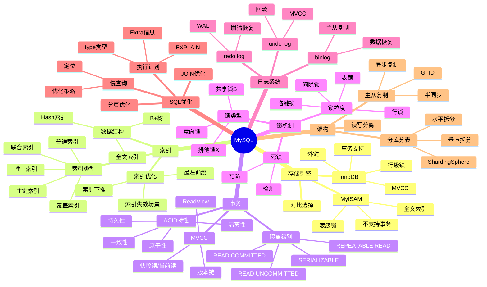

# MySQL数据库

> [!summary] TL;DR
> - 一句话定义：MySQL 是最流行的关系型数据库，基于 InnoDB 存储引擎提供事务支持。
> - 面试一句话结论：索引原理、事务隔离、锁机制、SQL 优化是必考核心。
> - 关键点：B+树索引、MVCC、锁类型、慢查询优化、主从复制。

> [!tip]
> **工程师思维自检**：
> 1. 我能解释 B+树为什么适合做索引吗？
> 2. 我能说清楚 MVCC 如何实现可重复读吗？

---

## 知识体系总览

---

## 核心模块导航

### 1. 索引

| 笔记 | 核心内容 | 面试频率 |
| :--- | :--- | :--- |
| [[B+树索引原理]] | 数据结构/查询优化 | ⭐⭐⭐⭐⭐ |
| [[索引优化实战]] | 最左前缀/失效场景 | ⭐⭐⭐⭐⭐ |

### 2. 事务与锁

| 笔记 | 核心内容 | 面试频率 |
| :--- | :--- | :--- |
| [[MySQL事务原理]] | ACID/隔离级别 | ⭐⭐⭐⭐⭐ |
| [[MVCC实现原理]] | 版本链/ReadView | ⭐⭐⭐⭐⭐ |
| [[MySQL锁机制]] | 行锁/间隙锁/死锁 | ⭐⭐⭐⭐⭐ |

### 3. 日志与恢复

| 笔记 | 核心内容 | 面试频率 |
| :--- | :--- | :--- |
| [[MySQL日志系统]] | redo/undo/binlog | ⭐⭐⭐⭐ |

### 4. 优化与架构

| 笔记 | 核心内容 | 面试频率 |
| :--- | :--- | :--- |
| [[SQL优化实战]] | EXPLAIN/慢查询 | ⭐⭐⭐⭐⭐ |
| [[主从复制原理]] | binlog/GTID | ⭐⭐⭐⭐ |
| [[分库分表方案]] | 拆分策略/中间件 | ⭐⭐⭐⭐ |

---

## 经典面试题速查

| 问题 | 简答 |
| :--- | :--- |
| 为什么用 B+树？ | 矮胖结构减少IO，叶子节点链表支持范围查询 |
| 聚簇索引 vs 非聚簇？ | 聚簇叶子存数据，非聚簇存主键需回表 |
| 覆盖索引是什么？ | 索引包含所有查询字段，无需回表 |
| 索引失效场景？ | 函数计算、隐式转换、like 左模糊、or 条件 |
| MVCC 原理？ | 版本链 + ReadView，根据事务 ID 判断可见性 |
| 幻读如何解决？ | RR 级别下，间隙锁 + 临键锁 |
| redo log vs binlog？ | redo 物理日志崩溃恢复，binlog 逻辑日志主从复制 |
| 慢查询优化思路？ | EXPLAIN 分析 → 加索引 → 优化 SQL → 分页优化 |

---

## 相关笔记（双向链接）

- [[MyBatis框架]]
- [[Redis缓存]]
- [[分布式系统]]
