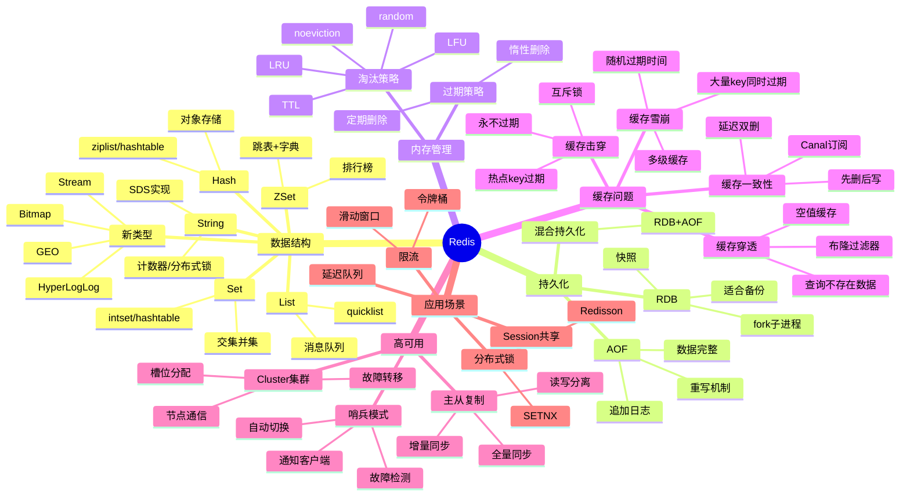

# Redis缓存

> [!summary] TL;DR
> - 一句话定义：Redis 是高性能的内存键值数据库，支持多种数据结构和持久化。
> - 面试一句话结论：数据结构、持久化、缓存问题、集群方案是必考核心。
> - 关键点：五种数据类型、RDB/AOF、缓存穿透/击穿/雪崩、主从/哨兵/Cluster。

> [!tip]
> **工程师思维自检**：
> 1. 我能解释 Redis 为什么这么快吗？
> 2. 我能说清楚缓存穿透/击穿/雪崩的区别和解决方案吗？

---

## 知识体系总览

---

## 核心模块导航

### 1. 数据结构

| 笔记 | 核心内容 | 面试频率 |
| :--- | :--- | :--- |
| [[Redis数据结构]] | 五种类型/底层实现 | ⭐⭐⭐⭐⭐ |
| [[Redis应用场景]] | 分布式锁/限流/排行榜 | ⭐⭐⭐⭐ |

### 2. 持久化

| 笔记 | 核心内容 | 面试频率 |
| :--- | :--- | :--- |
| [[Redis持久化机制]] | RDB/AOF/混合 | ⭐⭐⭐⭐⭐ |

### 3. 缓存问题

| 笔记 | 核心内容 | 面试频率 |
| :--- | :--- | :--- |
| [[缓存穿透击穿雪崩]] | 问题/解决方案 | ⭐⭐⭐⭐⭐ |
| [[缓存与数据库一致性]] | 更新策略 | ⭐⭐⭐⭐⭐ |

### 4. 高可用

| 笔记 | 核心内容 | 面试频率 |
| :--- | :--- | :--- |
| [[Redis高可用方案]] | 主从/哨兵/Cluster | ⭐⭐⭐⭐⭐ |

---

## 经典面试题速查

| 问题 | 简答 |
| :--- | :--- |
| Redis 为什么快？ | 内存操作 + 单线程避免切换 + IO 多路复用 + 高效数据结构 |
| String 底层实现？ | SDS（简单动态字符串），预分配 + 惰性释放 |
| ZSet 底层？ | 跳表 + 字典，跳表支持范围查询 |
| RDB vs AOF？ | RDB 快照体积小恢复快，AOF 日志数据完整但体积大 |
| 缓存穿透？ | 查询不存在的数据，布隆过滤器或缓存空值 |
| 缓存击穿？ | 热点 key 过期，互斥锁或逻辑过期 |
| 缓存雪崩？ | 大量 key 同时过期，随机过期时间 + 多级缓存 |
| 缓存一致性？ | 先更新数据库再删缓存，延迟双删 |
| 分布式锁实现？ | SETNX + 过期时间，Redisson 看门狗续期 |

---

## 相关笔记（双向链接）

- [[MySQL数据库]]
- [[分布式系统]]
- [[消息队列]]
