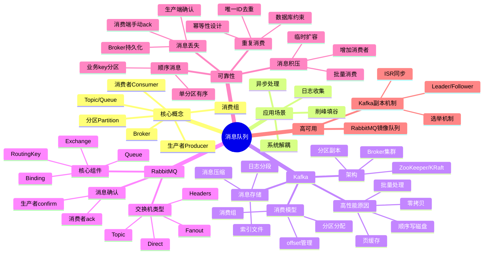

# 消息队列

> [!summary] TL;DR
> - 一句话定义：消息队列实现系统间异步通信、解耦和削峰填谷。
> - 面试一句话结论：消息可靠性、顺序性、重复消费、积压处理是核心考点。
> - 关键点：Kafka 高吞吐原理、RabbitMQ 消息模型、消息丢失/重复/顺序问题。

> [!tip]
> **工程师思维自检**：
> 1. 我能解释 Kafka 为什么吞吐量高吗？
> 2. 我能说清楚如何保证消息不丢失吗？

---

## 知识体系总览

---

## 核心模块导航

### 1. Kafka

| 笔记 | 核心内容 | 面试频率 |
| :--- | :--- | :--- |
| [[Kafka架构原理]] | 分区/副本/消费组 | ⭐⭐⭐⭐⭐ |
| [[Kafka高性能原理]] | 零拷贝/顺序写 | ⭐⭐⭐⭐⭐ |

### 2. RabbitMQ

| 笔记 | 核心内容 | 面试频率 |
| :--- | :--- | :--- |
| [[RabbitMQ消息模型]] | Exchange/Queue | ⭐⭐⭐⭐ |
| [[RabbitMQ可靠投递]] | confirm/ack | ⭐⭐⭐⭐ |

### 3. 可靠性问题

| 笔记 | 核心内容 | 面试频率 |
| :--- | :--- | :--- |
| [[消息丢失解决方案]] | 三端保证 | ⭐⭐⭐⭐⭐ |
| [[消息重复与幂等]] | 去重策略 | ⭐⭐⭐⭐⭐ |
| [[消息顺序性保证]] | 分区策略 | ⭐⭐⭐⭐ |

---

## 经典面试题速查

| 问题 | 简答 |
| :--- | :--- |
| MQ 的作用？ | 异步处理、系统解耦、削峰填谷 |
| Kafka 为什么快？ | 顺序写磁盘、零拷贝、批量发送、页缓存 |
| 零拷贝原理？ | sendfile 系统调用，减少用户态内核态拷贝 |
| 如何保证消息不丢失？ | 生产者 ack、Broker 持久化、消费者手动提交 |
| 如何保证顺序？ | 同一业务 key 发送到同一分区，单消费者消费 |
| 重复消费如何处理？ | 幂等性设计：唯一 ID + 去重表/Redis |
| 消息积压怎么办？ | 增加消费者、批量消费、临时 Topic 分流 |
| Kafka vs RabbitMQ？ | Kafka 高吞吐适合日志，RabbitMQ 功能丰富适合业务 |

---

## 相关笔记（双向链接）

- [[Redis缓存]]
- [[分布式系统]]
- [[Spring框架]]
