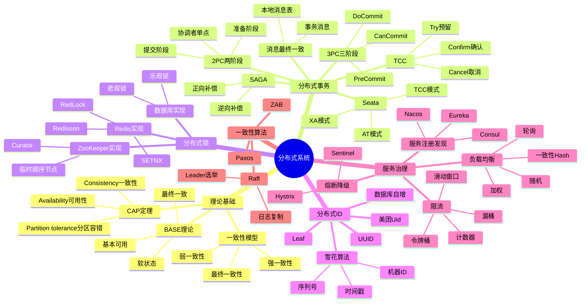

# 分布式系统

> [!summary] TL;DR
> - 一句话定义：分布式系统通过多节点协作完成任务，解决单机性能和可用性瓶颈。
> - 面试一句话结论：CAP 理论、分布式事务、分布式锁、ID 生成是核心考点。
> - 关键点：一致性算法、分布式事务方案、服务治理、限流熔断。

> [!tip]
> **工程师思维自检**：
> 1. 我能解释 CAP 理论及其权衡吗？
> 2. 我能说清楚分布式事务的解决方案吗？

---

## 知识体系总览

---

## 核心模块导航

### 1. 理论基础

| 笔记 | 核心内容 | 面试频率 |
| :--- | :--- | :--- |
| [[CAP与BASE理论]] | 分布式权衡 | ⭐⭐⭐⭐⭐ |
| [[一致性算法]] | Paxos/Raft | ⭐⭐⭐⭐ |

### 2. 分布式事务

| 笔记 | 核心内容 | 面试频率 |
| :--- | :--- | :--- |
| [[分布式事务方案]] | 2PC/TCC/SAGA | ⭐⭐⭐⭐⭐ |
| [[Seata实战]] | AT/TCC模式 | ⭐⭐⭐⭐ |

### 3. 分布式锁与ID

| 笔记 | 核心内容 | 面试频率 |
| :--- | :--- | :--- |
| [[分布式锁实现]] | Redis/ZK | ⭐⭐⭐⭐⭐ |
| [[分布式ID生成]] | 雪花算法 | ⭐⭐⭐⭐ |

### 4. 服务治理

| 笔记 | 核心内容 | 面试频率 |
| :--- | :--- | :--- |
| [[服务注册与发现]] | Nacos/Eureka | ⭐⭐⭐⭐ |
| [[限流熔断降级]] | Sentinel | ⭐⭐⭐⭐⭐ |

---

## 经典面试题速查

| 问题 | 简答 |
| :--- | :--- |
| CAP 理论？ | 一致性/可用性/分区容错，三选二，通常 CP 或 AP |
| BASE 理论？ | 基本可用、软状态、最终一致，对 CAP 的权衡 |
| 2PC 缺点？ | 同步阻塞、单点故障、数据不一致风险 |
| TCC 原理？ | Try 预留 → Confirm 确认/Cancel 取消，业务侵入大 |
| SAGA 原理？ | 长事务拆分，正向执行 + 逆向补偿 |
| 分布式锁实现？ | Redis SETNX、ZK 临时顺序节点、数据库 |
| Redis 锁问题？ | 过期时间、主从切换、Redisson 看门狗 |
| 雪花算法？ | 64位：时间戳41 + 机器ID10 + 序列号12 |
| 限流算法？ | 计数器、滑动窗口、令牌桶、漏桶 |

---

## 相关笔记（双向链接）

- [[Redis缓存]]
- [[消息队列]]
- [[Spring框架]]
- [[MySQL数据库]]
