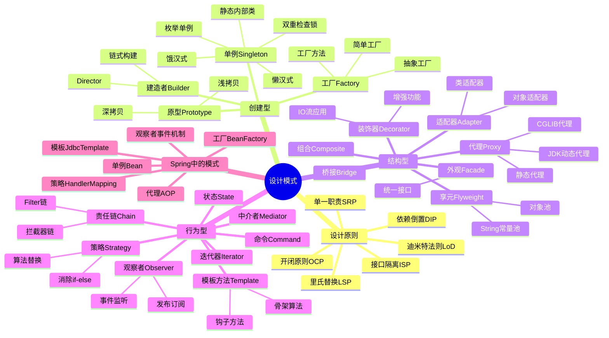

# 设计模式

> [!summary] TL;DR
> - 一句话定义：设计模式是解决软件设计中常见问题的可复用方案。
> - 面试一句话结论：单例、工厂、代理、策略、观察者是高频考点。
> - 关键点：六大原则、创建型/结构型/行为型分类、Spring 中的设计模式应用。

> [!tip]
> **工程师思维自检**：
> 1. 我能手写双重检查锁单例吗？
> 2. 我能说出 Spring 中用到了哪些设计模式吗？

---

## 知识体系总览



---

## 核心模块导航

### 1. 创建型模式

| 笔记 | 核心内容 | 面试频率 |
| :--- | :--- | :--- |
| [[单例模式详解]] | 五种实现/线程安全 | ⭐⭐⭐⭐⭐ |
| [[工厂模式详解]] | 简单/方法/抽象 | ⭐⭐⭐⭐⭐ |
| [[建造者模式]] | 链式构建 | ⭐⭐⭐ |

### 2. 结构型模式

| 笔记 | 核心内容 | 面试频率 |
| :--- | :--- | :--- |
| [[代理模式详解]] | 静态/动态/CGLIB | ⭐⭐⭐⭐⭐ |
| [[适配器与装饰器]] | 区别与应用 | ⭐⭐⭐⭐ |

### 3. 行为型模式

| 笔记 | 核心内容 | 面试频率 |
| :--- | :--- | :--- |
| [[策略模式详解]] | 算法替换 | ⭐⭐⭐⭐ |
| [[模板方法模式]] | 骨架算法 | ⭐⭐⭐⭐ |
| [[观察者模式]] | 发布订阅 | ⭐⭐⭐⭐ |
| [[责任链模式]] | 拦截器链 | ⭐⭐⭐⭐ |

---

## 经典面试题速查

| 问题 | 简答 |
| :--- | :--- |
| 单例模式实现？ | 饿汉式、懒汉式、DCL、静态内部类、枚举 |
| DCL 为什么要 volatile？ | 防止指令重排序导致获取未初始化对象 |
| 工厂模式区别？ | 简单工厂违反开闭，方法工厂扩展性好，抽象工厂生产产品族 |
| 代理和装饰器区别？ | 代理控制访问，装饰器增强功能 |
| JDK 动态代理 vs CGLIB？ | JDK 基于接口反射，CGLIB 基于类继承字节码 |
| 策略模式解决什么？ | 消除 if-else，算法可替换 |
| Spring 用了哪些模式？ | 单例、工厂、代理、模板、观察者、策略 |

---

## 代码速查

### 双重检查锁单例

```java
public class Singleton {
    // volatile 防止指令重排序
    private static volatile Singleton instance;

    private Singleton() {}

    public static Singleton getInstance() {
        if (instance == null) {              // 第一次检查
            synchronized (Singleton.class) {
                if (instance == null) {      // 第二次检查
                    instance = new Singleton();
                }
            }
        }
        return instance;
    }
}
```

### 策略模式

```java
// 策略接口
public interface PayStrategy {
    void pay(int amount);
}

// 具体策略
public class AliPay implements PayStrategy {
    public void pay(int amount) {
        System.out.println("支付宝支付: " + amount);
    }
}

// 上下文
public class PayContext {
    private PayStrategy strategy;

    public void setStrategy(PayStrategy strategy) {
        this.strategy = strategy;
    }

    public void execute(int amount) {
        strategy.pay(amount);
    }
}
```

---

## 相关笔记（双向链接）

- [[Java基础]]
- [[Spring框架]]
- [[Java并发编程]]
