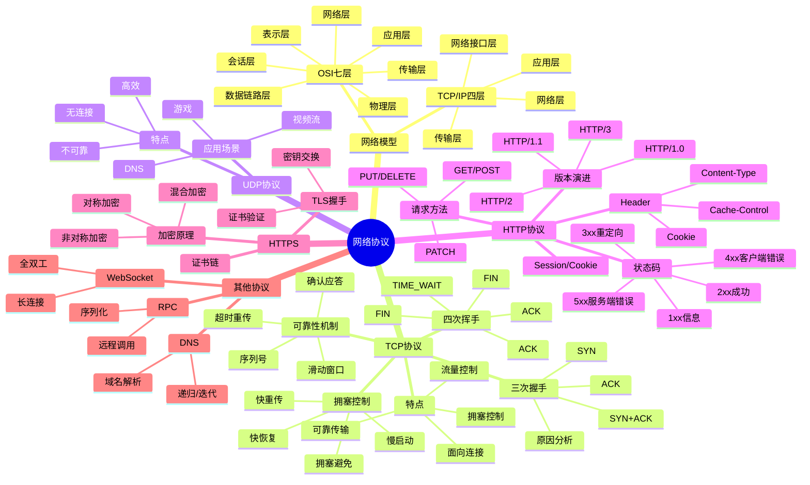

# 网络协议

> [!summary] TL;DR
> - 一句话定义：计算机网络协议定义了数据通信的规则，TCP/IP 是互联网的基础。
> - 面试一句话结论：TCP 三次握手四次挥手、HTTP/HTTPS、网络模型是必考核心。
> - 关键点：OSI/TCP模型、TCP 可靠传输、HTTP 协议、HTTPS 加密、Socket 编程。

> [!tip]
> **工程师思维自检**：
> 1. 我能解释 TCP 三次握手的原因吗？
> 2. 我能说清楚 HTTPS 的加密过程吗？

---

## 知识体系总览

---

## 核心模块导航

### 1. TCP/UDP

| 笔记 | 核心内容 | 面试频率 |
| :--- | :--- | :--- |
| [[TCP协议详解]] | 握手/挥手/可靠性 | ⭐⭐⭐⭐⭐ |
| [[TCP拥塞控制]] | 慢启动/快重传 | ⭐⭐⭐⭐ |
| [[TCP与UDP对比]] | 特点/场景 | ⭐⭐⭐⭐ |

### 2. HTTP/HTTPS

| 笔记 | 核心内容 | 面试频率 |
| :--- | :--- | :--- |
| [[HTTP协议详解]] | 版本/方法/状态码 | ⭐⭐⭐⭐⭐ |
| [[HTTPS加密原理]] | TLS/证书 | ⭐⭐⭐⭐⭐ |
| [[HTTP缓存机制]] | 强缓存/协商缓存 | ⭐⭐⭐⭐ |

### 3. 其他协议

| 笔记 | 核心内容 | 面试频率 |
| :--- | :--- | :--- |
| [[DNS解析原理]] | 递归/迭代 | ⭐⭐⭐ |
| [[WebSocket原理]] | 全双工通信 | ⭐⭐⭐ |

---

## 经典面试题速查

| 问题 | 简答 |
| :--- | :--- |
| TCP vs UDP？ | TCP 可靠有连接，UDP 高效无连接 |
| 三次握手原因？ | 确认双方收发能力正常，防止历史连接 |
| 四次挥手原因？ | TCP 全双工，需双方各自关闭 |
| TIME_WAIT 作用？ | 确保最后 ACK 到达，等待 2MSL |
| GET vs POST？ | GET 幂等可缓存参数在 URL，POST 非幂等参数在 body |
| HTTP 状态码？ | 200 成功，301/302 重定向，404 未找到，500 服务器错误 |
| HTTPS 原理？ | 非对称加密交换密钥，对称加密传输数据 |
| HTTP/1.1 vs HTTP/2？ | HTTP/2 多路复用、头部压缩、服务器推送 |
| Cookie vs Session？ | Cookie 客户端存储，Session 服务端存储 |

---

## 相关笔记（双向链接）

- [[Java基础]]
- [[分布式系统]]
- [[Spring框架]]
