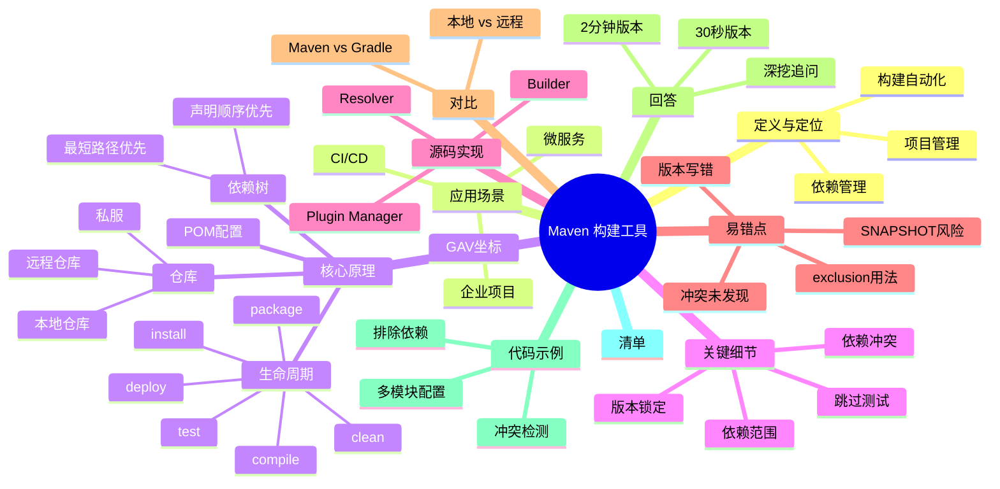

# Maven 构建工具与项目管理

> [!summary] TL;DR（3-5 行）
> - 一句话定义：Maven 是 Java 项目的依赖管理与构建自动化工具，通过 pom.xml 集中管理。
> - 面试一句话结论：Maven 用 GAV 坐标定位依赖，通过生命周期与插件完成编译/打包/发布。
> - 关键点：pom.xml 配置、依赖传递、Maven 生命周期、本地仓库与远程仓库。
> - 常见坑：依赖冲突、版本锁定不当、跳过必要的生命周期阶段。

> [!tip]
> **工程师思维自检**：
> 1. 我能解释"为什么 Maven 依赖冲突会发生"吗？
> 2. 我能快速定位 pom.xml 中的问题吗？

---

## 1. 定义与定位

- **它是什么**：Maven 是一个项目管理工具，负责 Java 项目的依赖管理、编译、测试、打包与发布。
- **解决什么问题**：避免手动管理 jar 包、统一构建流程、提升团队协作效率。
- **体系中的位置**：Java 工程体系的基础设施层。[[Java项目工程化]] [[Gradle]]

---

## 2. 应用场景

- 场景 1：企业 Java 项目的标准构建工具。
- 场景 2：微服务与模块化项目的多模块构建。
- 场景 3：CI/CD 流程中的自动化构建。
- 不适用：纯前端项目（用 npm/yarn）、Go/Rust 等其他语言。

---

## 3. 核心原理（面试够用版）

> [!note] 先给结论，再解释"怎么做到"

- **核心机制**（5-7 条要点）：
  1) **GAV 坐标**唯一标识一个依赖（GroupId/ArtifactId/Version）。
  2) **pom.xml** 是项目配置文件，声明依赖与构建规则。
  3) **依赖传递**：直接依赖的依赖会被自动引入。
  4) **Maven 生命周期**：clean → validate → compile → test → package → install → deploy。
  5) **本地仓库**存储已下载的 jar，**远程仓库**是 jar 的来源。
  6) **插件系统**支持扩展功能（编译、测试、打包等）。

### 3.1 关键流程（步骤）

1. 读取 pom.xml 中的依赖声明。
2. 检查本地仓库，缺失时从远程仓库下载。
3. 解析依赖树（处理传递依赖与冲突）。
4. 执行相应的构建阶段（生命周期）。

### 3.2 关键概念

- **GAV 坐标**：GroupId（公司域名倒写）+ ArtifactId（项目名）+ Version（版本号）。
- **POM**：Project Object Model，项目对象模型，Maven 配置的核心。
- **仓库**：本地（~/.m2/repository）和远程（中央仓库、私服）。
- **生命周期**：Maven 构建的标准流程，分为三个独立的生命周期（clean/default/site）。

### 3.3 费曼类比

> [!tip] 用人话解释
> Maven 就像一个"超级管家"：你告诉它"我要用哪些包"（pom.xml），它自动去"超市"（远程仓库）买回来，放到你的"储物间"（本地仓库）。然后按照你的"待办清单"（生命周期）依次编译、打包、发布。

---

## 4. 关键细节清单（高频考点）

- 考点 1：**依赖冲突解决**：最短路径优先 + 声明顺序优先。
- 考点 2：**依赖范围**：compile/provided/runtime/test/system 的区别。
- 考点 3：**版本锁定**：使用 dependencyManagement 统一版本。
- 考点 4：**生命周期阶段**：clean/compile/test/package/install/deploy。
- 考点 5：**跳过测试**：mvn clean install -DskipTests。
- 考点 6：**私服配置**：settings.xml 中的 mirror 与 server 标签。

---

## 5. 源码/实现要点（不装行号，只抓关键）

> [!tip] 目标：回答"Maven 如何管理依赖与构建"

- **关键组件**：
  - **Resolver**：负责依赖解析与下载（Maven 3.x+ 使用 Aether）。
  - **Builder**：构建 DAG（有向无环图）表示依赖树。
  - **Plugin Manager**：加载并执行相应的插件。

- **关键流程**：
  1. 解析 pom.xml → 2. 构建依赖树 → 3. 下载缺失的依赖 → 4. 执行插件.

- **关键策略**：
  - 最短路径优先解决冲突（深度小的版本优先）。
  - 声明顺序作为第二优先级（pom.xml 中声明顺序在前优先）。
  - exclusion 标签显式排除不需要的传递依赖。

- **面试话术**：Maven 通过依赖树算法与优先级规则自动处理冲突，比手动管理更高效。

---

## 6. 易错点与陷阱（至少 5 条）

1) **依赖冲突未及时发现**：使用 `mvn dependency:tree` 查看完整依赖树。
2) **版本号写错导致拉取失败**：检查中央仓库是否真的有这个版本。
3) **exclusion 用法错误**：排除的应该是传递依赖中不需要的包。
4) **跳过测试但忘记测试覆盖**：生产代码缺乏测试验证。
5) **私服配置不正确导致下载缓慢**：检查 settings.xml 中的镜像配置。
6) **snapshot 版本在生产使用**：snapshot 不稳定，应该用 release。
7) **本地仓库污染**：清理 ~/.m2/repository 后重新下载。

---

## 7. 对比与扩展（至少 2 组）

- **Maven vs Gradle**：Maven 声明式（告诉做什么），Gradle 程序式（描述如何做）；Maven 学习曲线平缓，Gradle 灵活性强。
- **最短路径 vs 声明顺序**：深度优先解决冲突，同深度时声明顺序优先。
- **本地仓库 vs 远程仓库**：本地是缓存，远程是源头；私服可以加速且隐私保护。
- 扩展问题：如何搭建私有 Maven 仓库？Nexus 或 Artifactory 的选型依据？

### 对比表

| 特性 | Maven | Gradle |
| :--- | :--- | :--- |
| 配置方式 | XML（pom.xml） | DSL（build.gradle） |
| 学习成本 | 低 | 中 |
| 构建速度 | 中 | 快（增量构建） |
| 灵活性 | 低 | 高 |
| 企业使用 | 非常广泛 | 新项目趋势 |

---

## 8. 标准面试回答（可直接背）

### 8.1 30 秒版本（电梯回答）

> [!quote]
> Maven 是 Java 项目的构建工具，用 pom.xml 管理依赖。通过 GAV 坐标唯一标识依赖，支持依赖传递与自动冲突解决。生命周期分为 clean/compile/test/package/install/deploy，完整了 Java 工程化流程。

### 8.2 2 分钟版本（结构化展开）

> [!quote]
> 1) **定义与定位**：Maven 是依赖管理 + 构建自动化工具。
> 2) **核心机制**：GAV 坐标定位依赖，pom.xml 声明配置，依赖树自动解析。
> 3) **生命周期**：clean（清理）→ validate（验证）→ compile（编译）→ test（测试）→ package（打包）→ install（安装）→ deploy（发布）。
> 4) **冲突解决**：最短路径优先 + 声明顺序优先。
> 5) **常见问题**：依赖冲突用 dependency:tree 定位，版本不一致用 dependencyManagement 统一。

### 8.3 深挖追问（面试官继续问什么）

- 追问 1：依赖冲突如何解决？→ 最短路径 + 声明顺序，可用 exclusion 显式排除。
- 追问 2：本地仓库与远程仓库的关系？→ 本地是缓存，缺失时自动从远程下载。
- 追问 3：如何避免 SNAPSHOT 在生产使用？→ CI/CD 流程中强制检查版本号。
- 追问 4：Maven 生命周期能否自定义？→ 不能改生命周期本身，但可以通过插件扩展阶段。
- 追问 5：多模块项目如何管理？→ 父 POM 定义公共配置，子模块继承并覆盖。

---

## 9. 代码题与代码示例（必须有详注）

> [!important] 要求：注释解释"为什么这样写"，不是解释语法

### 9.1 面试代码题（2-3 题）

- 题 1：给定 pom.xml，找出依赖冲突的根本原因。
- 题 2：如何配置 Maven 跳过测试但保留代码？
- 题 3：如何在多模块项目中统一依赖版本？

### 9.2 参考代码（Java + pom.xml）

#### 场景 1：解析 POM 中的依赖冲突

```java
// 目标：模拟 Maven 的依赖树构建与冲突检测
// 注意：这是简化版本，实际 Maven 使用更复杂的算法
import java.util.*;

public class MavenDependencyResolver {
    // 依赖节点的表示
    static class Dependency {
        String groupId, artifactId, version;
        int depth;

        Dependency(String ga, String v, int d) {
            String[] parts = ga.split(":");
            this.groupId = parts[0];
            this.artifactId = parts[1];
            this.version = v;
            this.depth = d;
        }

        @Override
        public String toString() {
            return groupId + ":" + artifactId + ":" + version + " (depth=" + depth + ")";
        }
    }

    public static void main(String[] args) {
        // 为什么用 Map：快速查询冲突的版本
        Map<String, List<Dependency>> depMap = new LinkedHashMap<>();

        // 模拟依赖树：
        // A -> B:1.0 (depth=1)
        // A -> C -> B:2.0 (depth=2)
        depMap.put("B", Arrays.asList(
            new Dependency("org.example:B", "1.0", 1),
            new Dependency("org.example:B", "2.0", 2)
        ));

        System.out.println("依赖冲突检测:");
        for (String artifact : depMap.keySet()) {
            List<Dependency> versions = depMap.get(artifact);
            if (versions.size() > 1) {
                System.out.println("冲突: " + artifact);
                // 为什么排序：最短路径优先（depth 小的获胜）
                versions.sort(Comparator.comparingInt((Dependency d) -> d.depth)
                                        .thenComparingInt(d -> -d.artifactId.compareTo(d.artifactId)));
                System.out.println("  选中版本: " + versions.get(0));
                System.out.println("  被排斥: " + versions.get(1));
            }
        }
    }
}

// 输出：
// 依赖冲突检测:
// 冲突: B
//   选中版本: org.example:B:1.0 (depth=1)
//   被排斥: org.example:B:2.0 (depth=2)
```

#### 场景 2：多模块项目的 pom.xml 配置

```xml
<!-- 父 POM：parent-pom.xml -->
<project>
    <modelVersion>4.0.0</modelVersion>
    <groupId>com.example</groupId>
    <artifactId>multi-module-parent</artifactId>
    <version>1.0.0</version>
    <packaging>pom</packaging>

    <!-- 为什么用 dependencyManagement：统一版本，避免子模块重复声明 -->
    <dependencyManagement>
        <dependencies>
            <dependency>
                <groupId>org.springframework</groupId>
                <artifactId>spring-core</artifactId>
                <version>5.3.0</version>
            </dependency>
        </dependencies>
    </dependencyManagement>

    <!-- 为什么用 modules：多模块聚合构建 -->
    <modules>
        <module>core</module>
        <module>web</module>
        <module>api</module>
    </modules>
</project>

<!-- 子 POM：core/pom.xml -->
<project>
    <modelVersion>4.0.0</modelVersion>
    <parent>
        <groupId>com.example</groupId>
        <artifactId>multi-module-parent</artifactId>
        <version>1.0.0</version>
    </parent>

    <artifactId>core</artifactId>

    <!-- 为什么不写版本：从 parent 的 dependencyManagement 继承 -->
    <dependencies>
        <dependency>
            <groupId>org.springframework</groupId>
            <artifactId>spring-core</artifactId>
            <!-- version 省略，使用 parent 定义的 5.3.0 -->
        </dependency>
    </dependencies>
</project>
```

#### 场景 3：排除冲突依赖

```xml
<!-- 为什么用 exclusion：A 依赖 B:1.0，B 又依赖 C:1.0，但我们的项目要用 C:2.0 -->
<dependency>
    <groupId>com.example</groupId>
    <artifactId>lib-a</artifactId>
    <version>1.0</version>

    <!-- 显式排除传递依赖中的 C:1.0 -->
    <exclusions>
        <exclusion>
            <groupId>com.other</groupId>
            <artifactId>lib-c</artifactId>
            <!-- 为什么不写版本：exclusion 只关心是否排除，不关心版本 -->
        </exclusion>
    </exclusions>
</dependency>

<!-- 然后显式引入我们需要的版本 -->
<dependency>
    <groupId>com.other</groupId>
    <artifactId>lib-c</artifactId>
    <version>2.0</version>
</dependency>
```

---

## 10. 复习 Checklist（可勾选）

- [ ] 我能解释 GAV 坐标的含义。
- [ ] 我能说清依赖传递与冲突解决规则。
- [ ] 我能手写一个基本的 pom.xml。
- [ ] 我能用 dependency:tree 定位冲突问题。
- [ ] 我能配置 dependencyManagement 统一版本。
- [ ] 我能解释 Maven 生命周期的顺序。
- [ ] 我能配置私服镜像加快下载。
- [ ] 我能排除不需要的传递依赖。

---

## 11. Mermaid 思维导图（Obsidian 可渲染）



---

## Java 领域额外说明

- **依赖管理**：Maven 是 Java 生态的标准工具，解决了 jar hell 问题。
- **与 Spring Boot 集成**：Spring Boot 提供 spring-boot-starter 简化依赖配置。
- **与微服务的关系**：多模块 Maven 项目是微服务架构的基础。

---

## 相关笔记（双向链接）

- [[Java项目工程化]]
- [[Gradle构建工具]]
- [[Spring Boot与自动化配置]]
- [[CI/CD流程]]
- [[Java依赖管理最佳实践]]

---

## 建议参考

- **官方资源**：[Apache Maven 官网](https://maven.apache.org/) - 最权威的文档与示例。
- **深入理解**：《Maven 实战》（徐晓斌）- 经典教材，覆盖依赖管理与多模块。
- **快速查询**：[Maven Central Repository](https://mvnrepository.com/) - 查询依赖坐标与最新版本。
- **私服搭建**：Nexus 或 Artifactory 的选型与配置。

