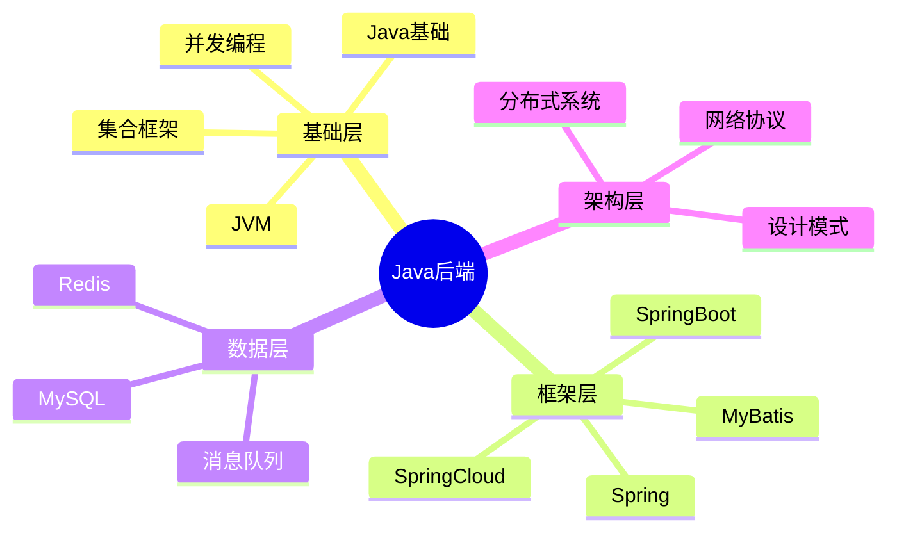
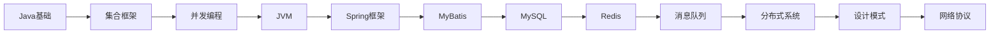

# Java后端八股总览

> [!summary] TL;DR
> - 本索引覆盖 Java 后端开发面试的核心知识体系
> - 包含 Java 基础、JVM、并发、框架、数据库、中间件、分布式等模块
> - 每个模块提供思维导图、高频考点、面试题速查

> [!tip]
> **面试准备建议**：
> 1. 按模块逐个击破，先广度后深度
> 2. 重点掌握每个模块的高频考点
> 3. 结合实际项目经验准备回答

---

## 知识体系总览



---

## 模块导航

### 基础层

| 序号 | 模块 | 核心内容 | 面试权重 |
| :---: | :--- | :--- | :---: |
| 01 | [[前端基础]] | HTML/CSS/JavaScript | ⭐⭐ |
| 02 | [[JVM基础]] | 内存模型/GC/类加载 | ⭐⭐⭐⭐⭐ |
| 03 | [[Java基础]] | 面向对象/异常/泛型/反射 | ⭐⭐⭐⭐ |
| 04 | [[Java集合框架]] | ArrayList/HashMap/ConcurrentHashMap | ⭐⭐⭐⭐⭐ |
| 05 | [[Java并发编程]] | 线程/锁/线程池/JUC | ⭐⭐⭐⭐⭐ |

### 框架层

| 序号 | 模块 | 核心内容 | 面试权重 |
| :---: | :--- | :--- | :---: |
| 06 | [[Spring框架]] | IoC/AOP/事务/SpringBoot | ⭐⭐⭐⭐⭐ |
| 07 | [[MyBatis框架]] | SQL映射/缓存/插件 | ⭐⭐⭐⭐ |

### 数据层

| 序号 | 模块 | 核心内容 | 面试权重 |
| :---: | :--- | :--- | :---: |
| 08 | [[MySQL数据库]] | 索引/事务/锁/优化 | ⭐⭐⭐⭐⭐ |
| 09 | [[Redis缓存]] | 数据结构/持久化/缓存问题 | ⭐⭐⭐⭐⭐ |
| 10 | [[消息队列]] | Kafka/RabbitMQ/可靠性 | ⭐⭐⭐⭐ |

### 架构层

| 序号 | 模块 | 核心内容 | 面试权重 |
| :---: | :--- | :--- | :---: |
| 11 | [[分布式系统]] | CAP/分布式事务/锁/ID | ⭐⭐⭐⭐⭐ |
| 12 | [[设计模式]] | 创建型/结构型/行为型 | ⭐⭐⭐⭐ |
| 13 | [[网络协议]] | TCP/HTTP/HTTPS | ⭐⭐⭐⭐ |

---

## 面试高频 Top 20

| 排名 | 考点 | 所属模块 |
| :---: | :--- | :--- |
| 1 | HashMap 原理与源码 | 集合框架 |
| 2 | synchronized 与锁升级 | 并发编程 |
| 3 | 线程池核心参数与执行流程 | 并发编程 |
| 4 | Spring IoC 与 Bean 生命周期 | Spring |
| 5 | Spring AOP 原理 | Spring |
| 6 | Spring 事务失效场景 | Spring |
| 7 | MySQL 索引原理（B+树） | MySQL |
| 8 | MySQL 事务与 MVCC | MySQL |
| 9 | Redis 数据结构与应用 | Redis |
| 10 | 缓存穿透/击穿/雪崩 | Redis |
| 11 | JVM 内存模型 | JVM |
| 12 | GC 算法与垃圾回收器 | JVM |
| 13 | ConcurrentHashMap 原理 | 集合框架 |
| 14 | volatile 关键字 | 并发编程 |
| 15 | ThreadLocal 原理 | 并发编程 |
| 16 | 分布式事务方案 | 分布式 |
| 17 | 分布式锁实现 | 分布式 |
| 18 | Kafka 高性能原理 | 消息队列 |
| 19 | TCP 三次握手四次挥手 | 网络 |
| 20 | HTTPS 加密原理 | 网络 |

---

## 学习路线建议



**阶段划分**：
1. **第一阶段**（1-2周）：Java 基础 + 集合 + 并发
2. **第二阶段**（1周）：JVM 深入
3. **第三阶段**（1-2周）：Spring 全家桶 + MyBatis
4. **第四阶段**（1-2周）：MySQL + Redis
5. **第五阶段**（1周）：消息队列 + 分布式
6. **第六阶段**（1周）：设计模式 + 网络 + 查漏补缺

---

## 目录结构

```
20_Java_FullStack/
├── 01_Frontend/          # 前端基础
├── 02_JVM/               # JVM
├── 03_JavaSE/            # Java基础
├── 04_Collections/       # 集合框架
├── 05_Concurrency/       # 并发编程
├── 06_Spring/            # Spring框架
├── 07_MyBatis/           # MyBatis
├── 08_MySQL/             # MySQL数据库
├── 09_Redis/             # Redis缓存
├── 10_MessageQueue/      # 消息队列
├── 11_Distributed/       # 分布式系统
├── 12_DesignPatterns/    # 设计模式
├── 13_Network/           # 网络协议
└── Build_Tools/          # 构建工具
```
