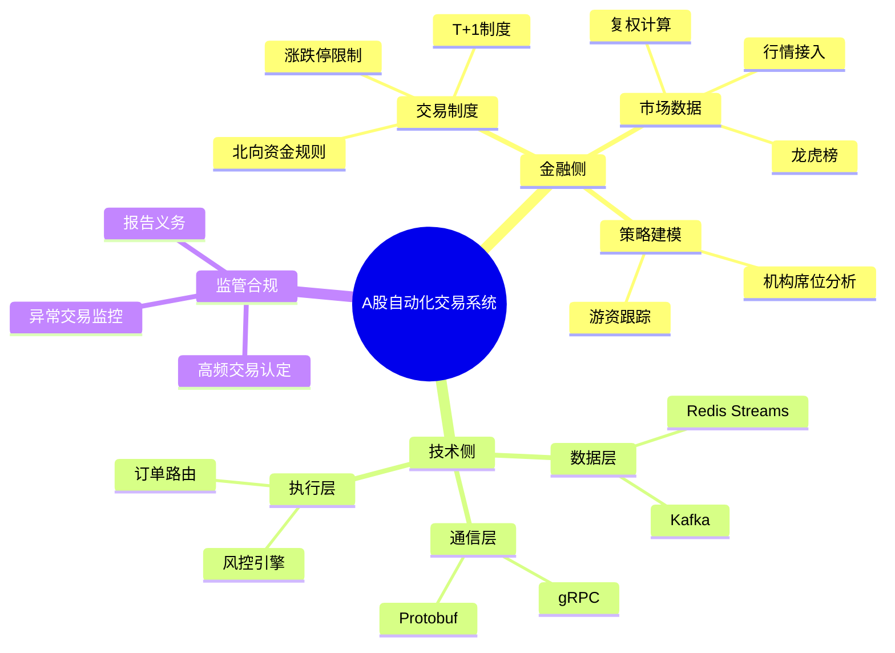

# A股自动化交易系统概览

## TL;DR

构建集金融微观结构建模（T+1规则、龙虎榜博弈）与高性能分布式架构（gRPC/Redis）于一体的自动化交易平台，在合规监管框架下通过低延迟执行与深度数据挖掘获取 Alpha。^[1,2]

## 知识地图

## 系统架构

### 核心模块

| 模块 | 技术栈 | 职责 |
|------|--------|------|
| **数据接入层** | Netty + Socket | 接收解析实时行情（盘前竞价/连续竞价）^[3] |
| **策略引擎层** | Python 多进程 | 订阅行情、生成交易信号（解决 GIL 限制）^[3] |
| **风控执行层** | Java/C++ | 静态/动态风控校验、订单路由（系统心脏）^[3] |
| **账户管理模块** | - | 资金状态维护、杠杆率计算、持仓复权^[4] |
| **回测系统** | - | 消除幸存者偏差、未来函数校验、滑点模拟^[5] |

## 金融侧要点

### 交易制度

| 制度 | 说明 |
|------|------|
| **股票 T+1** | 当日买入次日方可卖出 |
| **资金 T+0** | 当日回笼资金可用不可取 |
| **涨跌停** | 主板 ±10%，科创/创业板 ±20% |
| **北向资金** | 仅限价单，不可改单（需先撤后报）^[6,11] |

### 龙虎榜策略

**触发条件：**
- 涨跌幅偏离值 ±7%
- 换手率 20%
- 振幅 15%^[7,8]

**策略建模要点：**
- 关注「机构席位」与「知名游资」协同效应
- 买卖前五金额比 ≥ 2:1 为强势信号
- 三连板后「爆量分歧」低吸机会^[9,10]

### 复权计算

- **前复权**：以当前价为基准向前修正
- **后复权**：以发行价为基准向后修正
- 目的：消除分红送配导致的价格断裂，保证技术指标连续性^[12,13]

## 技术侧要点

### 通信技术选型

| 技术 | 优势 | 适用场景 |
|------|------|----------|
| **gRPC** | HTTP/2 双向流、Protobuf 序列化（比 JSON 紧凑 5 倍） | 策略端 ↔ 执行端低延迟指令推送^[14] |
| **Redis Streams** | 内存操作低延迟、运维简易、支持消费组 | 中等吞吐量 MVP、高频 Tick 分发^[3] |
| **Kafka** | 极高吞吐、持久化存储 | 日志归档、海量历史数据同步^[18,19] |

### 设计模式

- **观察者模式**：处理行情驱动逻辑
- **状态模式**：管理订单生命周期（Pending → Filled/Cancelled）^[20]

## 监管合规要点

### 高频交易认定标准

| 指标 | 阈值 |
|------|------|
| 单账户每秒申报/撤单 | > 300 笔 |
| 全日申报/撤单 | > 20,000 笔 |

触发后面临差异化收费与重点监控^[21,22]

### 异常交易行为（必须规避）

- 频繁瞬时撤单（委托后 < 100ms 撤单）
- 瞬时申报速率异常
- 拉抬打压行为^[4,23]

### 合规机制

- **一键断路器（Kill Switch）**：程序错误时立即停止所有交易^[4]
- **先报告后交易**：如实报告账户信息、资金规模、交易策略、服务器位置^[24,25]

## 知识网络

- [[龙虎榜策略]]
- [[T+1制度与复权计算]]
- [[程序化交易监管法规]]
- [[gRPC vs Redis 技术选型]]
- [[分布式架构设计]]

## 引用来源

本文内容来自 NotebookLM 笔记本，共 25 条引用标注。

---

> [!tip] 后续行动
> - 使用 `/sb-visualize` 生成 Canvas 可视化
> - 补充 [[龙虎榜策略]] 等关联概念笔记
> - 安排复习计划
