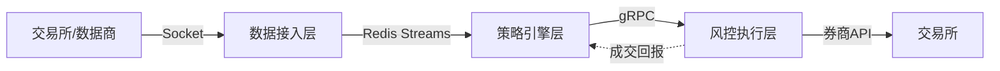

# 分布式架构设计

## 核心定义

量化交易系统采用解耦的三层架构（数据层→策略层→执行层），融合金融特性与高性能计算需求，实现低延迟、高吞吐与合规风控的平衡。^[1]

## 关键要点

### 1. 分层架构



| 层级 | 职责 | 技术选型 |
|------|------|----------|
| **数据接入层** | Socket连接、协议解析、行情分发 | Java Netty（异步非阻塞I/O）^[1] |
| **策略引擎层** | 订阅行情、运行模型、生成信号 | Python 多进程（规避GIL）^[1] |
| **风控执行层** | 静态/动态风控、订单路由 | Java/C++（低GC延迟）^[1] |

### 2. 各层技术选型

#### 指令传输：gRPC

| 特性 | 优势 |
|------|------|
| HTTP/2 多路复用 | 减少TCP握手开销^[15,16] |
| Protobuf 强类型 | 比JSON小5倍，自动生成多语言代码^[5,17] |
| 双向流 | 服务器主动推送成交回报^[4,5] |

**适用**：策略(Python) ↔ 执行(Java/C++)^[1]

#### 行情分发：Redis Streams

| 特性 | 优势 |
|------|------|
| 消费组 | 支持动态扩展策略实例^[1] |
| 内存操作 | 微秒级延迟^[1] |
| 运维简单 | MVP阶段优于Kafka^[6,8] |

**适用**：数据层 → 策略层（扇出分发）^[1]

#### 海量存储：Kafka

| 特性 | 优势 |
|------|------|
| 磁盘持久化 | 全市场数年Tick数据^[3,7] |
| 极高吞吐 | 支持全量回放(Replay)^[3,7] |

**适用**：历史数据存储、回测系统

### 3. 设计模式应用

#### 观察者模式 (Observer)

```
行情适配器 [Subject]
    ├── 策略引擎 [Observer]
    ├── 风控模块 [Observer]
    └── 监控大屏 [Observer]

每当新Tick到达 → 自动触发所有观察者更新
```
实现数据源与业务逻辑解耦^[9]

#### 状态模式 (State)

```
订单生命周期：
Pending → Sent → Accepted → PartialFilled → Filled/Cancelled

每种状态封装合法操作：
- "已报待撤"状态 → 才允许处理"撤单成功"回报
```
防止状态机逻辑混乱^[9]

### 4. 高可用与容错设计

| 机制 | 实现方式 |
|------|----------|
| **Redis高可用** | 部署 Sentinel 或 Cluster，主节点宕机自动切换^[10] |
| **离线队列** | 客户端库(ioredis)缓存指令，重连后自动发送^[11] |
| **消息可靠性** | Redis Streams ACK机制，未确认消息可被认领重处理^[1,12] |
| **合规熔断** | 一键断路器(Kill Switch)，异常时阻断订单发送^[13,14] |

### 5. 性能优化策略

#### 通信优化

| 策略 | 效果 |
|------|------|
| gRPC双向流 | 替代请求-响应，减少TCP握手^[15,16] |
| Protobuf序列化 | 降低CPU开销，减少带宽占用^[5,17] |

#### 内存优化

| 策略 | 效果 |
|------|------|
| Payload压缩(GZIP) | 降低内存占用和网络I/O延迟^[18] |
| 流长度控制(MAXLEN~) | 限制Stream长度，防止内存溢出^[19] |

#### 并发控制

```python
# Python策略层：多进程规避GIL
from multiprocessing import Process

# 每个策略运行在独立进程
strategy_process = Process(target=run_strategy, args=(config,))
strategy_process.start()
```
^[1]

### 6. 系统监控与运维

| 监控项 | 指标 | 告警阈值 |
|--------|------|----------|
| **合规流量** | 每秒报撤单速率 | < 300笔/秒（令牌桶算法）^[20] |
| **Redis状态** | 内存使用率、消费者Lag | 防止处理不过来行情^[19] |
| **gRPC状态** | 连接状态、超时重试 | 合理设置Timeout^[21,22] |

> [!important] 日志与审计
> 所有关键操作（下单、撤单、风控拦截）必须持久化记录，满足"先报告、后交易"的监管合规审计要求^[14]

## 面试考点

**Q: 量化系统为什么采用三层架构？**

> 为实现低延迟、高吞吐与合规风控的平衡。数据层用Netty处理高并发行情，策略层用Python多进程利用科学计算生态，执行层用Java/C++确保低GC延迟和长时稳定运行。三层解耦便于独立扩展和维护。

**Q: 如何保证消息不丢失？**

> Redis Streams的ACK机制：消费者处理完消息必须发送XACK确认，未确认的消息保留在PEL（待处理列表），其他消费者可认领重新处理。

## 知识网络

- [[A股自动化交易系统-概览]]
- [[gRPC vs Redis 技术选型]]
- [[程序化交易监管法规]]

## 引用来源

本文内容来自 NotebookLM 笔记本，共 22 条引用标注。
