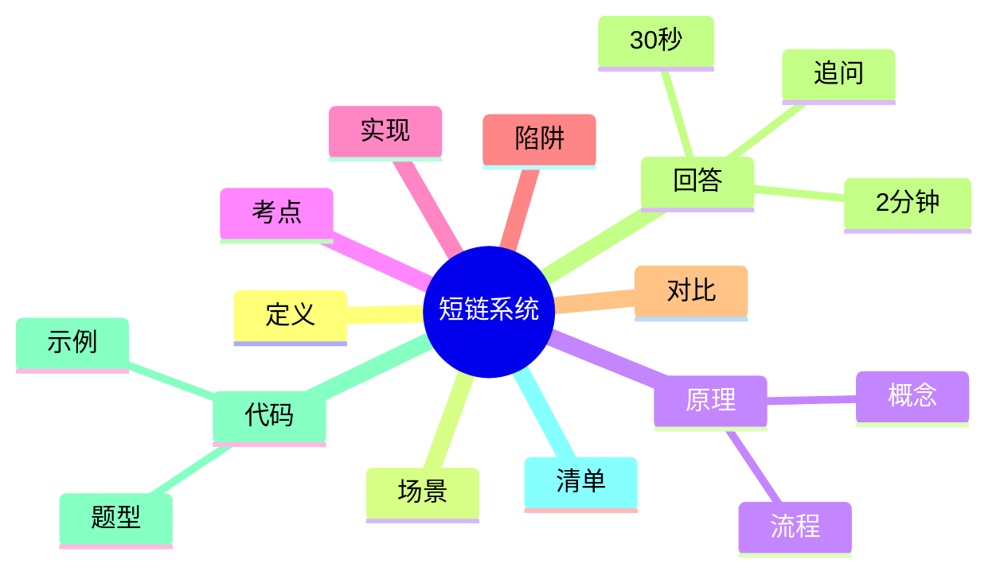
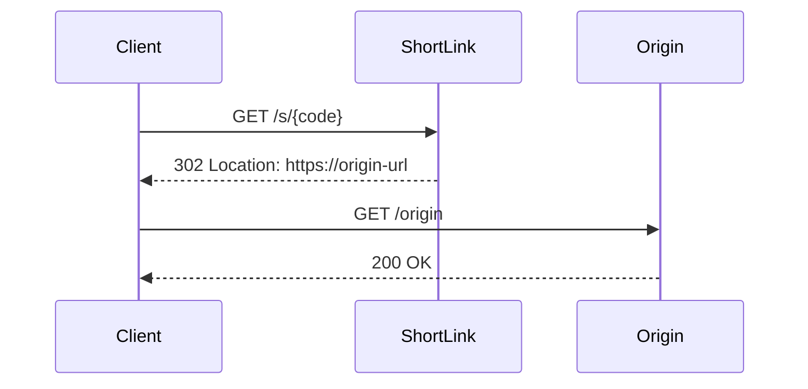

# 短链系统需求分析与设计

> [!summary] TL;DR（3-5 行）
> - 一句话定义：短链系统把长 URL 压缩为短码，并在访问时重定向。
> - 面试一句话结论：关键在“唯一短码生成 + 高性能跳转 + 统计与风控”。
> - 关键点：短码生成、缓存与落库、302 跳转链路、统计异步化。
> - 常见坑：短码冲突、缓存击穿、统计强一致。

> [!tip]
> **工程师思维自检**：
> 1. 我能解释“高并发跳转”为何能撑住吗？
> 2. 我能给出冲突/穿透/雪崩的治理策略吗？

---

## 1. 定义与定位

- **它是什么**：将长 URL 映射为短码，访问短码时 302 跳转到原链接。
- **解决什么问题**：提升分享可读性、便于统计与风控。
- **体系中的位置**：Web 系统设计题，涉及 [[HTTP]]、[[Redis]]、[[MySQL]]。

---

## 2. 应用场景

- 场景 1：社交分享与营销落地页追踪。
- 场景 2：内部系统链接管理与统计。
- 不适用：不允许重定向或对 URL 完整性要求极高的场景。

---

## 3. 核心原理（面试够用版）

> [!note] 先给结论，再解释“怎么做到”

- **核心机制**（5-7 条要点）：
  1) 生成短码（Base62/雪花/自增 ID）。
  2) 落库建立短码 → 长链映射。
  3) 缓存命中直接 302 跳转。
  4) 缓存未命中回源 DB，再回填缓存。
  5) 访问日志异步化，统计与报表延迟可接受。
  6) 风控：黑名单、过期控制、访问频控。

### 3.1 关键流程（步骤）

1. 创建短链：校验 URL → 生成短码 → 写库 → 写缓存。
2. 访问短链：查缓存 → 302 跳转 → 记录访问事件。
3. 统计：异步消费访问事件 → 聚合报表。

### 3.2 关键数据结构/概念

- **短码**：短链接 ID（Base62 或哈希）。
- **访问事件**：用于 PV/UV 统计的事件流。

### 3.3 费曼类比

> [!tip] 用人话解释
> 像把“长地址”换成“快递取件码”，输入短码就能找到真正地址。

---

## 4. 关键细节清单（高频考点）

- 考点 1：短码冲突策略（重试/随机化）。
- 考点 2：缓存击穿与穿透治理（Bloom Filter、空值缓存）。
- 考点 3：统计异步化，避免影响跳转延迟。
- 考点 4：过期策略与黑名单处理。

---

## 5. 源码/实现要点（不装行号，只抓关键）

> [!tip] 目标：回答“实现层面为什么这样设计”

- **关键组件**：短码生成器、缓存层、数据库、统计消费端。
- **关键流程**：生成短码 → 写库 → 回填缓存 → 跳转。
- **关键策略**：热路径只读缓存，统计走异步消息队列。
- **面试话术**：跳转链路是读缓存优先，统计异步化避免阻塞。

---

## 6. 易错点与陷阱（至少 5 条）

1) 短码冲突未处理导致覆盖旧数据。
2) 缓存穿透导致 DB 被打爆。
3) 统计强一致要求过高导致延迟变大。
4) 过期短链未清理，产生脏数据。
5) 302 跳转链路未考虑 HTTPS/头信息。

---

## 7. 对比与扩展（至少 2 组）

- **302 vs 301**：302 临时跳转更符合短链变更场景。
- **Base62 vs 哈希**：Base62 可控长度，哈希有冲突风险。
- 扩展问题：如何做短链风控与防刷？

### 对比表

| 特性 | Base62 | 哈希 |
| :--- | :--- | :--- |
| 长度可控 | 强 | 弱 |
| 冲突概率 | 低 | 中 |
| 可解码性 | 可 | 不可 |

---

## 8. 标准面试回答（可直接背）

### 8.1 30 秒版本（电梯回答）

> [!quote]
> 短链系统把长 URL 转成短码并在访问时 302 跳转。核心是短码生成与去重、缓存优先的跳转路径以及异步统计，保障高并发访问下的稳定性。常见治理是 Bloom Filter、防止缓存穿透与冲突重试。

### 8.2 2 分钟版本（结构化展开）

> [!quote]
> 1) 定义与定位：短链是 URL 映射系统。 
> 2) 场景：分享与统计。 
> 3) 原理：短码生成→落库→缓存→跳转，统计异步化。 
> 4) 易错点：冲突、缓存击穿、统计阻塞。 
> 5) 扩展：风控与限流。

### 8.3 深挖追问（面试官继续问什么）

- 追问 1：如何保证短码唯一？→ 自增 ID + Base62 或重试。
- 追问 2：跳转链路如何优化？→ 缓存优先 + 热点预热。
- 追问 3：统计如何保证性能？→ 异步队列批量写入。

---

## 9. 代码题与代码示例（必须有详注）

> [!important] 要求：注释解释“为什么这样写”，不是解释语法

### 9.1 面试代码题（2-3 题）

- 题 1：实现 Base62 编码，用于短码生成。
- 题 2：如何设计缓存命中率统计？
- 题 3：如何做短码冲突重试？

### 9.2 参考代码（Java）

```java
// 目标：用 Base62 生成短码（示意）
// 注意：这里只演示编码策略，不含持久化
public class ShortCodeBase62 {
    private static final char[] TABLE = "0123456789abcdefghijklmnopqrstuvwxyzABCDEFGHIJKLMNOPQRSTUVWXYZ".toCharArray();

    public static String encode(long id) {
        // 为什么用 StringBuilder：高效拼接，避免多次创建字符串
        StringBuilder sb = new StringBuilder();
        // 使用除余法将 id 转为 62 进制
        while (id > 0) {
            int idx = (int)(id % 62);
            sb.append(TABLE[idx]);
            id /= 62;
        }
        // 逆序是因为低位先生成
        return sb.reverse().toString();
    }

    public static void main(String[] args) {
        long id = 123456789L;
        // 输出短码，用于落库或缓存
        System.out.println(encode(id));
    }
}
```

---

## 10. 复习 Checklist（可勾选）

- [ ] 我能解释短码生成与冲突处理。
- [ ] 我能描述缓存跳转链路。
- [ ] 我能说明统计异步化的价值。
- [ ] 我能给出防穿透/雪崩策略。
- [ ] 我能区分 302 与 301。

---

## 11. Mermaid 思维导图（Obsidian 可渲染）



### HTTP 请求-响应链路（必须）



---

## DB 额外要求（事务与并发）

- 事务四特性：ACID（原子性、一致性、隔离性、持久性）。
- 隔离级别：读未提交/读已提交/可重复读/可串行化。
- 并发事务例子：
  - T1：读取短码 → 更新统计
  - T2：读取短码 → 删除短码
  - 若隔离级别过低，可能出现读到已删除的记录（不可重复读或幻读）。
  - 解决：使用可重复读或行锁/MVCC。

---

## 相关笔记（双向链接）

- [[HTTP]]
- [[Redis]]
- [[MySQL]]
- [[系统设计]]
