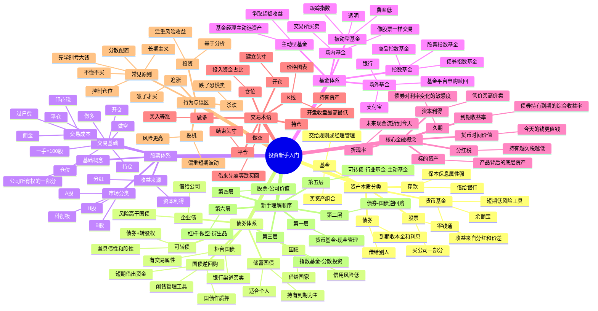

# 投资新手入门思维导图

```mermaid
mindmap
  root((投资新手入门))
    资产本质分类
      存款
        借给银行
        保本保息属性强
      债券
        借给别人
        到期收本金和利息
      股票
        买公司一部分
        收益来自分红和价差
      基金
        买资产组合
        交给规则或经理管理
      货币基金
        短期低风险工具
        余额宝
        零钱通

    债券体系
      国债
        借给国家
        信用风险低
      企业债
        借给公司
        风险高于国债
      储蓄国债
        适合个人
        持有到期为主
      柜台国债
        银行渠道买卖
        有交易属性
      国债逆回购
        短期借出资金
        国债作质押
        闲钱管理工具
      可转债
        债券+转股权
        兼具债性和股性

    股票体系
      基础概念
        公司所有权的一部分
      收益来源
        分红
        资本利得
      市场分类
        A股
        B股
        H股
        科创板
      交易基础
        一手=100股
        做多
        做空
        开仓
        持仓
        平仓
        仓位
      交易成本
        佣金
        印花税
        过户费

    基金体系
      主动型基金
        基金经理主动选资产
        争取超额收益
      被动型基金
        跟踪指数
        费率低
        透明
      指数基金
        股票指数基金
        债券指数基金
        商品指数基金
      场内基金
        交易所买卖
        像股票一样交易
      场外基金
        支付宝
        银行
        基金平台申购赎回

    核心金融概念
      标的资产
        产品背后的底层资产
      货币时间价值
        今天的钱更值钱
      折现率
        未来现金流折到今天
      到期收益率
        债券持有到期的综合收益率
      久期
        债券对利率变化的敏感度
      资本利得
        低价买高价卖
      分红税
        持有越久税越低

    交易术语
      K线
        价格图表
        开盘收盘最高最低
      开仓
        建立头寸
      持仓
        持有资产
      平仓
        结束头寸
      仓位
        投入资金占比
      做多
        买入等涨
      做空
        借来先卖等跌买回

    行为与误区
      投资
        基于分析
        注重风险收益
      投机
        偏重短期波动
        风险更高
      追涨
        涨了才买
      杀跌
        跌了恐慌卖
      常见原则
        不懂不买
        分散配置
        控制仓位
        长期主义
        先学别亏大钱

    新手理解顺序
      第一层
        货币基金-现金管理
      第二层
        债券-国债逆回购
      第三层
        指数基金-分散投资
      第四层
        股票-公司价值
      第五层
        可转债-行业基金-主动基金
      第六层
        杠杆-做空-衍生品
```

---

## 关联笔记

- [[投资新手入门]]
- [[股票入门]]
- [[investool投资辅助工具使用指南]]

## Canvas 版本

- [[Canvas-投资新手入门思维导图]] - 交互式 Canvas 思维导图
