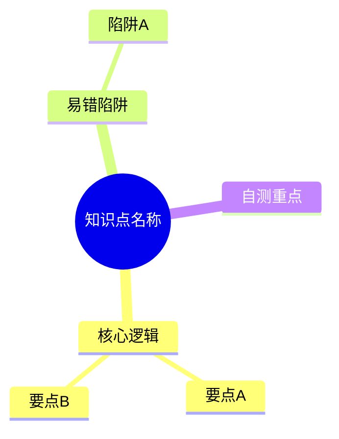

# PKM 知识库路由规范 v2.0

> [!IMPORTANT]
> 本规范是 AI 整理原始笔记、生成成品笔记的**最高准则**。AI 在处理任何 `00-收集箱` 中的内容并输出至库中时，必须全文无条件遵守。

---

## 1. 目录路由协议 (Type → Path)

AI 不准根据感觉选择目录，必须严格执行以下路由：

| 笔记类型 (Type) | 目标路径 | 备注 |
| :--- | :--- | :--- |
| **inbox** | `00-收集箱/00-待分诊/` | 所有碎片入口 |
| **learning** | `02-学习记录/` | 课程笔记/踩坑/复盘/日报周报 |
| **concept** | `10-领域知识/01-计算机/{{对应学科}}/` | 通用计算机基础知识点 |
| **interview** | `10-领域知识/01-计算机/Java/00-面试题库/` | 面试八股文专项 |
| **project** | `20-项目实战/01-在做/{{项目名}}/` | 项目相关的所有内容 |
| **output** | `30-输出作品/01-面试回答/` | 可复用成品（面试稿/文章/报告） |
| **moc** | `01-导航索引/` | 知识地图、索引文件 |
| **archive** | `90-归档区/` | 不再维护的内容 |

### 核心原则
1. **按用途分类，不按内容分类**：避免双入口问题
2. **同一内容只有一个家**：知识→10，项目→20，成品→30
3. **资源链接不等于知识**：外部链接放 `60-资源库/`，消化后的知识放 `10-领域知识/`

---

## 2. 成品输出格式协议

### 2.1 YAML Frontmatter (必选)
每篇笔记头部必须包含以下字段：

```yaml
---
type: concept | interview | learning | project | output | moc
domain: 计算机 | Java | 数据库 | ...
status: 🌿 苗 | ☀️ 树 | 💎 钻
tags: [tag1, tag2]
created: YYYY-MM-DD
updated: YYYY-MM-DD
---
```

**状态说明**：
- 🌿 苗：初步整理，逻辑可能不完整
- ☀️ 树：逻辑完备，可以复用
- 💎 钻：深度理解，高频使用

### 2.2 视觉引导 (必选)
开篇第一块必须是 Mermaid 思维导图，层级深度不超过 3 层：



### 2.3 正文结构 (极简原则)
正文必须短而清晰，按以下固定模块书写：

1. **核心问题**：用面试问法（如果适用）
2. **3 行结论**：≤3 条，用一句话讲清楚是什么、为什么
3. **核心要点**：≤6 条，列出关键技术点或逻辑
4. **易错点**：≤4 条，提醒实际开发或面试中的常见坑
5. **自测题**：≥3 题，用于闭环检验
6. **相关链接**：wikilink 指向相关笔记

### 2.4 代码示例规范
- **原则**：最小可理解示例
- **限制**：不超过 40 行，注释占比需达 30% 以上
- **必须包含**：在代码块后写明"**预期执行现象**"

### 2.5 确定性保护
- 对于 AI 不确定的内容，**绝对禁止**写死
- 必须使用 `> [!WARNING] 待确认` 标注
- 必须紧跟 `验证方法`（例如：具体执行哪条命令，查看哪个日志）

---

## 3. 笔记类型体系

系统只保留 5 种笔记类型：

1. **收集箱条目 (inbox)**：一句话/几段碎片
2. **学习记录 (learning)**：过程、踩坑、复盘（不要求完美）
3. **领域知识卡 (concept/interview)**：一个知识点的"可复用结论"
4. **项目笔记 (project)**：和项目绑定的设计/实现/问题
5. **输出作品 (output)**：面试回答、文章、报告、PPT大纲

---

## 4. 对 AI 的约束

1. **真实性高于美观**：如果原始记录很乱，AI 只需确保理解逻辑，保留"真实反馈"
2. **自动归档**：AI 整理后，必须主动移动或创建文件到对应的路由路径
3. **必须添加回链**：在笔记底部添加相关知识卡的双向链接
4. **MOC 同步更新**：新增知识卡后，主动更新对应领域的 MOC

---

## 5. 目录结构速查

```
00-收集箱/         # 所有碎片入口
01-导航索引/       # MOC/仪表盘
02-学习记录/       # 学习过程
10-领域知识/       # 长期沉淀的知识库
20-项目实战/       # 项目相关
30-输出作品/       # 可复用成品
60-资源库/         # 外部资料索引
80-模板/           # 所有模板/规范
90-归档区/         # 冷存
```
