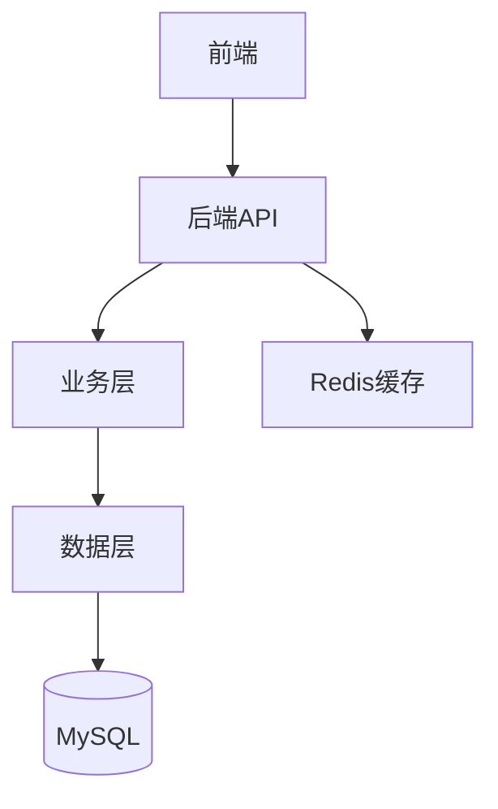

# {{项目名称}} - 项目主页

---

## 📋 项目简介

**项目名称**：{{项目全称}}
**技术栈**：{{Spring Boot, Redis, MySQL 等}}
**项目类型**：{{个人项目/实战课程/开源贡献}}
**时间周期**：{{开始时间}} - {{结束时间/进行中}}

**核心功能**：
- 功能 1：{{描述}}
- 功能 2：{{描述}}
- 功能 3：{{描述}}

---

## 🎯 学习目标

- [ ] 掌握 {{技术点1}}
- [ ] 理解 {{技术点2}}
- [ ] 实践 {{技术点3}}

---

## 📊 里程碑与待办

### 已完成
- [x] {{里程碑1}}
- [x] {{里程碑2}}

### 进行中
- [ ] {{当前任务1}}
- [ ] {{当前任务2}}

### 计划中
- [ ] {{未来任务1}}
- [ ] {{未来任务2}}

---

## 🏗️ 架构与模块

**核心模块**：
1. **模块 1**：{{功能说明}}
2. **模块 2**：{{功能说明}}
3. **模块 3**：{{功能说明}}

---

## 📚 项目笔记索引

### 学习笔记
- [[学习笔记1]]
- [[学习笔记2]]

### 源码分析
- [[核心功能源码分析]]
- [[架构设计分析]]

### 踩坑记录
- [[问题1：描述]]
- [[问题2：描述]]

---

## 🔌 接口与API

| 接口路径 | 方法 | 功能 | 状态 |
|---------|------|------|------|
| `/api/xxx` | POST | {{功能}} | ✅ |
| `/api/yyy` | GET | {{功能}} | 🚧 |

---

## ⚠️ 关键踩坑

1. **坑点 1**：{{问题描述}}
   - **解决方案**：{{如何解决}}
   - **相关笔记**：[[详细踩坑记录]]

2. **坑点 2**：{{问题描述}}
   - **解决方案**：{{如何解决}}

---

## 📤 输出作品

该项目产生的可复用成果：

- [[面试回答：基于该项目的xxx技术点]]
- [[技术文章：xxx实践总结]]
- [[可复用代码片段：xxx工具类]]

---

## 🔗 外部资源

- **项目仓库**：{{GitHub链接}}
- **参考教程**：{{课程/文档链接}}
- **相关文档**：{{官方文档等}}

---

## 📝 项目总结

> [!NOTE] 项目完成后填写

**收获**：
- {{技术收获1}}
- {{技术收获2}}

**不足**：
- {{待改进点1}}
- {{待改进点2}}

**下一步**：
- {{后续优化方向}}
