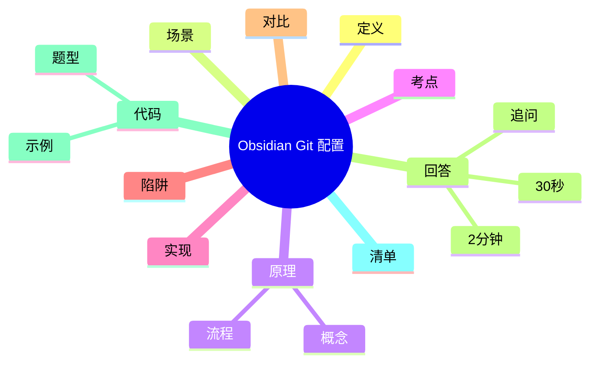

# Obsidian Git 笔记库配置全流程

> [!summary] TL;DR（3-5 行）
> - 一句话定义：从零搭建 Obsidian + Git 的笔记库同步流程。
> - 面试一句话结论：核心是“仓库初始化 + .gitignore + 自动同步”。
> - 关键点：远端地址、忽略规则、冲突处理、插件配置。
> - 常见坑：远端未关联、嵌套仓库、忽略规则不全。

> [!tip]
> **工程师思维自检**：
> 1. 我能在新机器上 10 分钟内复现完整环境吗？
> 2. 我能解释每一步的目的和风险吗？

---

## 1. 定义与定位

- **它是什么**：将本地 Vault 与远端 Git 仓库绑定的完整配置流程。
- **解决什么问题**：自动备份、可回滚、跨设备同步。
- **体系中的位置**：工具链搭建流程，连接 [[Obsidian]] 与 [[Git]]。

---

## 2. 应用场景

- 场景 1：首次搭建笔记库同步。
- 场景 2：新机器迁移环境。
- 不适用：不希望使用版本控制的轻量笔记。

---

## 3. 核心原理（面试够用版）

> [!note] 先给结论，再解释“怎么做到”

- **核心机制**（5-7 条要点）：
  1) Vault 是普通目录，可直接 git init 或 clone。
  2) 远端仓库定义同步目标。
  3) .gitignore 控制噪音文件。
  4) commit/push 保存与同步历史。
  5) 插件定时执行 push/pull。

### 3.1 关键流程（步骤）

1. 安装 Obsidian + Git。
2. 初始化仓库或克隆远端仓库。
3. 配置 .gitignore。
4. 首次提交并绑定远端。
5. 设置插件自动同步策略。

### 3.2 关键概念

- **远端仓库**：同步目标。
- **.gitignore**：忽略本地配置与缓存。

### 3.3 费曼类比

> [!tip] 用人话解释
> 像把“本地笔记本”接上云端保险箱，每次修改都有存档。

---

## 4. 关键细节清单（高频考点）

- 考点 1：远端地址必须正确且可访问。
- 考点 2：忽略规则要包含 `.obsidian/`。
- 考点 3：首次提交后再配置自动同步。
- 考点 4：冲突先 pull 再 push。

---

## 5. 源码/实现要点（不装行号，只抓关键）

> [!tip] 目标：回答“执行层面为什么是这样”

- **关键组件**：Git 仓库、远端地址、插件配置文件。
- **关键流程**：初始化 → 忽略 → 首次提交 → 自动化。
- **关键策略**：先稳定再自动化，避免冲突。
- **面试话术**：本质是 Git 基础流程的工程化封装。

---

## 6. 易错点与陷阱（至少 5 条）

1) 忘记关联远端导致无法同步。
2) 嵌套仓库导致 push/pull 混乱。
3) 忽略规则不全，推送大量无关文件。
4) 自动同步过于频繁导致冲突。
5) 没有备份远端仓库地址。

---

## 7. 对比与扩展（至少 2 组）

- **插件自动化 vs 手动 Git**：前者省心，后者更可控。
- **GitHub vs GitLab**：功能相近，重点在访问速度与权限。
- 扩展问题：如何在团队知识库中做权限隔离？

### 对比表

| 特性 | 插件自动化 | 手动 Git |
| :--- | :--- | :--- |
| 成本 | 低 | 中 |
| 可控性 | 中 | 高 |
| 冲突风险 | 高 | 低 |

---

## 8. 标准面试回答（可直接背）

### 8.1 30 秒版本（电梯回答）

> [!quote]
> Obsidian Git 配置流程核心是把 Vault 初始化为仓库或 clone 远端，配置 .gitignore，再进行首次提交与绑定远端。最后再开启插件自动 push/pull。关键是控制同步频率并处理冲突。

### 8.2 2 分钟版本（结构化展开）

> [!quote]
> 1) 定义与定位：把笔记库交给 Git 做版本控制与同步。 
> 2) 场景：首次搭建或迁移环境。 
> 3) 原理：初始化 → 忽略规则 → 首次提交 → 自动化同步。 
> 4) 易错点：远端未关联、嵌套仓库、忽略规则不全。 
> 5) 扩展：团队知识库的权限与冲突治理。

### 8.3 深挖追问（面试官继续问什么）

- 追问 1：为什么必须先提交再自动化？→ 防止未初始化时推送失败。
- 追问 2：为什么忽略 `.obsidian/`？→ 避免用户环境差异。
- 追问 3：冲突频发怎么办？→ 降低自动频率并固定操作顺序。

---

## 9. 代码题与代码示例（必须有详注）

> [!important] 要求：注释解释“为什么这样写”，不是解释语法

### 9.1 面试代码题（2-3 题）

- 题 1：如何生成适配 Obsidian 的 .gitignore？
- 题 2：如何检测远端地址是否已配置？
- 题 3：如何统计本地仓库的未提交文件数？

### 9.2 参考代码（Java）

```java
// 目标：生成一个最小可用的 .gitignore
// 注意：只保留 Obsidian 必要忽略项
import java.nio.file.*;
import java.util.*;

public class GitignoreGenerator {
    public static void main(String[] args) throws Exception {
        List<String> lines = Arrays.asList(
            ".obsidian/",
            "**/workspace.json",
            "**/workspaces-mobile.json"
        );

        // 为什么直接写文件：确保新仓库开箱即用
        Path file = Paths.get(".gitignore");
        Files.write(file, lines);
        System.out.println(".gitignore generated");
    }
}
```

---

## 10. 复习 Checklist（可勾选）

- [ ] 我能按步骤完成一次完整配置。
- [ ] 我能解释每一步的目的。
- [ ] 我能处理一次简单冲突。
- [ ] 我能设置合理的自动同步频率。
- [ ] 我能在新机器上复现环境。

---

## 11. Mermaid 思维导图（Obsidian 可渲染）



---

## 相关笔记（双向链接）

- [[Obsidian]]
- [[Git]]
- [[知识管理]]
