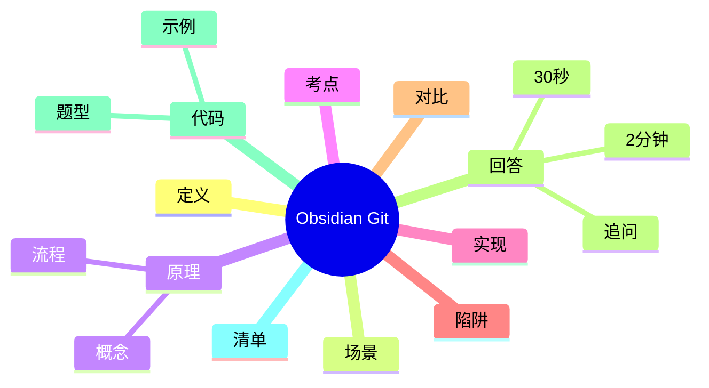

---
title: "Obsidian 笔记库与 Git 同步"
aliases: ["Obsidian 笔记库与 Git 同步 八股", "Obsidian 笔记库与 Git 同步 面试"]
tags: [Tools, 八股, Interview/高频, Obsidian, Git]
created: 2026-01-21
level: interview
status: draft
---

# Obsidian 笔记库与 Git 同步

> [!summary] TL;DR（3-5 行）
> - 一句话定义：用 Git 管理 Obsidian 笔记库，实现版本控制与多端同步。
> - 面试一句话结论：核心是“仓库边界清晰 + .gitignore 合理 + 同步频率稳定”。
> - 关键点：仓库结构、同步流程、冲突处理、插件自动化。
> - 常见坑：嵌套仓库、误推配置文件、冲突未解决。

> [!tip]
> **工程师思维自检**：
> 1. 我能在 5 分钟内恢复一个损坏的笔记库吗？
> 2. 我能解释冲突的根因并给出解决策略吗？

---

## 1. 定义与定位

- **它是什么**：把 Obsidian Vault 当作 Git 仓库，进行版本管理与同步。
- **解决什么问题**：防丢失、可回滚、跨设备同步。
- **体系中的位置**：知识管理与工具链的一部分，连接 [[Obsidian]] 与 [[Git]]。

---

## 2. 应用场景

- 场景 1：多设备编辑同一份笔记库。
- 场景 2：需要历史版本回溯。
- 不适用：只在本机使用且不想维护版本的轻量笔记。

---

## 3. 核心原理（面试够用版）

> [!note] 先给结论，再解释“怎么做到”

- **核心机制**（5-7 条要点）：
  1) Vault 就是普通目录，可直接初始化为 Git 仓库。
  2) .gitignore 排除 Obsidian 配置与临时文件。
  3) push/pull 保持远端同步。
  4) 插件定时保存与自动推送。
  5) 冲突通过合并或回滚解决。

### 3.1 关键流程（步骤）

1. 初始化仓库（git init）或 clone。
2. 配置 .gitignore 排除噪音文件。
3. 设定自动同步策略（插件或脚本）。
4. 出现冲突时手动处理再提交。

### 3.2 关键概念

- **Vault**：Obsidian 的笔记库目录。
- **远端仓库**：GitHub/GitLab 等。

### 3.3 费曼类比

> [!tip] 用人话解释
> 像给你的“纸质笔记本”装上时光机：每次修改都会留下可回溯的版本。

---

## 4. 关键细节清单（高频考点）

- 考点 1：**仓库边界**要清晰，避免嵌套 .git。
- 考点 2：**.gitignore** 防止配置文件污染历史。
- 考点 3：**同步频率**平衡“及时性”和“冲突风险”。
- 考点 4：**冲突处理**要先 pull 后 push。

---

## 5. 源码/实现要点（不装行号，只抓关键）

> [!tip] 目标：回答“执行层面为什么是这样”

- **关键组件**：Git 仓库、远端地址、Obsidian Git 插件。
- **关键流程**：本地修改 → git add/commit → push → 远端同步。
- **关键策略**：忽略配置文件、固定同步间隔、手动处理冲突。
- **面试话术**：本质是用 Git 管理普通文件夹，插件只是自动化。

---

## 6. 易错点与陷阱（至少 5 条）

1) 仓库内再建仓库导致嵌套冲突。
2) 忘记 .gitignore，推送大量配置/缓存文件。
3) 多设备同时编辑导致冲突。
4) 自动推送频率过高，提交碎片化。
5) 只 push 不 pull，导致远端更新丢失。

---

## 7. 对比与扩展（至少 2 组）

- **Git 同步 vs 云盘同步**：Git 可回滚，云盘更直观但缺历史。
- **手动同步 vs 自动同步**：自动高效但冲突风险更大。
- 扩展问题：如何在团队共享知识库？

### 对比表

| 特性 | Git 同步 | 云盘同步 |
| :--- | :--- | :--- |
| 历史版本 | 强 | 弱 |
| 冲突处理 | 明确 | 不透明 |
| 自动化 | 需插件 | 内置 |

---

## 8. 标准面试回答（可直接背）

### 8.1 30 秒版本（电梯回答）

> [!quote]
> 用 Git 同步 Obsidian 的核心是把 Vault 作为普通仓库管理：配置 .gitignore，保证仓库边界清晰，再用插件或脚本自动 push/pull。关键在于控制同步频率并正确处理冲突，才能兼顾效率与稳定性。

### 8.2 2 分钟版本（结构化展开）

> [!quote]
> 1) 定义与定位：把 Vault 交给 Git 做版本管理和多端同步。 
> 2) 场景：多设备编辑、需要历史回滚。 
> 3) 原理：初始化仓库、配置 .gitignore、push/pull 同步。 
> 4) 易错点：嵌套仓库、冲突处理不当。 
> 5) 扩展：插件定时推送提升效率。

### 8.3 深挖追问（面试官继续问什么）

- 追问 1：冲突怎么处理？→ 先 pull，再手工合并与 commit。
- 追问 2：为什么要 .gitignore？→ 避免噪音文件污染历史。
- 追问 3：自动同步安全吗？→ 频率过高会增加冲突概率。

---

## 9. 代码题与代码示例（必须有详注）

> [!important] 要求：注释解释“为什么这样写”，不是解释语法

### 9.1 面试代码题（2-3 题）

- 题 1：如何自动检测 Vault 中是否存在嵌套 .git？
- 题 2：如何生成适配 Obsidian 的 .gitignore？
- 题 3：如何统计最近 30 天的提交次数？

### 9.2 参考代码（Java）

```java
// 目标：扫描 Vault 目录，检测是否存在嵌套 .git
// 注意：嵌套仓库会导致同步混乱
import java.nio.file.*;

public class GitNestChecker {
    public static void main(String[] args) throws Exception {
        Path vault = Paths.get("D:/Docs/Notes/ObsidianVault");

        // 使用 walk 是为了递归检查所有子目录
        boolean nested = Files.walk(vault)
            .filter(p -> p.getFileName().toString().equals(".git"))
            // 为什么过滤掉根目录：根目录是合法仓库
            .anyMatch(p -> !p.getParent().equals(vault));

        System.out.println("Has nested repo: " + nested);
    }
}
```

---

## 10. 复习 Checklist（可勾选）

- [ ] 我能解释 Vault 与 Git 仓库的关系。
- [ ] 我能写出 .gitignore 的必要项。
- [ ] 我能处理一次简单的合并冲突。
- [ ] 我能配置 Obsidian Git 插件自动同步。
- [ ] 我能快速回滚到历史版本。

---

## 11. Mermaid 思维导图（Obsidian 可渲染）



---

## 相关笔记（双向链接）

- [[Obsidian]]
- [[Git]]
- [[知识管理]]
